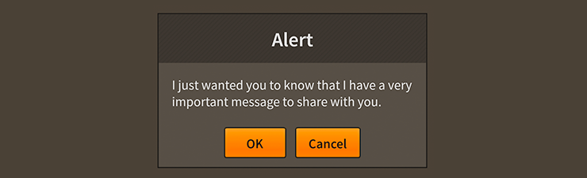

# How to use the Feathers `Alert` component

The [`Alert`](../api-reference/feathers/controls/Alert.html) class renders a window as a [pop-up](pop-ups.html) over all other content. Typically, an alert displays a header with a title, followed by some multiline text and an optional icon. A set of buttons to select different actions appears at the bottom of the alert.

<figure>

<figcaption>An `Alert` component skinned with `MetalWorksMobileTheme`</figcaption>
</figure>

-   [The Basics](#the-basics)

-   [Skinning an `Alert`](#skinning-an-alert)

-   [Closing and Disposal](#closing-and-disposal)

## The Basics

We create an `Alert` a bit differently than other components. Rather than calling a constructor, we call the static function [`Alert.show()`](../api-reference/feathers/controls/Alert.html#show()). Let's see how this works by displaying a simple message in an `Alert` when we touch a button. First, let's create the button:

``` code
var button:Button = new Button();
button.label = "Click Me";
button.addEventListener( Event.TRIGGERED, button_triggeredHandler );
this.addChild( button );
```

Then, in the listener for the button's `Event.TRIGGERED` event, we create the alert:

``` code
function button_triggeredHandler( event:Event ):void
{
	var button:Button = Button( event.currentTarget );
	var alert:Alert = Alert.show( "I have something important to say", "Warning", new ListCollection(
	[
		{ label: "OK", triggered: okButton_triggeredHandler }
	]) );
}
```

Three arguments are required. The first is the alert's message. The second argument is the title displayed in the alert's header. Finally, a [`ListCollection`](../api-reference/feathers/data/ListCollection.html) of button data must be passed in to display in a [`ButtonGroup`](button-group.html).

In addition to listening for [`Event.TRIGGERED`](../api-reference/feathers/controls/Button.html#event:triggered) to be dispatched by individual buttons, you may also listen for [`Event.CLOSE`](../api-reference/feathers/controls/Alert.html#event:close) on the alert:

``` code
alert.addEventListener( Event.CLOSE, alert_closeHandler );
```

The event object's `data` property will contain the item from the `ButtonGroup` data provider that is associated with the button that was triggered:

``` code
function alert_closeHandler( event:Event, data:Object ):void
{
	if( data.label == "OK" )
	{
		// the OK button was clicked
	}
}
```

Additional, optional arguments are available for `Alert.show()`. Let's take a look at those next.

### Icon

An optional icon may be displayed next to the alert's message. We'll use a `starling.display.Image` in the following example, but the icon may be any Starling display object:

```code
var icon:Image = new Image( iconTexture );
Alert.show( message, title, buttons, icon );
```

Pass in the icon after the alert's buttons.

### Modality

Following the icon is the `isModal` argument. This determines whether there is an overlay between the alert and the rest of the display list. When an alert is modal, the overlay blocks touches to everything that appears under the alert. If the alert isn't modal, there will be no overlay to block the touch, and anything below the alert will remain interactive.

Alerts are displayed using the [`PopUpManager`](pop-ups.html). By default, modal overlays are managed by the `PopUpManager`, but you can give a custom overlay to all alerts (that will be different from other modal pop-ups) when you set the static property, [`overlayFactory`](../api-reference/feathers/controls/Alert.html#overlayFactory):

``` code
Alert.overlayFactory = function():DisplayObject
{
	var tiledBackground:Image = new Image( texture );
	tiledBackground.tileGrid = new Rectangle();
	return tiledBackground;
};
```

When [`PopUpManager.addPopUp()`](../api-reference/feathers/core/PopUpManager.html#addPopUp()) is called to show the alert, the custom overlay factory will be passed in as an argument.

### Centering

Following the modality is the `isCentered` argument. This determines if the alert will be globally centered on the Starling stage. If the alert or the stage is resized, the alert will be automatically repositioned to remain centered.

### Custom `Alert` factory

When an alert is created with `Alert.show()`, the function stored by the [`Alert.alertFactory()`](../api-reference/feathers/controls/Alert.html#alertFactory) property is called to instantiate an `Alert` instance. One of the final arguments of `Alert.show()` allows you to specify a custom alert factory. This let's you customize an individual alert to be different than other alerts. For instance, let's say that a particular alert should have different background skin than others. We might create an alert factory function like this:

``` code
function customAlertFactory():Alert
{
	var alert:Alert = new Alert();
	alert.styleNameList.add( "custom-alert" );
	return alert;
};
Alert.show( "I have something important to say", "Alert Title", new ListCollection({label: "OK"}), true, true, customAlertFactory );
```

If you're working with a [theme](themes.html), you can set a custom styling function for a `Alert` with the style name `"custom-alert"` to provide different skins for this alert.

## Skinning an `Alert`

A number of styles may be customized on an alert, including the message font styles, the background skin, and an optional icon. Additionally, alert has some sub-components that may be styled, including the header and the button group. For full details about which properties are available, see the [`Alert` API reference](../api-reference/feathers/controls/Alert.html). We'll look at a few of the most common ways of styling an alert below.

### Using a theme? Some tips for customizing an individual alert's styles

A [theme](themes.html) does not style a component until the component initializes. This is typically when the component is added to stage. If you try to pass skins or font styles to the component before the theme has been applied, they may be replaced by the theme! Let's learn how to avoid that.

As a best practice, when you want to customize an individual component, you should add a custom value to the component's [`styleNameList`](../api-reference/feathers/core/FeathersControl.html#styleNameList) and [extend the theme](extending-themes.html). However, it's also possible to use an [`AddOnFunctionStyleProvider`](../api-reference/feathers/skins/AddOnFunctionStyleProvider.html) outside of the theme, if you prefer. This class will call a function after the theme has applied its styles, so that you can make a few tweaks to the default styles.

In the following example, we customize the alert's message `fontStyles` with an `AddOnFunctionStyleProvider`:

``` code
function setExtraAlertStyles( alert:Alert ):void
{
	alert.fontStyles = new TextFormat( "Helvetica", 20, 0xcc0000 );
}
alert.styleProvider = new AddOnFunctionStyleProvider(
	alert.styleProvider, setExtraAlertStyles );
```

Our changes only affect the font styles. The alert will continue to use the theme's background skins, padding, and other styles.

### Font styles

As we saw above, the font styles of the alert's message may be customized using the [`fontStyles`](../api-reference/feathers/controls/Alert.html#fontStyles) and [`disabledFontStyles`](../api-reference/feathers/controls/Alert.html#disabledFontStyles) properties:

``` code
alert.fontStyles = new TextFormat( "Helvetica", 20, 0x3c3c3c );
alert.disabledFontStyles = new TextFormat( "Helvetica", 20, 0x9a9a9a );
```

Pass in a [`starling.text.TextFormat`](http://doc.starling-framework.org/current/starling/text/TextFormat.html) object, which will work with any type of [text renderer](text-renderers.html).

The font styles of the alert's title may be customized on the alert's `Header` component. See [How to use the Feathers `Header` component](header.html) for details.

The font styles of the alert's buttons may be customized through the alert's `ButtonGroup` component. See [How to use the Feathers `ButtonGroup` component](button-group.html) for details.

### Background skin

The background skin fills the full width and height of the alert. In the following example, we pass in a `starling.display.Image`, but the skin may be any Starling display object:

``` code
var skin:Image = new Image( enabledTexture );
skin.scale9Grid = new Rectangle( 2, 4, 3, 8 );
alert.backgroundSkin = skin;
```

It's as simple as setting the [`backgroundSkin`](../api-reference/feathers/controls/Scroller.html#backgroundSkin) property.

A separate [`backgroundDisabledSkin`](../api-reference/feathers/controls/Scroller.html#disabledBackgroundSkin) may be provided to display when the alert is disabled:

``` code
var disabledSkin:Image = new Image( disabledTexture );
disabledSkin.scale9Grid = new Rectangle( 2, 4, 3, 8 );
alert.backgroundDisabledSkin = disabledSkin;
```

If the `backgroundDisabledSkin` isn't provided to a disabled alert, it will fall back to using the default `backgroundSkin` in the disabled state.

### Layout

Padding may be added around the edges of the alert. This padding is applied around the edges of the message text renderer, and is generally used to show a bit of the background as a border.

``` code
alert.paddingTop = 15;
alert.paddingRight = 20;
alert.paddingBottom = 15;
alert.paddingLeft = 20;
```

If all four padding values should be the same, you may use the [`padding`](../api-reference/feathers/controls/Scroller.html#padding) property to quickly set them all at once:

``` code
alert.padding = 20;
```

If an optional icon is displayed, you may use the [`gap`](../api-reference/feathers/controls/Alert.html#gap) property to add some space between the message and the icon:

``` code
alert.gap = 12;
```

### Skinning the header

This section only explains how to access the header sub-component. Please read [How to use the Feathers `Header` component](header.html) for full details about the skinning properties that are available on `Header` components.

#### With a Theme

If you're creating a [theme](themes.html), you can target the [`Alert.DEFAULT_CHILD_STYLE_NAME_HEADER`](../api-reference/feathers/controls/Alert.html#DEFAULT_CHILD_STYLE_NAME_HEADER) style name.

``` code
getStyleProviderForClass( Header )
	.setFunctionForStyleName( Alert.DEFAULT_CHILD_STYLE_NAME_HEADER, setAlertHeaderStyles );
```

The styling function might look like this:

``` code
private function setAlertHeaderStyles( header:Header ):void
{
	header.backgroundSkin = new Image( headerBackgroundTexture );
	header.fontStyles = new TextFormat( "Helvetica", 16, 0x3c3c3c );
}
```

You can override the default style name to use a different one in your theme, if you prefer:

``` code
alert.customHeaderStyleName = "custom-header";
```

You can set the styling function for the [`customHeaderStyleName`](../api-reference/feathers/controls/Panel.html#customHeaderStyleName) like this:

``` code
getStyleProviderForClass( Header )
	.setFunctionForStyleName( "custom-header", setAlertCustomHeaderStyles );
```

#### Without a Theme

If you are not using a theme, you can use [`headerFactory`](../api-reference/feathers/controls/Panel.html#headerFactory) to provide skins for the alert's header:

``` code
alert.headerFactory = function():Header
{
	var header:Header = new Header();

	//skin the header here, if you're not using a theme
	header.backgroundSkin = new Image( headerBackgroundTexture );
	header.fontStyles = new TextFormat( "Helvetica", 16, 0x3c3c3c );

	return header;
}
```

### Skinning the buttons

This section only explains how to access the button group sub-component. Please read [How to use the Feathers `ButtonGroup` component](button-group.html) for full details about the skinning properties that are available on `ButtonGroup` components.

#### With a Theme

If you're creating a [theme](themes.html), you can target the [`Alert.DEFAULT_CHILD_STYLE_NAME_BUTTON_GROUP`](../api-reference/feathers/controls/Alert.html#DEFAULT_CHILD_STYLE_NAME_BUTTON_GROUP) style name.

``` code
getStyleProviderForClass( ButtonGroup )
	.setFunctionForStyleName( Alert.DEFAULT_CHILD_STYLE_NAME_BUTTON_GROUP, setAlertButtonGroupStyles );
```

The styling function might look like this:

``` code
private function setAlertButtonGroupStyles( group:ButtonGroup ):void
{
	group.gap = 20;
}
```

You can override the default style name to use a different one in your theme, if you prefer:

``` code
alert.customButtonGroupStyleName = "custom-button-group";
```

You can set the styling function for the [`customButtonGroupStyleName`](../api-reference/feathers/controls/Alert.html#customButtonGroupStyleName) like this:

``` code
getStyleProviderForClass( ButtonGroup )
	.setFunctionForStyleName( "custom-button-group", setAlertCustomButtonGroupStyles );
```

#### Without a Theme

If you are not using a theme, you can use [`buttonGroupFactory`](../api-reference/feathers/controls/Alert.html#buttonGroupFactory) to provide skins for the alert's button group:

``` code
alert.buttonGroupFactory = function():Header
{
	var group:ButtonGroup = new ButtonGroup();
	
	//skin the button group here, if you're not using a theme
	group.gap = 20;
	
	return group;
}
```

### Using a factory to skin an `Alert` without a theme

If you're not using a theme, you can specify a factory to create the alert, including setting skins, in a couple of different ways. The first is to set the [`Alert.alertFactory`](../api-reference/feathers/controls/Alert.html#alertFactory) static property to a function that provides skins for the alert. This factory will be called any time that [`Alert.show()`](../api-reference/feathers/controls/Alert.html#show()) is used to create an alert.

``` code
function skinnedAlertFactory():Alert
{
	var alert:Alert = new Alert();
	alert.backgroundSkin = new Image( texture );
	// etc...
	return alert;
};
Alert.alertFactory = skinnedAlertFactory;
```

Another option is to pass an alert factory to `Alert.show()`. This allows you to create a specific alert differently than the default global `Alert.alertFactory`.

``` code
function skinnedAlertFactory():Alert
{
	var alert:Alert = new Alert();
	alert.backgroundSkin = new Image( texture );
	// etc...
	return alert;
};
Alert.show( message, title, buttons, isModal, isCentered, skinnedAlertFactory );
```

You should generally always skin the alerts with a factory or with a theme instead of passing the skins to the `Alert` instance returned by calling `Alert.show()`. If you skin an alert after `Alert.show()` is called, it may not necessarily be positioned or sized correctly anymore.

## Closing and disposal

The alert will automatically remove itself from the display list and dispose itself when one of its buttons is triggered. In most cases, you don't need to do any kind of cleanup.

To manually close and dispose the alert without triggering a button, you may simply remove the alert from its parent:

``` code
alert.removeFromParent( true );
```

## Related Links

-   [`feathers.controls.Alert` API Documentation](../api-reference/feathers/controls/Alert.html)