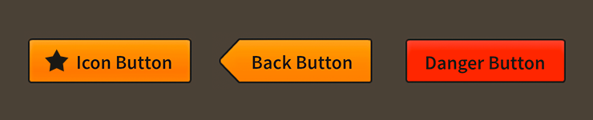

# How to use the Feathers `Button` component

The [`Button`](../api-reference/feathers/controls/Button.html) class displays a button that may be triggered by pressing and releasing. It can display an optional label and an optional icon with a variety of layout options. Buttons have separate states for each of the different touch phases. The skin and icon can be customized for each state, and the label [text renderer](text-renderers.html) may display different font styles for each state too.

<figure>

<figcaption>`Button` components skinned with `MetalWorksMobileTheme`</figcaption>
</figure>

-   [The Basics](#the-basics)

-   [Button states](#button-states)

-   [Skinning a `Button`](#skinning-a-button)

## The Basics

First, let's create a `Button` control, give it a label, and add it to the display list:

``` actionscript
var button:Button = new Button();
button.label = "Click Me";
this.addChild( button );
```

If we want to know when the button is tapped or clicked, we can listen for [`Event.TRIGGERED`](../api-reference/feathers/controls/BasicButton.html#event:triggered):

``` actionscript
button.addEventListener( Event.TRIGGERED, button_triggeredHandler );
```

This event is dispatched when the touch ends *and* the touch was not dragged outside of the button's bounds. In other words, the button is only triggered when the touch both begins and ends over the button.

The listener function might look like this:

``` actionscript
function button_triggeredHandler( event:Event ):void
{
    trace( "button triggered" );
}
```

## Button states

When the user interacts with a button, it's internal state changes. This may be used for skinning purposes, such as displaying different background skins or changing font styles. We'll look at some examples in a moment.

All buttons have the following states:

* [`ButtonState.UP`](../api-reference/feathers/controls/ButtonState.html#UP) is the button's default state when the user is not interacting with it.
* [`ButtonState.DOWN`](../api-reference/feathers/controls/ButtonState.html#DOWN) is the state when the user presses the button by touching it or clicking it with the mouse.
* [`ButtonState.HOVER`](../api-reference/feathers/controls/ButtonState.html#HOVER) is the state when the mouse is hovering over the button. On a touchscreen, this state is not used.
* [`ButtonState.DISABLED`](../api-reference/feathers/controls/ButtonState.html#DISABLED) is the state when the button's `isEnabled` property has been set to `false`.

## Skinning a `Button`

A number of styles may be customized on a button, including the font styles, the background skin, and an optional icon. For full details about which properties are available, see the [`Button` API reference](../api-reference/feathers/controls/Button.html). We'll look at a few of the most common ways of styling a button below.

### Font styles

The font styles of the button's label text renderer may be customized using the [`fontStyles`](../api-reference/feathers/controls/Button.html#fontStyles) property.

``` actionscript
button.fontStyles = new TextFormat( "Helvetica", 20, 0x3c3c3c );
```

Pass in a [`starling.text.TextFormat`](http://doc.starling-framework.org/current/starling/text/TextFormat.html) object, which will work with any type of [text renderer](text-renderers.html).

If the button's label should use different font styles when the button is disabled, you may set the [`disabledFontStyles`](../api-reference/feathers/controls/Button.html#disabledFontStyles) property too:

``` actionscript
button.disabledFontStyles = new TextFormat( "Helvetica", 20, 0x9a9a9a );
```

Finally, we can even customize the font styles for each of the button's specific states:

``` actionscript
button.setFontStylesForState( ButtonState.DOWN,
	new TextFormat( "Helvetica", 20, 0xcc0000 ) );
```

Using the code above, the color of the button's label will change when the button is pressed, and the state changes to `ButtonState.DOWN`.

When font styles aren't available for a specific state, the button will use the default `fontStyles` as a fallback. For example, we haven't provided font styles for `ButtonState.HOVER`, so the default styles will be used.

### Background skins

Let's give our button its background skin. In the following example, we'll use an [`ImageSkin`](../api-reference/feathers/skins/ImageSkin.html), but the skin may be any Starling display object:

``` actionscript
var skin:ImageSkin = new ImageSkin( upTexture );
skin.scale9Grid = new Rectangle( 2, 3, 3, 8 );
button.defaultSkin = skin;
```

We can change the appearance of the button's skin when the state changes. In the next example, we provide another texture to the same `ImageSkin` for the button's "down" state:

``` actionscript
skin.setTextureForState( ButtonState.DOWN, downTexture );
```

The `ImageSkin` automatically listens for changes to the button's state and updates its appearance to match. When the user presses the button down, the `ImageSkin` will display this texture instead of the default one.

We can also provide different display objects for specific states, if needed. In the next example, we have a texture for the "disabled" state that requires a different `scale9Grid` than the other textures. We can create a separate `ImageSkin` for this state:

``` actionscript
var disabledSkin:ImageSkin = new ImageSkin( disabledTexture );
disabledSkin.scale9Grid = new Rectangle( 4, 2, 2, 10 );
button.setSkinForState( ButtonState.DISABLED, disabledSkin );
```

Pass in skins for any state using the [`setSkinForState()`](../api-reference/feathers/controls/BasicButton.html#setSkinForState()) function.

If a skin is not provided for a specific state, the button will display its `defaultSkin`. Similarly, when using an `ImageSkin`, and a texture isn't provided for a specific state, it will display its default texture.

### Icons

Let's also add an icon to the `Button`. Icons may be customized for each of the button's states (just like the background skin), but let's simply use one icon. In this example, we'll pass in a `starling.display.Image`:

``` actionscript
button.defaultIcon = new Image( iconTexture );
```

This icon will be displayed for all of the button's different states.

If we wanted to change the appearance of the icon when the button's state changes, we could use a [`feathers.skins.ImageSkin`](../api-reference/feathers/skins/ImageSkin.html) with multiple textures, like we did in the example above that demonstrated how to set the button's background skin. Similarly, we could use [`setIconForState()`](../api-reference/feathers/controls/Button.html#setIconForState()) to pass in different display objects for each state.

## Layout

Padding may be added on each side of the button:

``` actionscript
button.paddingTop = 5;
button.paddingRight = 8;
button.paddingBottom = 5;
button.paddingLeft = 8;
```

If all four padding values should be the same, you may use the [`padding`](../api-reference/feathers/controls/Button.html#padding) property to quickly set them all at once:

``` actionscript
button.padding = 6;
```

The icon may be positioned on any side of the button's label. Let's move the icon above the label so that they are stacked vertically:

``` actionscript
button.iconPosition = RelativePosition.TOP;
```

We set the [`iconPosition`](../api-reference/feathers/controls/Button.html#iconPosition) property to [`RelativePosition.TOP`](../api-reference/feathers/layout/RelativePosition.html#TOP). We can easily position the icon to the top, right, bottom, or left of the label.

The [`gap`](../api-reference/feathers/controls/Button.html#gap) refers to the space, measured in pixels, between the icon and the label:

``` actionscript
button.gap = 10;
```

The [`horizontalAlign`](../api-reference/feathers/controls/Button.html#horizontalAlign) and [`verticalAlign`](../api-reference/feathers/controls/Button.html#verticalAlign) properties will adjust the alignment of the icon and label inside the button, allowing you to anchor them at the edges or in the center.

``` actionscript
button.horizontalAlign = HorizontalAlign.CENTER;
button.verticalAlign = VerticalAlign.MIDDLE;
```

## Related Links

-   [`feathers.controls.Button` API Documentation](../api-reference/feathers/controls/Button.html)