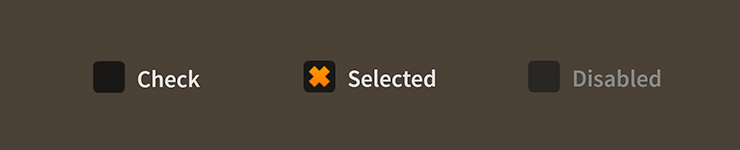

# How to use the Feathers `Check` component

The [`Check`](../api-reference/feathers/controls/Check.html) component is actually a [`ToggleButton`](toggle-button.html) component, but it is given a different visual appearance.

<figure>

<figcaption>`Check` components skinned with `MetalWorksMobileTheme`</figcaption>
</figure>

-   [The Basics](#the-basics)

-   [Skinning a `Check`](#skinning-a-check)

## The Basics

A `Check` component can be created much like a `ToggleButton`:

``` code
var check:Check = new Check();
check.label = "Click Me";
check.isSelected = true;
this.addChild( check );
```

See [How to use the Feathers `ToggleButton` component](toggle-button.html) for a more detailed look at this component's capabilities.

## Skinning a `Check`

A skinned `Check` component usually has no background (or a transparent one) and the touch states of the check are displayed through the icon skins. For full details about which properties are available, see the [`Check` API reference](../api-reference/feathers/controls/Check.html).

As mentioned above, `Check` is a subclass of `ToggleButton`. For more detailed information about the skinning options available to `Check`, see [How to use the Feathers `ToggleButton` component](toggle-button.html).

## Related Links

-   [`feathers.controls.Check` API Documentation](../api-reference/feathers/controls/Check.html)

-   [How to use the Feathers `ToggleButton` component](toggle-button.html)

-   [How to use the Feathers `ToggleSwitch` component](toggle-switch.html)