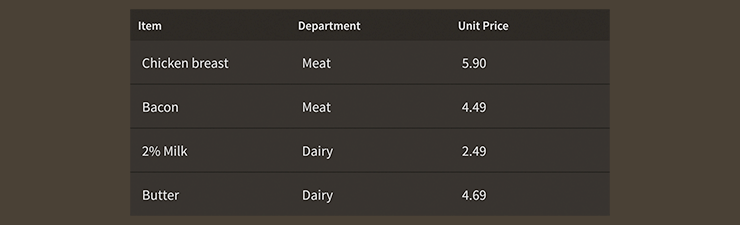

# How to use the Feathers `DataGrid` component

The [`DataGrid`](../api-reference/feathers/controls/DataGrid.html) class displays a table of data. Each item in the data provider is displayed as a row, divided into columns for the item's fields. It includes support for selection, scrolling, layout virtualization to optimize rendering of large collections, and custom cell renderers.

<figure>

<figcaption>`DataGrid` component skinned with `MetalWorksMobileTheme`</figcaption>
</figure>

-   [The Basics](#the-basics)

-   [Selection](#selection)

-   [Skinning a `DataGrid`](#skinning-a-data-grid)

-   [Custom cell renderers](#custom-cell-renderers)

-   [Customize scrolling behavior](#customize-scrolling-behavior)

## The Basics

First, let's create a `DataGrid` control and add it to the display list:

``` code
var grid:DataGrid = new DataGrid();
grid.width = 300;
grid.height = 250;
this.addChild( grid );
```

Next, we want the data grid to display some items, so let's create an [`ArrayCollection`](../api-reference/feathers/data/ArrayCollection.html) as its data provider.

``` code
var items:ArrayCollection = new ArrayCollection(
[
	{ item: "Chicken breast", dept: "Meat", price: "5.90" },
	{ item: "Bacon", dept: "Meat", price: "4.49" },
	{ item: "2% Milk", dept: "Dairy", price: "2.49" },
	{ item: "Butter", dept: "Dairy", price: "4.69" },
	{ item: "Lettuce", dept: "Produce", price: "1.29" },
	{ item: "Broccoli", dept: "Produce", price: "2.99" },
	{ item: "Whole Wheat Bread", dept: "Bakery", price: "2.49" },
	{ item: "English Muffins", dept: "Bakery", price: "2.99" },
]);
grid.dataProvider = items;
```

`ArrayCollection` wraps a regular ActionScript `Array`, and it adds special events and things that the `DataGrid` uses to add, update, and remove rows in real time.

<aside class="info">`ArrayCollection` is one of multiple classes that implement the [`IListCollection`](../api-reference/feathers/data/IListCollection.html) interface. `IListCollection` may wrap any type of data to provide a common API that the `DataGrid` component can understand. Out of the box, we may use these collection implementations: 

* [`ArrayCollection`](../api-reference/feathers/data/ArrayCollection.html) for data based on an [`Array`](http://help.adobe.com/en_US/FlashPlatform/reference/actionscript/3/Array.html)
* [`VectorCollection`](../api-reference/feathers/data/VectorCollection.html) for data based on a [`Vector`](http://help.adobe.com/en_US/FlashPlatform/reference/actionscript/3/Vector.html)
* [`XMLListCollection`](../api-reference/feathers/data/XMLListCollection.html) for data based on an [`XMLList`](http://help.adobe.com/en_US/FlashPlatform/reference/actionscript/3/XMLList.html)

It's even possible for anyone to create new `IListCollection` implementations to display custom data types, if needed.</aside>

### Columns

Now, we should define the columns in the data grid, so that it knows which fields from the data provider's items to display. Let's start by taking a moment to review one of the items from the data provider:

``` code
{ item: "Broccoli", dept: "Produce", price: "2.99" },
```

The item has three fields, `item`, `dept`, and `price`. We can define a [`DataGridColumn`](../api-reference/feathers/controls/DataGridColumn.html) for each of them, and pass them to the `columns` property in a collection.

``` code
grid.columns = new ArrayCollection(
[
	new DataGridColumn("item", "Item"),
	new DataGridColumn("dept", "Department"),
	new DataGridColumn("price", "Unit Price"),
]);
```

As you can see in the code above, we can also customize the text to display in each column header. Setting the header text is optional, and the field name will be displayed when it is omitted.

<aside class="info">If you don't set the `columns` property, the data grid will attempt to populate it automatically. There's no guarantee that the columns will be displayed in any particular order, so it's usually a good idea to define the columns manually instead of relying on the automatic behavior.</aside>

## Selection

The `DataGrid` component may have one selected item, which selects an entire row. You can access information about selection through the [`selectedIndex`](../api-reference/feathers/controls/DataGrid.html#selectedIndex) and [`selectedItem`](../api-reference/feathers/controls/DataGrid.html#selectedItem) properties. If there is no selection, the value of `selectedIndex` will be `-1` and the value of `selectedItem` will be `null`.

To listen for when the selection changes, listen to [`Event.CHANGE`](../api-reference/feathers/controls/DataGrid.html#event:change):

``` code
grid.addEventListener( Event.CHANGE, grid_changeHandler );
```

The listener might look something like this:

``` code
private function grid_changeHandler( event:Event ):void
{
    var grid:DataGrid = DataGrid( event.currentTarget );
    trace( "selectedIndex:", grid.selectedIndex );
}
```

You can manually change the selection, if needed:

``` code
grid.selectedIndex = 4;
```

Selection indices start at `0`, so the above code would select the fifth row in the data grid.

If you prefer, you can change selection by passing in an item from the data provider:

``` code
grid.selectedItem = item;
```

If needed, you can clear selection manually:

``` code
grid.selectedIndex = -1;
```

To disable selection completely, use the [`isSelectable`](../api-reference/feathers/controls/DataGrid.html#isSelectable) property:

``` code
grid.isSelectable = false;
```

To support the selection of more than one item, set the [`allowMultipleSelection`](../api-reference/feathers/controls/DataGrid.html#allowMultipleSelection) property to `true`:

``` code
grid.allowMultipleSelection = true;
```

## Skinning a `DataGrid`

A data grid has a main background skin and one for its headers. It also supports *divider* skins between headers and columns. Much of the ability to customize the appearance of a data grid exists inside the cell renderer and header renderer components, such as their font styles and backgrounds for different states. For full details about which properties are available on a `DataGrid`, see the [`DataGrid` API reference](../api-reference/feathers/controls/DataGrid.html). We'll look at a few of the most common ways of styling a data grid below.

### Background skin

We can give the data grid a background skin that fills the entire width and height of the data grid. In the following example, we pass in a `starling.display.Image`, but the skin may be any Starling display object:

``` code
var skin:Image = new Image( texture );
skin.scale9Grid = new Rectangle( 2, 2, 1, 6 );
grid.backgroundSkin = skin;
```

It's as simple as setting the [`backgroundSkin`](../api-reference/feathers/controls/Scroller.html#backgroundSkin) property.

We can give the data grid a different background when it is disabled:

``` code
var skin:Image = new Image( disabledTexture );
skin.scale9Grid = new Rectangle( 1, 3, 2, 6 );
grid.backgroundDisabledSkin = skin;
```

The [`backgroundDisabledSkin`](../api-reference/feathers/controls/Scroller.html#backgroundDisabledSkin) is displayed when the data grid is disabled. If the `backgroundDisabledSkin` isn't provided to a disabled data grid, it will fall back to using the `backgroundSkin` in the disabled state.

The data grid's header may be skinned using the [`headerBackgroundSkin`](../api-reference/feathers/controls/DataGrid.html#headerBackgroundSkin) and [`headerBackgroundDisabledSkin`](../api-reference/feathers/controls/DataGrid.html#headerBackgroundDisabledSkin) properties:

``` code
var skin:Image = new Image( texture );
skin.scale9Grid = new Rectangle( 1, 2, 2, 6 );
grid.headerBackgroundSkin = skin;

var skin2:Image = new Image( disabledTexture );
skin.scale9Grid = new Rectangle( 2, 1, 3, 4 );
grid.headerBackgroundSkin = skin2;
```

### Skinning the Scroll Bars

This section only explains how to access the horizontal scroll bar and vertical scroll bar sub-components. Please read [How to use the Feathers `ScrollBar` component](scroll-bar.html) (or [`SimpleScrollBar`](simple-scroll-bar.html)) for full details about the skinning properties that are available on scroll bar components.

#### With a Theme

If you're creating a [theme](themes.html), you can target the [`Scroller.DEFAULT_CHILD_STYLE_NAME_HORIZONTAL_SCROLL_BAR`](../api-reference/feathers/controls/Scroller.html#DEFAULT_CHILD_STYLE_NAME_HORIZONTAL_SCROLL_BAR) style name for the horizontal scroll bar and the [`Scroller.DEFAULT_CHILD_STYLE_NAME_VERTICAL_SCROLL_BAR`](../api-reference/feathers/controls/Scroller.html#DEFAULT_CHILD_STYLE_NAME_VERTICAL_SCROLL_BAR) style name for the vertical scroll bar.

``` code
getStyleProviderForClass( ScrollBar )
    .setFunctionForStyleName( Scroller.DEFAULT_CHILD_STYLE_NAME_HORIZONTAL_SCROLL_BAR, setHorizontalScrollBarStyles );
getStyleProviderForClass( ScrollBar )
    .setFunctionForStyleName( Scroller.DEFAULT_CHILD_STYLE_NAME_VERTICAL_SCROLL_BAR, setVerticalScrollBarStyles );
```

The styling function for the horizontal scroll bar might look like this:

``` code
private function setHorizontalScrollBarStyles(scrollBar:ScrollBar):void
{
    scrollBar.trackLayoutMode = TrackLayoutMode.SINGLE;
}
```

You can override the default style names to use different ones in your theme, if you prefer:

``` code
grid.customHorizontalScrollBarStyleName = "custom-horizontal-scroll-bar";
grid.customVerticalScrollBarStyleName = "custom-vertical-scroll-bar";
```

You can set the function for the [`customHorizontalScrollBarStyleName`](../api-reference/feathers/controls/Scroller.html#customHorizontalScrollBarStyleName) and the [`customVerticalScrollBarStyleName`](../api-reference/feathers/controls/Scroller.html#customVerticalScrollBarStyleName) like this:

``` code
getStyleProviderForClass( ScrollBar )
    .setFunctionForStyleName( "custom-horizontal-scroll-bar", setCustomHorizontalScrollBarStyles );
getStyleProviderForClass( ScrollBar )
    .setFunctionForStyleName( "custom-vertical-scroll-bar", setCustomVerticalScrollBarStyles );
```

#### Without a Theme

If you are not using a theme, you can use [`horizontalScrollBarFactory`](../api-reference/feathers/controls/Scroller.html#horizontalScrollBarFactory) and [`verticalScrollBarFactory`](../api-reference/feathers/controls/Scroller.html#verticalScrollBarFactory) to provide skins for the data grid's scroll bars:

``` code
grid.horizontalScrollBarFactory = function():ScrollBar
{
    var scrollBar:ScrollBar = new ScrollBar();

    //skin the scroll bar here, if not using a theme
    scrollBar.trackLayoutMode = TrackLayoutMode.SINGLE;

    return scrollBar;
}
```

### Skinning the Cell Renderers

This section only explains how to access the cell renderer sub-components. Please read [How to use the default Feathers item renderer with `List`, `DataGrid`, `Tree`, and `GroupedList`](default-item-renderers.html) for full details about the skinning properties that are available on the default cell renderers.

<aside class="info">Other components use the term *item* renderer, but *cell* is a bit more appropriate for a data grid, which divides the fields of each item into multiple cells.</aside>

[Custom cell renderers](item-renderers.html) may be accessed similarly, but they won't necessarily have the same styling properties as the default cell renderers. When using custom cell renderers, you may easily replace references to the [`DefaultDataGridCellRenderer`](../api-reference/feathers/controls/renderers/DefaultDataGridCellRenderer.html) class in the code below with references to your custom cell renderer class.

#### With a Theme

If you are creating a [theme](themes.html), you can set a function for the default styles like this:

``` code
getStyleProviderForClass( DefaultDataGridCellRenderer ).defaultStyleFunction = setCellRendererStyles;
```

The styling function might look like this:

``` code
private function setCellRendererStyles(cellRenderer:DefaultDataGridCellRenderer):void
{
    var skin:ImageSkin = new ImageSkin( upTexture );
    skin.setTextureForState( ButtonState.DOWN, downTexture );
    skin.scale9Grid = new Rectangle( 2, 2, 1, 6 );
    cellRenderer.defaultSkin = skin;
    cellRenderer.fontStyles = new TextFormat( "Helvetica", 20, 0xc3c3c3 );
}
```

If you want to customize a specific cell renderer to look different than the default, you may use a custom style name to call a different function:

``` code
grid.customCellRendererStyleName = "custom-cell-renderer";
```

You can set the function for the custom [`customCellRendererStyleName`](../api-reference/feathers/controls/DataGrid.html#customCellRendererStyleName) like this:

``` code
getStyleProviderForClass( DefaultDataGridCellRenderer )
    .setFunctionForStyleName( "custom-cell-renderer", setCustomCellRendererStyles );
```

#### Without a theme

If you are not using a theme, you can use [`cellRendererFactory`](../api-reference/feathers/controls/DataGrid.html#cellRendererFactory) to provide skins for the data grid's cell renderers:

``` code
grid.cellRendererFactory = function():IDataGridCellRenderer
{
    var cellRenderer:DefaultDataGridCellRenderer = new DefaultDataGridCellRenderer();

    //set cell renderer styles here, if not using a theme
    var skin:ImageSkin = new ImageSkin( upTexture );
    skin.setTextureForState( ButtonState.DOWN, downTexture );
    skin.scale9Grid = new Rectangle( 2, 2, 1, 6 );
    cellRenderer.defaultSkin = skin;
    cellRenderer.fontStyles = new TextFormat( "Helvetica", 20, 0xc3c3c3 );

    return cellRenderer;
}
```

## Custom cell renderers

## Customize scrolling behavior

A number of properties are available to customize scrolling behavior and the scroll bars.

### Interaction Modes

Scrolling containers provide two main interaction modes, which can be changed using the [`interactionMode`](../api-reference/feathers/controls/Scroller.html#interactionMode) property.

By default, you can scroll using touch, just like you would on many mobile devices including smartphones and tablets. This mode allows you to grab the container anywhere within its bounds and drag it around to scroll. This mode is defined by the constant, [`ScrollInteractionMode.TOUCH`](../api-reference/feathers/controls/ScrollInteractionMode.html#TOUCH).

Alternatively, you can set `interactionMode` to [`ScrollInteractionMode.MOUSE`](../api-reference/feathers/controls/ScrollInteractionMode.html#MOUSE). This mode allows you to scroll using the horizontal or vertical scroll bar sub-components. You can also use the mouse wheel to scroll vertically.

Finally, you can set `interactionMode` to [`ScrollInteractionMode.TOUCH_AND_SCROLL_BARS`](../api-reference/feathers/controls/ScrollInteractionMode.html#TOUCH_AND_SCROLL_BARS). This mode allows you to scroll both by dragging the container's content and by using the scroll bars.

### Scroll Bar Display Mode

The [`scrollBarDisplayMode`](../api-reference/feathers/controls/Scroller.html#scrollBarDisplayMode) property controls how and when scroll bars are displayed. This value may be overridden by the scroll policy, as explained below.

The default value is [`ScrollBarDisplayMode.FLOAT`](../api-reference/feathers/controls/ScrollBarDisplayMode.html#FLOAT), which displays the scroll bars as an overlay above the view port's content, rather than affecting the size of the view port. When the scroll bars are floating, they fade out when the container is not actively scrolling. This is a familiar behavior for scroll bars in the touch interaction mode. In the mouse interaction mode, the scroll bars will appear when the mouse hovers over them and then disappear when the hover ends.

To completely hide the scroll bars, but still allow scrolling, you can set `scrollBarDisplayMode` to [`ScrollBarDisplayMode.NONE`](../api-reference/feathers/controls/ScrollBarDisplayMode.html#NONE).

If you want the scroll bars to always be visible outside of the content in a fixed position, you can set `scrollBarDisplayMode` to [`ScrollBarDisplayMode.FIXED`](../api-reference/feathers/controls/ScrollBarDisplayMode.html#FIXED). This is best for traditional desktop scrollable content.

Finally, you can set `scrollBarDisplayMode` to [`ScrollBarDisplayMode.FIXED_FLOAT`](../api-reference/feathers/controls/ScrollBarDisplayMode.html#FIXED_FLOAT) to display the scroll bar as an overlay above the view port's content, but it does not fade away.

### Scroll Policies

The two previous properties control how scrolling works. The [`horizontalScrollPolicy`](../api-reference/feathers/controls/Scroller.html#horizontalScrollPolicy) and [`verticalScrollPolicy`](../api-reference/feathers/controls/Scroller.html#verticalScrollPolicy) properties control whether scrolling is enabled or not.

The default scroll policy for both directions is [`ScrollPolicy.AUTO`](../api-reference/feathers/controls/ScrollPolicy.html#AUTO). If the content's width is greater than the view port's width, the container may scroll horizontally (same for height and vertical scrolling). If not, then the container will not scroll in that direction. In addition to the `scrollBarDisplayMode`, this can affect whether the scroll bar is visible or not.

You can completely disable scrolling in either direction, set the scroll policy to [`ScrollPolicy.OFF`](../api-reference/feathers/controls/ScrollPolicy.html#OFF). The scroll bar will not be visible, and the container won't scroll, even if the content is larger than the view port.

Finally, you can ensure that scrolling is always enabled by setting the scroll policy to [`ScrollPolicy.ON`](../api-reference/feathers/controls/ScrollPolicy.html#ON). If combined with `hasElasticEdges` in the touch interaction mode, it will create a playful edge that always bounces back, even when the content is smaller than the view port. If using the mouse interaction mode, the scroll bar may always be visible under the same circumstances, though it may be disabled if the content is smaller than the view port.

## Related Links

-   [`feathers.controls.DataGrid` API Documentation](../api-reference/feathers/controls/DataGrid.html)