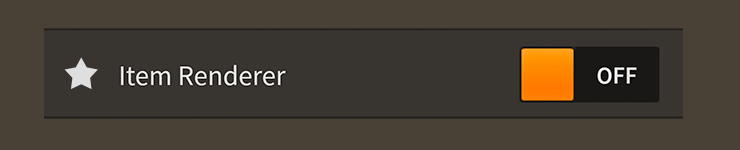

# How to use the Feathers `DefaultListItemRenderer` and `DefaultGroupedListItemRenderer`

The [`DefaultListItemRenderer`](../api-reference/feathers/controls/renderers/DefaultListItemRenderer.html) and [`DefaultGroupedListItemRenderer`](../api-reference/feathers/controls/renderers/DefaultGroupedListItemRenderer.html) classes provide a basic way to display items from data collections in the [`List`](list.html) and [`GroupedList`](grouped-list.html) components. These default item renderers are derived from the same base class, and their functionality is virtually identical.

<figure>

<figcaption>A `DefaultListItemRenderer` component skinned with `MetalWorksMobileTheme`</figcaption>
</figure>

<aside class="info">In many of the examples below, code and descriptions will refer to the [`DefaultListItemRenderer`](../api-reference/feathers/controls/renderers/DefaultListItemRenderer.html) class and the [`IListItemRenderer`](../api-reference/feathers/controls/renderers/IListItemRenderer.html) interface, which are both used by the `List` component. When using a `GroupedList` component, you should substitute the [`DefaultGroupedListItemRenderer`](../api-reference/feathers/controls/renderers/DefaultGroupedListItemRenderer.html) class and the [`IGroupedListItemRenderer`](../api-reference/feathers/controls/renderers/IGroupedListItemRenderer.html) interface instead.

Whether using a `List` or a `GroupedList`, the default item renderers will have all of the same properties that are used in the examples below. The differences are entirely behind the scenes.</aside>

-   [The Basics](#the-basics)

-   [Children of an item renderer](#children-of-an-item-renderer)

-   [Skinning a default item renderer](#skinning-a-default-item-renderer)

## The Basics

Item renderers are managed by a `List` or `GroupedList` component, and you generally don't add them to the display list directly. To customize properties on a default item renderer, you can use the list's [`itemRendererFactory`](../api-reference/feathers/controls/List.html#itemRendererFactory):

``` code
list.itemRendererFactory = function():IListItemRenderer
{
    var renderer:DefaultListItemRenderer = new DefaultListItemRenderer();
    renderer.labelField = "text";
    return renderer;
}
```

In the next section, we'll look at several examples of properties that we can set in the `itemRendererFactory`.

## Children of an item renderer

An item renderer provides up to three children to display data. A label, an icon, and an accessory. A label must always display a string in a [text renderer](text-renderers.html). However, both the icon and the accessory have three different ways to display data. They may display either a texture or URL in an [`ImageLoader`](image-loader.html), a string in a text renderer, or they can add an arbitrary display object, like a Feathers component, as a child.

### Label

The [`labelField`](../api-reference/feathers/controls/renderers/BaseDefaultItemRenderer.html#labelField) property displays a string in the primary [text renderer](text-renderers.html).

Consider the following item in a data provider:

``` code
{ text: "Example Item" }
```

For an item renderer to display "Example Item" string, it needs to know about the item's `text` property:

``` code
renderer.labelField = "text";
```

The default item renderer also has a [`labelFunction`](../api-reference/feathers/controls/renderers/BaseDefaultItemRenderer.html#labelFunction) property that may be used to generate a string dynamically.

### Icon

The icon is typically intended for displaying a texture (either preloaded or from a URL) in an [`ImageLoader`](image-loader.html) component. However, for convenience, it may also display a string in another text renderer, or it may add any Starling display object as a child.

When loading a texture or URL, the item renderer will create and manage its own internal `ImageLoader` instance. If the texture is loaded from a URL, we do not need to dispose this texture when we are finished with it. The texture will be disposed when the `ImageLoader` is disposed. If we pass in a preloaded texture, it is our responsibility to dispose it when needed.

To display a texture or a URL, you may use the [`iconSourceField`](../api-reference/feathers/controls/renderers/BaseDefaultItemRenderer.html#iconSourceField) property.

Consider the following item from the data provider:

``` code
{ label: "Example Label", thumbnail: atlas.getTexture( "texture-name" ) }
```

For an item renderer to display the texture from the altas, it needs to know about the item's `thumbnail` property:

``` code
renderer.iconSourceField = "thumbnail";
```

Similar to the `labelField` property, the [`iconLabelField`](../api-reference/feathers/controls/renderers/BaseDefaultItemRenderer.html#iconLabelField) property can be used to display a string in another [text renderer](text-renderers.html). This can be a convenient way to display another line of text, or it could even be used to display symbols using icon fonts.

Finally, if you need to display a Feathers component or any other type of Starling display object, you can use the [`iconField`](../api-reference/feathers/controls/renderers/BaseDefaultItemRenderer.html#iconField) property.

Consider the following code where a [`Slider`](slider.html) component is included in a list's data provider:

``` code
var slider:Slider = new Slider();
slider.minimum = 0;
slider.maximum = 10;
slider.step = 1;
slider.value = 0;
 
list.dataProvider = new ArrayCollection(
[
    { label: "Example Label", control: slider }
];
```

For an item renderer to add the display object as a child, it needs to know about the item's `control` property:

``` code
renderer.iconField = "control";
```

When using `iconField`, it's important to understand that the display object in the data provider will not be automatically disposed when the item renderer or the list is disposed. This display object may need to be used in another list later, and Feathers cannot know whether it is safe to dispose it, similar to how a [`starling.display.Image`](http://doc.starling-framework.org/core/starling/display/Image.html) cannot dispose its [`starling.textures.Texture`](http://doc.starling-framework.org/core/starling/textures/Texture.html). To avoid memory leaks, remember to dispose any display objects included in the list's data provider when the list is disposed. The [`dispose()`](../api-reference/feathers/data/IListCollection.html#dispose()) function on the data provider makes it easy to dispose display objects in an `IListCollection`.

Finally, it's possible to skin the icon without passing it through the data provider. For example, you might want to display a checkmark as the icon when an item renderer is selected. Set the [`itemHasIcon`](../api-reference/feathers/controls/renderers/BaseDefaultItemRenderer.html#itemHasIcon) property to `false`, and you can skin the icon using [`defaultIcon`](../api-reference/feathers/controls/Button.html#defaultIcon) and [`setIconForState()`](../api-reference/feathers/controls/Button.html#setIconForState()) just like you would for a button.

### Accessory

In addition to the label and the icon, the default item renderer can display a third child, an *accessory*. This is a display object that is added as a child and it is often meant to be interactive in some way. For instance, you might create a list of settings with labels on the left and some user interface controls like sliders and toggle switches on the right.

When using interactive accessories, it's a good idea to set the list's [`isSelectable`](../api-reference/feathers/controls/List.html#isSelectable) property to `false` to avoid touch conflicts and user confusion. When a list displays interactive accessories, it may not be obvious that the items in a list may be touched to select them too.

Similar to icons, for extra convenience and flexibility, an accessory may be a text renderer that displays a string, an [`ImageLoader`](image-loader.html) that displays a texture, or a Starling display object that is added as a child. You may use the [`accessorySourceField`](../api-reference/feathers/controls/renderers/BaseDefaultItemRenderer.html#accessorySourceField) property, the [`accessoryLabelField`](../api-reference/feathers/controls/renderers/BaseDefaultItemRenderer.html#accessoryLabelField) property, and the [`accessoryField`](../api-reference/feathers/controls/renderers/BaseDefaultItemRenderer.html#accessoryField) property. These properties work the same as they would for icons.

Similar to `iconField`, a display object in the list's data provider that is displayed using `accessoryField` will not be automatically disposed when the item renderer or the list is disposed. See the note above about `iconField` for details.

Finally, similar to `itemHasIcon`, it's possible to skin the accessory without passing it through the data provider by setting [`itemHasAccessory`](../api-reference/feathers/controls/renderers/BaseDefaultItemRenderer.html#itemHasAccessory) to `false`. You can skin the accessory using [`defaultAccessory`](../api-reference/feathers/controls/renderers/BaseDefaultItemRenderer.html#defaultAccessory) and [`setAccessoryForState()`](../api-reference/feathers/controls/renderers/setAccessoryForState.html#setAccessoryForState()).

## Skinning a default item renderer

The [`DefaultListItemRenderer`](../api-reference/feathers/controls/renderers/DefaultListItemRenderer.html) class is a subclass of the [`ToggleButton`](toggle-button.html) component. Like a button, the default item renderer can change its background skin based on the touch state, and it supports different background skins when selected too. Similarly, an item renderer may have both a label and an icon, and all of the layout options used by buttons for alignment, gap, and padding apply to an item renderer too. For full details about these inherited properties, see [How to use the Feathers `Button` component](button.html) and [How to use the Feathers `ToggleButton` component](toggle-button.html). For full details about which properties are available to item renderers, see the [`DefaultListItemRenderer` API reference](../api-reference/feathers/controls/renderers/DefaultListItemRenderer.html). We'll look at a few of the most common ways of styling an item renderer below.

### Font styles

If the item renderer's accessory is a label set using `accessoryLabelField` or `accessoryLabelFunction`, we can customize its font styles using the [`accessoryLabelFontStyles`](../api-reference/feathers/controls/renderers/BaseDefaultItemRenderer.html#accessoryLabelFontStyles) property.

``` code
itemRenderer.accessoryLabelFontStyles = new TextFormat( "Helvetica", 20, 0x3c3c3c );
```

Pass in a [`starling.text.TextFormat`](http://doc.starling-framework.org/current/starling/text/TextFormat.html) object, which will work with any type of [text renderer](text-renderers.html).

If the accessory label should use different font styles when the item renderer is disabled, you may set the [`accessoryLabelDisabledFontStyles`](../api-reference/feathers/controls/renderers/BaseDefaultItemRenderer.html#accessoryLabelDisabledFontStyles) property too:

``` code
itemRenderer.accessoryLabelDisabledFontStyles = new TextFormat( "Helvetica", 20, 0x9a9a9a );
```

Finally, we can even customize the accessory label's font styles for each of the item renderer's specific states:

```code
itemRenderer.setAccessoryLabelFontStylesForState( ButtonState.DOWN,
	new TextFormat( "Helvetica", 20, 0xcc0000 ) );
```

Using the code above, the color of the accessor label will change when the item renderer is pressed, and the state changes to `ButtonState.DOWN`.

When font styles aren't available for a specific state, the item renderer will use the default `accessoryLabelFontStyles` as a fallback. For example, we haven't provided font styles for `ButtonState.HOVER`, so the default styles will be used.

Similarly, if the item renderer's icon is a label set using `iconLabelField` or `iconLabelFunction`, its font styles may be customized too. Use the [`iconLabelFontStyles`](../api-reference/feathers/controls/renderers/BaseDefaultItemRenderer.html#iconLabelFontStyles) and  [`iconLabelDisabledFontStyles`](../api-reference/feathers/controls/renderers/BaseDefaultItemRenderer.html#iconLabelDisabledFontStyles) properties, or the [`setIconLabelFontStylesForState()`](../api-reference/feathers/controls/renderers/BaseDefaultItemRenderer.html#setIconLabelFontStylesForState()) function.

### Layout with an accessory

Buttons may have two children, a label text renderer and an icon, but the default item renderers add a third child, known as an *accessory*. Earlier, we looked at how an accessory may be passed in through the data provider. Now, let's look at some of the layout options available when adding an accessory into the mix.

Positioning the accessory in the item renderer's layout is very similar to positioning the icon relative to the label text renderer. The default item renderer has an [`accessoryPosition`](../api-reference/feathers/controls/renderers/BaseDefaultItemRenderer.html#accessoryPosition) property that will allow it to be positioned relative to the other children. The [`accessoryGap`](../api-reference/feathers/controls/renderers/BaseDefaultItemRenderer.html#accessoryGap) property defines the gap in pixels between the accessory and the other children.

<aside class="info">The [`iconPosition`](../api-reference/feathers/controls/renderers/BaseDefaultItemRenderer.html#accessoryPosition) and [`gap`](../api-reference/feathers/controls/renderers/BaseDefaultItemRenderer.html#gap) properties provided by the [`Button`](button.html) superclass may also be used by item renderers to position the icon.</aside>

When displaying all three children that the default item renderer supports (the label text renderer, the icon, and the accessory), you can use the [`layoutOrder`](../api-reference/feathers/controls/renderers/BaseDefaultItemRenderer.html#layoutOrder) property to customize the order that the children are positioned in the layout. By default, the label text renderer is positioned first, followed by the icon (relative to the label), and finally, the accessory is positioned last (relative to the combined bounding box of the label and the icon). Alternatively, you can change the order so that the label text renderer is positioned first, followed by the accessory (relative to the label), and the icon is positioned last (relative to the combined bounding box of the label and the accessory).

## Related Links

-   [`feathers.controls.renderers.DefaultListItemRenderer` API Documentation](../api-reference/feathers/controls/renderers/DefaultListItemRenderer.html)

-   [`feathers.controls.renderers.DefaultGroupedListItemRenderer` API Documentation](../api-reference/feathers/controls/renderers/DefaultGroupedListItemRenderer.html)

-   [How to use the Feathers `List` component](list.html)

-   [How to use the Feathers `GroupedList` component](grouped-list.html)

-   [Creating custom item renderers for the Feathers `List` and `GroupedList` components](item-renderers.html)