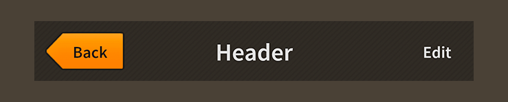

# How to use the Feathers `Header` component

The [`Header`](../api-reference/feathers/controls/Header.html) component displays an optional title and a region on the left and right sides for extra controls (usually buttons for navigation).

<figure>

<figcaption>A `Header` component skinned with `MetalWorksMobileTheme`</figcaption>
</figure>

-   [The Basics](#the-basics)

-   [Skinning a `Header`](#skinning-a-header)

## The Basics

First, let's create a `Header` control, give it a title, and add it to the display list.

``` actionscript
var header:Header = new Header();
header.title = "Settings";
this.addChild( header );
```

Next, we'll add a back button to the left side of the header.

``` actionscript
var backButton:Button = new Button();
backButton.label = "Back";
backButton.addEventListener( Event.TRIGGERED, backButton_triggeredHandler );
 
header.leftItems = new <DisplayObject>[ backButton ];
```

Notice that we create our button just like we would any regular button, including adding an event listener, except we don't add it to the display list. We pass it to the [`leftItems`](../api-reference/feathers/controls/Header.html#leftItems) property in a `Vector.<DisplayObject>` and the header manages adding it as a child and keeping it in the header's layout.

We could add additional buttons or controls to the [`rightItems`](../api-reference/feathers/controls/Header.html#rightItems) region or the [`centerItems`](../api-reference/feathers/controls/Header.html#centerItems) region, if desired.

<aside class="warn">Normally, the title text renderer is displayed in the center region of the `Header`. If the `centerItems` property is not empty, the title will be hidden. The [`titleAlign`](../api-reference/feathers/controls/Header.html#titleAlign) property, which we'll learn how to use in a moment, may be used to reposition the title on the left or right side so that it doesn't conflict with the center items.</aside>

## Skinning a `Header`

A header offers a number of properties that may be used to customize its appearance. For full details about which properties are available, see the [`Header` API reference](../api-reference/feathers/controls/Header.html). We'll look at a few of the most common ways of styling a header below.

### Font styles

The font styles of the header's title may be customized using the [`fontStyles`](../api-reference/feathers/controls/Header.html#fontStyles) property.

``` actionscript
header.fontStyles = new TextFormat( "Helvetica", 20, 0x3c3c3c );
```

Pass in a [`starling.text.TextFormat`](http://doc.starling-framework.org/current/starling/text/TextFormat.html) object, which will work with any type of [text renderer](text-renderers.html).

If the header's title should use different font styles when the header is disabled, you may set the [`disabledFontStyles`](../api-reference/feathers/controls/Header.html#disabledFontStyles) property too:

``` actionscript
header.disabledFontStyles = new TextFormat( "Helvetica", 20, 0x9a9a9a );
```

### Background skins

Let's give the header a background skin that stretches to fill the entire width and height of the header. In the following example, we pass in a `starling.display.Image`, but the skin may be any Starling display object:

``` actionscript
var skin:Image = new Image( texture );
skin.scale9Grid = new Rectangle( 2, 2, 1, 6 );
header.backgroundSkin = skin;
```

It's as simple as setting the [`backgroundSkin`](../api-reference/feathers/controls/Header.html#backgroundSkin) property.

We can give the header a different background when it is disabled:

``` actionscript
var skin:Image = new Image( texture );
skin.scale9Grid = new Rectangle( 1, 3, 2, 6 );
header.backgroundDisabledSkin = skin;
```

The [`backgroundDisabledSkin`](../api-reference/feathers/controls/Header.html#backgroundDisabledSkin) is displayed when the header is disabled. If the `backgroundDisabledSkin` isn't provided to a disabled header, it will fall back to using the `backgroundSkin` in the disabled state.

### Layout

By default, the header's title text renderer appears in the center. The `titleAlign` property may be set to [`HorizontalAlign.LEFT`](../api-reference/feathers/layout/HorizontalAlign.html#LEFT) to position the title to the left. If the `leftItems` property is not empty, the title will still appear on the left, but it will be positioned after the left items. Similarly, we can use [`HorizontalAlign.RIGHT`](../api-reference/feathers/layout/HorizontalAlign.html#RIGHT) to align the title to the right side of the header. If the `rightItems` property is not empty, the title will still appear on the right, but it will be positioned before the right items.

Let's align the title to the right:

``` actionscript
header.titleAlign = HorizontalAlign.RIGHT;
```

Similar to many Feathers components, the `Header` provides [`gap`](../api-reference/feathers/controls/Header.html#gap) and various padding values for layouts.

``` actionscript
header.gap = 10;
header.paddingTop = 15;
header.paddingRight = 20;
header.paddingBottom = 15;
header.paddingLeft = 20;
```

If all four padding values should be the same, you may use the [`padding`](../api-reference/feathers/controls/Header.html#padding) property to set them all at once:

``` actionscript
header.padding = 20;
```

## Related Links

-   [`feathers.controls.Header` API Documentation](../api-reference/feathers/controls/Header.html)