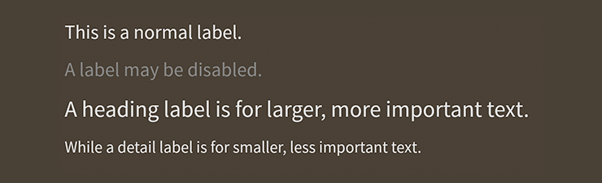

# How to use the Feathers `Label` component

The [`Label`](../api-reference/feathers/controls/Label.html) component is for displaying text. It uses a [text renderer](text-renderers.html).

<figure>

<figcaption>`Label` components skinned with `MetalWorksMobileTheme`</figcaption>
</figure>

-   [The Basics](#the-basics)

-   [Skinning a `Label`](#skinning-a-label)

-   [Change the text renderer](#change-the-text-renderer)

## The Basics

First, let's create a `Label` control, give it some text to display, and add it to the display list:

``` code
var label:Label = new Label();
label.text = "I am the very model of a modern Major General";
this.addChild( label );
```

The text may be wrapped if it is too long to fit on one line:

``` code
label.width = 100;
label.wordWrap = true;
```

Set the [`wordWrap`](../api-reference/feathers/controls/Label.as#wordWrap) property to `true` to enable wrapping.

## Skinning a `Label`

A number of styles may be customized on a label, including the font styles, the background skin, and padding. For full details about which properties are available, see the [`Label` API reference](../api-reference/feathers/controls/Label.html). We'll look at a few of the most common ways of styling a label below.

### Using a theme? Some tips for customizing an individual label's styles

A [theme](themes.html) does not style a component until the component initializes. This is typically when the component is added to stage. If you try to pass skins or font styles to the component before the theme has been applied, they may be replaced by the theme! Let's learn how to avoid that.

As a best practice, when you want to customize an individual component, you should add a custom value to the component's [`styleNameList`](../api-reference/feathers/core/FeathersControl.html#styleNameList) and [extend the theme](extending-themes.html). However, it's also possible to use an [`AddOnFunctionStyleProvider`](../api-reference/feathers/skins/AddOnFunctionStyleProvider.html) outside of the theme, if you prefer. This class will call a function after the theme has applied its styles, so that you can make a few tweaks to the default styles.

In the following example, we customize the label's `fontStyles` with an `AddOnFunctionStyleProvider`:

``` code
var label:Label = new Label();
function setExtraLabelStyles( label:Label ):void
{
	label.fontStyles = new TextFormat( "Helvetica", 20, 0xcc0000 );
}
label.styleProvider = new AddOnFunctionStyleProvider(
	label.styleProvider, setExtraLabelStyles );
```

Our changes only affect the font styles. The label will continue to use the theme's background skins, padding, and other styles.

### Font styles

As we saw above, font styles of the label may be customized using the [`fontStyles`](../api-reference/feathers/controls/Label.html#fontStyles) property.

``` code
label.fontStyles = new TextFormat( "Helvetica", 20, 0x3c3c3c );
```

Pass in a [`starling.text.TextFormat`](http://doc.starling-framework.org/current/starling/text/TextFormat.html) object, which will work with any type of [text renderer](text-renderers.html).

If the label should use different font styles when it is disabled, you may set the [`disabledFontStyles`](../api-reference/feathers/controls/Label.html#disabledFontStyles) property too:

``` code
label.disabledFontStyles = new TextFormat( "Helvetica", 20, 0x9a9a9a );
```

### Background skin

Let's give the label a background skin that stretches to fill the entire width and height of the label. In the following example, we pass in a `starling.display.Image`, but the skin may be any Starling display object:

``` code
var skin:Image = new Image( texture );
skin.scale9Grid = new Rectangle( 2, 2, 1, 6 );
label.backgroundSkin = skin;
```

It's as simple as setting the [`backgroundSkin`](../api-reference/feathers/controls/Label.html#backgroundSkin) property.

We can give the label a different background when it is disabled:

``` code
var skin:Image = new Image( texture );
skin.scale9Grid = new Rectangle( 1, 3, 2, 6 );
label.backgroundDisabledSkin = skin;
```

The [`backgroundDisabledSkin`](../api-reference/feathers/controls/Label.html#backgroundDisabledSkin) is displayed when the label is disabled. If the `backgroundDisabledSkin` isn't provided to a disabled label, it will fall back to using the `backgroundSkin` in the disabled state.

### Layout

Similar to many Feathers components, a `Label` provides several properties to add padding around its content:

``` code
label.paddingTop = 15;
label.paddingRight = 20;
label.paddingBottom = 15;
label.paddingLeft = 20;
```

If all four padding values should be the same, you may use the [`padding`](../api-reference/feathers/controls/Label.html#padding) property to set them all at once:

``` code
label.padding = 20;
```

## Change the text renderer

By default, a `Label` will use the global [`FeathersControl.defaultTextRendererFactory()`](../api-reference/feathers/core/FeathersControl.html#defaultTextRendererFactory) to create its text renderer. If you want to change the type of text renderer used by an individual `Label`, you can provide a custom factory:

``` code
label.textRendererFactory = function():ITextRenderer
{
	return new TextBlockTextRenderer();
};
```

If the [`textRendererFactory`](../api-reference/feathers/control/Label.html#textRendererFactory) property is not `null`, it will be used instead of `FeathersControl.defaultTextRendererFactory()`.

The `fontStyles` property will work with any type of text renderer.

## Related Links

-   [`feathers.controls.Label` API Documentation](../api-reference/feathers/controls/Label.html)

-   [Introduction to Feathers Text Renderers](text-renderers.html)