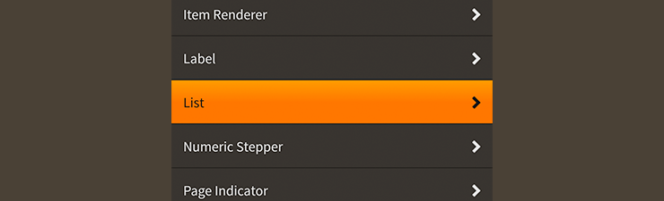

# How to use the Feathers `List` component

The [`List`](../api-reference/feathers/controls/List.html) class renders a series of items from a flat data source such as an `Array` or `Vector`. It includes support for selection, scrolling, custom layouts, layout virtualization to optimize rendering of large collections, and custom item renderers.

<figure>

<figcaption>A `List` component skinned with `MetalWorksMobileTheme`</figcaption>
</figure>

-   [The Basics](#the-basics)

-   [Selection](#selection)

-   [Skinning a `List`](#skinning-a-list)

-   [Custom item renderers](#custom-item-renderers)

-   [Multiple item renderer factories](#multiple-item-renderer-factories)

-   [Customize scrolling behavior](#customize-scrolling-behavior)

-   [Optimizing lists](#optimizing-lists)

## The Basics

First, let's create a `List` control and add it to the display list:

``` code
var list:List = new List();
list.width = 250;
list.height = 300;
this.addChild( list );
```

Next, we want the list to display some items, so let's create an [`ArrayCollection`](../api-reference/feathers/data/ArrayCollection.html) as its data provider.

``` code
var groceryList:ArrayCollection = new ArrayCollection(
[
    { text: "Milk", thumbnail: textureAtlas.getTexture( "milk" ) },
    { text: "Eggs", thumbnail: textureAtlas.getTexture( "eggs" ) },
    { text: "Bread", thumbnail: textureAtlas.getTexture( "bread" ) },
    { text: "Chicken", thumbnail: textureAtlas.getTexture( "chicken" ) },
]);
list.dataProvider = groceryList;
```

`ArrayCollection` wraps a regular ActionScript `Array`, and it adds special events and things that the `List` uses to add, update, and remove item renderers in real time.

<aside class="info">`ArrayCollection` is one of multiple classes that implement the [`IListCollection`](../api-reference/feathers/data/IListCollection.html) interface. `IListCollection` may wrap any type of data to provide a common API that the `List` component can understand. Out of the box, we may use these collection implementations: 

* [`ArrayCollection`](../api-reference/feathers/data/ArrayCollection.html) for data based on an [`Array`](http://help.adobe.com/en_US/FlashPlatform/reference/actionscript/3/Array.html)
* [`VectorCollection`](../api-reference/feathers/data/VectorCollection.html) for data based on a [`Vector`](http://help.adobe.com/en_US/FlashPlatform/reference/actionscript/3/Vector.html)
* [`XMLListCollection`](../api-reference/feathers/data/XMLListCollection.html) for data based on an [`XMLList`](http://help.adobe.com/en_US/FlashPlatform/reference/actionscript/3/XMLList.html)

It's even possible for anyone to create new `IListCollection` implementations to display custom data types, if needed.</aside>

Now, we need to tell the item renderers how to display the data. The list simply passes each item from the data provider to an item renderer, and it is the item renderer's responsibility to interpret the properties of an item.

By default, a list renders items from the data provider using the [`DefaultListItemRenderer`](default-item-renderers.html) component. This default item renderer has many options for displaying strings, textures, and even adding display objects from the data provider as children. Let's look at a couple of these properties right now.

Start by taking a moment to review one of the items from the data provider:

``` code
{ text: "Milk", thumbnail: textureAtlas.getTexture( "milk" ) }
```

The item's `text` property contains a string, and the `thumbnail` property contains a texture. We can tell the default item renderer to use the values from these two properties to display two children: a label and an icon.

``` code
list.itemRendererFactory = function():IListItemRenderer
{
    var itemRenderer:DefaultListItemRenderer = new DefaultListItemRenderer();
    itemRenderer.labelField = "text";
    itemRenderer.iconSourceField = "thumbnail";
    return itemRenderer;
};
```

When using the [`labelField`](../api-reference/feathers/controls/renderers/BaseDefaultItemRenderer.html#labelField), the default item renderer will automatically create a [text renderer](text-renderers.html) to display the string. Similarly, when you use the [`iconSourceField`](../api-reference/feathers/controls/renderers/BaseDefaultItemRenderer.html#iconSourceField), the item renderer will automatically create an [`ImageLoader`](image-loader.html) to display the texture. You may also use `iconSourceField` to ask the `ImageLoader` to display an image loaded from a URL instead of a texture. The value is passed to the [`source`](../api-reference/feathers/controls/ImageLoader.html#source) property of the `ImageLoader`.

The default item renderers can support up to three children, including a label, an icon, and a third one, called an *accessory*. In addition to `labelField` and `iconSourceField` properties, a default item renderer's children may be customized with several other similar properties. Please see [How to use the default Feathers item renderer with `List`, `DataGrid`, `Tree`, and `GroupedList`](default-item-renderers.html) for complete details.

## Selection

The `List` component may have one selected item. You can access information about selection through the [`selectedIndex`](../api-reference/feathers/controls/List.html#selectedIndex) and [`selectedItem`](../api-reference/feathers/controls/List.html#selectedItem) properties. If there is no selection, the value of `selectedIndex` will be `-1` and the value of `selectedItem` will be `null`.

To listen for when the selection changes, listen to [`Event.CHANGE`](../api-reference/feathers/controls/List.html#event:change):

``` code
list.addEventListener( Event.CHANGE, list_changeHandler );
```

The listener might look something like this:

``` code
private function list_changeHandler( event:Event ):void
{
    var list:List = List( event.currentTarget );
    trace( "selectedIndex:", list.selectedIndex );
}
```

You can manually change the selection, if needed:

``` code
list.selectedIndex = 4;
```

Selection indices start at `0`, so the above code would select the fifth item in the list.

If you prefer, you can change selection by passing in an item from the data provider:

``` code
list.selectedItem = item;
```

If needed, you can clear selection manually:

``` code
list.selectedIndex = -1;
```

To disable selection completely, use the [`isSelectable`](../api-reference/feathers/controls/List.html#isSelectable) property:

``` code
list.isSelectable = false;
```

To support the selection of more than one item, set the [`allowMultipleSelection`](../api-reference/feathers/controls/List.html#allowMultipleSelection) property to `true`:

``` code
list.allowMultipleSelection = true;
```

## Skinning a `List`

A list has a background skin and a layout. Much of the ability to customize the appearance of a list exists inside the item renderer components, such as their font styles and backgrounds for different states. For full details about which properties are available on a `List`, see the [`List` API reference](../api-reference/feathers/controls/List.html). We'll look at a few of the most common ways of styling a list below.

### Background skin

We can give the list a background skin that fills the entire width and height of the list. In the following example, we pass in a `starling.display.Image`, but the skin may be any Starling display object:

``` code
var skin:Image = new Image( texture );
skin.scale9Grid = new Rectangle( 2, 2, 1, 6 );
list.backgroundSkin = skin;
```

It's as simple as setting the [`backgroundSkin`](../api-reference/feathers/controls/Scroller.html#backgroundSkin) property.

We can give the list a different background when it is disabled:

``` code
var skin:Image = new Image( texture );
skin.scale9Grid = new Rectangle( 1, 3, 2, 6 );
list.backgroundDisabledSkin = skin;
```

The [`backgroundDisabledSkin`](../api-reference/feathers/controls/Scroller.html#backgroundDisabledSkin) is displayed when the list is disabled. If the `backgroundDisabledSkin` isn't provided to a disabled list, it will fall back to using the `backgroundSkin` in the disabled state.

### Layout

Padding may be added around the edges of the list's content. This padding is different than any type of padding that may be provided by the `layout` property. The layout padding is applied inside the list's content, but the list's padding is applied outside of the content, and is generally used to show a bit of the background as a border around the content.

``` code
list.paddingTop = 15;
list.paddingRight = 20;
list.paddingBottom = 15;
list.paddingLeft = 20;
```

If all four padding values should be the same, you may use the [`padding`](../api-reference/feathers/controls/Scroller.html#padding) property to quickly set them all at once:

``` code
list.padding = 20;
```

The default layout for a list is to display the items vertically one after the other. We can change that to a horizontal layout, a tiled layout, or even a completely [custom layout algorithm](custom-layouts.html). Let's switch to a [`HorizontalLayout`](horizontal-layout.html) and customize it a bit:

``` code
var layout:HorizontalLayout = new HorizontalLayout();
layout.verticalAlign = VerticalAlign.JUSTIFY;
layout.gap = 10;
layout.padding = 15;
list.layout = layout;
```

When the list automatically defaults to a [`VerticalLayout`](vertical-layout.html), it also updates its scroll policy so that it will scroll vertically with elastic edges and will only scroll horizontally if the content is larger than the view port. If we're switching to a horizontal layout, the scroll policies won't be updated automatically, so we should also manually adjust the scroll policies:

``` code
list.horizontalScrollPolicy = ScrollPolicy.AUTO;
list.verticalScrollPolicy = ScrollPolicy.OFF;
```

#### Layout Virtualization

Generally, a list will use something called *[layout virtualization](faq/layout-virtualization.html)* by default because it offers significant performance improvements. When using a virtual layout, a list will display a limited number of item renderers at a time (usually only those that are visible in the view port) to avoid using massive amounts of memory. This means that data providers can contain thousands, or even tens of thousands, of items without a large performance impact. Additionally, the list will reuse that small number of item renderers to display different items as it scrolls. This keeps the runtime from creating many temporary objects that need to be garbage collected. To learn more, see [FAQ: What is layout virtualization?](faq/layout-virtualization.html)

### Skinning the Scroll Bars

This section only explains how to access the horizontal scroll bar and vertical scroll bar sub-components. Please read [How to use the Feathers `ScrollBar` component](scroll-bar.html) (or [`SimpleScrollBar`](simple-scroll-bar.html)) for full details about the skinning properties that are available on scroll bar components.

#### With a Theme

If you're creating a [theme](themes.html), you can target the [`Scroller.DEFAULT_CHILD_STYLE_NAME_HORIZONTAL_SCROLL_BAR`](../api-reference/feathers/controls/Scroller.html#DEFAULT_CHILD_STYLE_NAME_HORIZONTAL_SCROLL_BAR) style name for the horizontal scroll bar and the [`Scroller.DEFAULT_CHILD_STYLE_NAME_VERTICAL_SCROLL_BAR`](../api-reference/feathers/controls/Scroller.html#DEFAULT_CHILD_STYLE_NAME_VERTICAL_SCROLL_BAR) style name for the vertical scroll bar.

``` code
getStyleProviderForClass( ScrollBar )
    .setFunctionForStyleName( Scroller.DEFAULT_CHILD_STYLE_NAME_HORIZONTAL_SCROLL_BAR, setHorizontalScrollBarStyles );
getStyleProviderForClass( ScrollBar )
    .setFunctionForStyleName( Scroller.DEFAULT_CHILD_STYLE_NAME_VERTICAL_SCROLL_BAR, setVerticalScrollBarStyles );
```

The styling function for the horizontal scroll bar might look like this:

``` code
private function setHorizontalScrollBarStyles(scrollBar:ScrollBar):void
{
    scrollBar.trackLayoutMode = TrackLayoutMode.SINGLE;
}
```

You can override the default style names to use different ones in your theme, if you prefer:

``` code
list.customHorizontalScrollBarStyleName = "custom-horizontal-scroll-bar";
list.customVerticalScrollBarStyleName = "custom-vertical-scroll-bar";
```

You can set the function for the [`customHorizontalScrollBarStyleName`](../api-reference/feathers/controls/Scroller.html#customHorizontalScrollBarStyleName) and the [`customVerticalScrollBarStyleName`](../api-reference/feathers/controls/Scroller.html#customVerticalScrollBarStyleName) like this:

``` code
getStyleProviderForClass( ScrollBar )
    .setFunctionForStyleName( "custom-horizontal-scroll-bar", setCustomHorizontalScrollBarStyles );
getStyleProviderForClass( ScrollBar )
    .setFunctionForStyleName( "custom-vertical-scroll-bar", setCustomVerticalScrollBarStyles );
```

#### Without a Theme

If you are not using a theme, you can use [`horizontalScrollBarFactory`](../api-reference/feathers/controls/Scroller.html#horizontalScrollBarFactory) and [`verticalScrollBarFactory`](../api-reference/feathers/controls/Scroller.html#verticalScrollBarFactory) to provide skins for the list's scroll bars:

``` code
list.horizontalScrollBarFactory = function():ScrollBar
{
    var scrollBar:ScrollBar = new ScrollBar();

    //skin the scroll bar here, if not using a theme
    scrollBar.trackLayoutMode = TrackLayoutMode.SINGLE;

    return scrollBar;
}
```

### Skinning the Item Renderers

This section only explains how to access the item renderer sub-components. Please read [How to use the default Feathers item renderer with `List`, `DataGrid`, `Tree`, and `GroupedList`](default-item-renderers.html) for full details about the skinning properties that are available on the default item renderers.

[Custom item renderers](item-renderers.html) may be accessed similarly, but they won't necessarily have the same styling properties as the default item renderers. When using custom item renderers, you may easily replace references to the [`DefaultListItemRenderer`](../api-reference/feathers/controls/renderers/DefaultListItemRenderer.html) class in the code below with references to your custom item renderer class.

#### With a Theme

If you are creating a [theme](themes.html), you can set a function for the default styles like this:

``` code
getStyleProviderForClass( DefaultListItemRenderer ).defaultStyleFunction = setItemRendererStyles;
```

The styling function might look like this:

``` code
private function setItemRendererStyles(itemRenderer:DefaultListItemRenderer):void
{
    var skin:ImageSkin = new ImageSkin( upTexture );
    skin.setTextureForState( ButtonState.DOWN, downTexture );
    skin.scale9Grid = new Rectangle( 2, 2, 1, 6 );
    itemRenderer.defaultSkin = skin;
    itemRenderer.fontStyles = new TextFormat( "Helvetica", 20, 0xc3c3c3 );
}
```

If you want to customize a specific item renderer to look different than the default, you may use a custom style name to call a different function:

``` code
list.customItemRendererStyleName = "custom-item-renderer";
```

You can set the function for the custom [`customItemRendererStyleName`](../api-reference/feathers/controls/List.html#customItemRendererStyleName) like this:

``` code
getStyleProviderForClass( DefaultListItemRenderer )
    .setFunctionForStyleName( "custom-item-renderer", setCustomItemRendererStyles );
```

#### Without a theme

If you are not using a theme, you can use [`itemRendererFactory`](../api-reference/feathers/controls/List.html#itemRendererFactory) to provide skins for the list's item renderers:

``` code
list.itemRendererFactory = function():IListItemRenderer
{
    var itemRenderer:DefaultListItemRenderer = new DefaultListItemRenderer();

    //set item renderer styles here, if not using a theme
    var skin:ImageSkin = new ImageSkin( upTexture );
    skin.setTextureForState( ButtonState.DOWN, downTexture );
    skin.scale9Grid = new Rectangle( 2, 2, 1, 6 );
    itemRenderer.defaultSkin = skin;
    itemRenderer.fontStyles = new TextFormat( "Helvetica", 20, 0xc3c3c3 );

    return itemRenderer;
}
```

## Custom item renderers

If the default item renderer doesn't have the features that you need, the `List` component offers the ability to use [custom item renderers](item-renderers.html) instead. Custom item renderers must be Feathers components that implement the [`IListItemRenderer`](../api-reference/feathers/controls/renderers/IListItemRenderer.html) interface.

<aside class="info">For full details about implementing custom item renderers, see [Creating custom item renderers for the Feathers `List` and `GroupedList` components](item-renderers.html).</aside>

The easiest way to tell a list to display its data using a custom item renderer is to set the [`itemRendererType`](../api-reference/feathers/controls/List.html#itemRendererType) property:

``` code
list.itemRendererType = ExampleCustomItemRenderer;
```

Sometimes, you might want to change some properties on each item renderer as it is created. You can use the [`itemRendererFactory`](../api-reference/feathers/controls/List.html#itemRendererFactory) property instead of `itemRendererType` to call a function that returns a newly created item renderer:

``` code
list.itemRendererFactory = function():IListItemRenderer
{
    var itemRenderer:ExampleCustomItemRenderer = new ExampleCustomItemRenderer();
    itemRenderer.exampleProperty = 20;
    return itemRenderer;
}
```

### Listening to Events from Custom Item Renderers

Listening to events dispatched by a custom item renderer isn't too difficult. Simply dispatch the event normally from the item renderer. No need for bubbling. As an example, let's say that we want to dispatch `Event.COMPLETE` from an item renderer when something happens:

``` code
function someEventHandler( event:Event ):void
{
    this.dispatchEventWith( Event.COMPLETE );
}
```

On our list, first we need to listen for `FeathersEventType.RENDERER_ADD`:

``` code
list.addEventListener( FeathersEventType.RENDERER_ADD, list_rendererAddHandler );
```

Inside the listener for `FeathersEventType.RENDERER_ADD`, we add a listener for our event dispatched by the item renderer:

``` code
function list_rendererAddHandler( event:Event, itemRenderer:IListItemRenderer ):void
{
    itemRenderer.addEventListener( Event.COMPLETE, itemRenderer_customCompleteHandler );
}
 
function itemRenderer_customCompleteHandler( event:Event ):void
{
    var itemRenderer:IListItemRenderer = IListItemRenderer( event.currentTarget );
}
```

Finally, we want to be sure to remove the listeners from the item renderers, so we should also listen for `FeathersEventType.RENDERER_REMOVE`:

``` code
list.addEventListener( FeathersEventType.RENDERER_REMOVE, list_rendererRemoveHandler );
```

The listener for `FeathersEventType.RENDERER_REMOVE` looks very similar to the listener for `FeathersEventType.RENDERER_ADD`:

``` code
function list_rendererRemoveHandler( event:Event, itemRenderer:IListItemRenderer ):void
{
    itemRenderer.removeEventListener( Event.COMPLETE, itemRenderer_customCompleteHandler );
}
```

## Multiple item renderer factories

A list may display differnent item renderers for different items in the data provider. We can use the [`setItemRendererFactoryWithID()`](../api-reference/feathers/controls/List.html#setItemRendererFactoryWithID()) method to pass in more than one item renderer factory:

``` code
function regularItemFactory():IListItemRenderer
{
    return new DefaultListItemRenderer();
}
list.setItemRendererFactoryWithID( "regular-item", regularItemFactory );

function headerItemFactory():IListItemRenderer
{
    return new CustomItemRenderer();
}
list.setItemRendererFactoryWithID( "header-item", headerItemFactory );
```

Each factory should be given a unique `String` identifier. We'll use these values in a moment.

The [`factoryIDFunction`](../api-reference/feathers/controls/List.html#factoryIDFunction) is used to determine which item renderer factory should be used for a particular item. In the example below, we use `factoryIDFunction` to give the first item in the data provider a different item renderer than the other items:
 
``` code
list.factoryIDFunction = function( item:Object, index:int ):String
{
    if(index === 0)
    {
        return "header-item";
    }
    return "regular-item";
};
```

This function should accept two arguments. The first is the item from the data provider, and the second is the item's index in the data provider. We can use this index, or one of the properties of the item, to determine which item renderer factory to use. The function should return one of the `String` identifiers that we passed to `setItemRendererFactoryWithID()`.

## Customize scrolling behavior

A number of properties are available to customize scrolling behavior and the scroll bars.

### Interaction Modes

Scrolling containers provide two main interaction modes, which can be changed using the [`interactionMode`](../api-reference/feathers/controls/Scroller.html#interactionMode) property.

By default, you can scroll using touch, just like you would on many mobile devices including smartphones and tablets. This mode allows you to grab the container anywhere within its bounds and drag it around to scroll. This mode is defined by the constant, [`ScrollInteractionMode.TOUCH`](../api-reference/feathers/controls/ScrollInteractionMode.html#TOUCH).

Alternatively, you can set `interactionMode` to [`ScrollInteractionMode.MOUSE`](../api-reference/feathers/controls/ScrollInteractionMode.html#MOUSE). This mode allows you to scroll using the horizontal or vertical scroll bar sub-components. You can also use the mouse wheel to scroll vertically.

Finally, you can set `interactionMode` to [`ScrollInteractionMode.TOUCH_AND_SCROLL_BARS`](../api-reference/feathers/controls/ScrollInteractionMode.html#TOUCH_AND_SCROLL_BARS). This mode allows you to scroll both by dragging the container's content and by using the scroll bars.

### Scroll Bar Display Mode

The [`scrollBarDisplayMode`](../api-reference/feathers/controls/Scroller.html#scrollBarDisplayMode) property controls how and when scroll bars are displayed. This value may be overridden by the scroll policy, as explained below.

The default value is [`ScrollBarDisplayMode.FLOAT`](../api-reference/feathers/controls/ScrollBarDisplayMode.html#FLOAT), which displays the scroll bars as an overlay above the view port's content, rather than affecting the size of the view port. When the scroll bars are floating, they fade out when the container is not actively scrolling. This is a familiar behavior for scroll bars in the touch interaction mode. In the mouse interaction mode, the scroll bars will appear when the mouse hovers over them and then disappear when the hover ends.

To completely hide the scroll bars, but still allow scrolling, you can set `scrollBarDisplayMode` to [`ScrollBarDisplayMode.NONE`](../api-reference/feathers/controls/ScrollBarDisplayMode.html#NONE).

If you want the scroll bars to always be visible outside of the content in a fixed position, you can set `scrollBarDisplayMode` to [`ScrollBarDisplayMode.FIXED`](../api-reference/feathers/controls/ScrollBarDisplayMode.html#FIXED). This is best for traditional desktop scrollable content.

Finally, you can set `scrollBarDisplayMode` to [`ScrollBarDisplayMode.FIXED_FLOAT`](../api-reference/feathers/controls/ScrollBarDisplayMode.html#FIXED_FLOAT) to display the scroll bar as an overlay above the view port's content, but it does not fade away.

### Scroll Policies

The two previous properties control how scrolling works. The [`horizontalScrollPolicy`](../api-reference/feathers/controls/Scroller.html#horizontalScrollPolicy) and [`verticalScrollPolicy`](../api-reference/feathers/controls/Scroller.html#verticalScrollPolicy) properties control whether scrolling is enabled or not.

The default scroll policy for both directions is [`ScrollPolicy.AUTO`](../api-reference/feathers/controls/ScrollPolicy.html#AUTO). If the content's width is greater than the view port's width, the container may scroll horizontally (same for height and vertical scrolling). If not, then the container will not scroll in that direction. In addition to the `scrollBarDisplayMode`, this can affect whether the scroll bar is visible or not.

You can completely disable scrolling in either direction, set the scroll policy to [`ScrollPolicy.OFF`](../api-reference/feathers/controls/ScrollPolicy.html#OFF). The scroll bar will not be visible, and the container won't scroll, even if the content is larger than the view port.

Finally, you can ensure that scrolling is always enabled by setting the scroll policy to [`ScrollPolicy.ON`](../api-reference/feathers/controls/ScrollPolicy.html#ON). If combined with `hasElasticEdges` in the touch interaction mode, it will create a playful edge that always bounces back, even when the content is smaller than the view port. If using the mouse interaction mode, the scroll bar may always be visible under the same circumstances, though it may be disabled if the content is smaller than the view port.

### Paging

Set the [`snapToPages`](../api-reference/feathers/controls/Scroller.html#snapToPages) property to true to make the scroll position snap to the nearest full page. A page is defined as a multiple of the view ports width or height. If the view port is 100 pixels wide, then the first horizontal page starts at 0 pixels, the second at 100, and the third at 200.

The [`pageWidth`](../api-reference/feathers/controls/Scroller.html#pageWidth) and [`pageHeight`](../api-reference/feathers/controls/Scroller.html#pageHeight) properties may be used to customize the size of a page. Rather than using the full view port width or height, any pixel value may be specified for page snapping.

## Optimizing Lists

A number of properties are available for you to customize the list's behavior in ways that may improve performance. They may not help in all cases, and they may not be possible in some cases, depending on your design requirements.

### List properties

The following properties are available on the list:

-   Set the [`clipContent`](../api-reference/feathers/controls/Scroller.html#clipContent) property to `false` to disable masking around the list. On mobile, it is often possible to disable clipping because many lists fill most of the screen, and other user interface controls can be placed at a higher depth on the display list to obscure any content that escapes the edges of the list.

### Item renderer properties

The following properties are available on the default item renderer:

-   Set [`isQuickHitAreaEnabled`](../api-reference/feathers/core/FeathersControl.html#isQuickHitAreaEnabled) to `true` to optimize the hit test to quickly check against a rectangle instead of the item renderer and all of its children. If the list's item renderers don't have accessories or other children that should be interactive, and the only way to interact with an item renderer is to tap it to select it, then you don't need more complicated hit testing.

### Layout properties

The following properties are available on some layouts:

-   Ensure that [`useVirtualLayout`](../api-reference/feathers/layout/IVirtualLayout.html#useVirtualLayout) is always set to `true`. When a layout is virtualized, only the item renderers that are visible will be created, with possibly an extra item renderer or two to ensure that the number of item renderers remain stable during scrolling to avoid garbage collection. This results in a significantly reduced number of display objects for Starling to loop through when rendering every frame (becoming more and more effective as the length of the list's data provider increases).

-   Set the [`autoHideBackground`](../api-reference/feathers/controls/Scroller.html#autoHideBackground) property to `true` to automatically set the `visible` property of the background skin to `false` when the list's item renderers will completely obscure it. This results in one less display object for Starling to render and may be able to reduce draw calls in some situations. Hiding the list's background is only possible when the item renderers are fully opaque (no transparency) and when they are sized to fully cover the background of the list (with a justify alignment and no padding, for instance). If the item renderers have any transparency or don't completely cover the background, then this property should not be enabled.

## Related Links

-   [`feathers.controls.List` API Documentation](../api-reference/feathers/controls/List.html)

-   [How to use the default Feathers item renderer with `List`, `DataGrid`, `Tree`, and `GroupedList`](default-item-renderers.html)

-   [Creating custom item renderers for the Feathers `List`, `DataGrid`, `Tree`, and `GroupedList` components](item-renderers.html)