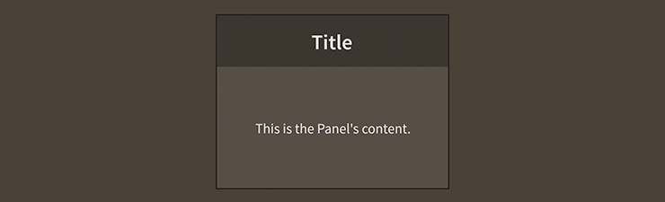

# How to use the Feathers `Panel` component

The [`Panel`](../api-reference/feathers/controls/Panel.html) component is a container that supports layout and scrolling, similar to [`ScrollContainer`](scroll-container.html), but it also adds a header and an optional footer above and below the content, respectively. This component is useful for creating windows and dialogs and making any kind of grouping that needs a header or title.

<figure>

<figcaption>A `Panel` component skinned with `MetalWorksMobileTheme`</figcaption>
</figure>

## The Basics

First, let's create a `Panel` container and add it to the display list:

``` code
var panel:Panel = new Panel();
this.addChild( panel );
```

We can easily add a title to the panel's header by setting the [`title`](../api-reference/feathers/controls/Panel.html#title) property.

``` code
panel.title = "Tools";
```

A `Panel` works a lot like any [`DisplayObjectContainer`](http://doc.starling-framework.org/core/starling/display/DisplayObjectContainer.html), so you can use the standard `addChild()`, `removeChild()` and other display list manipulation functions.

``` code
var xPosition:Number = 0;
for(var i:int = 0; i < 5; i++)
{
    var quad:Quad = new Quad( 100, 100, 0xff0000 );
    quad.x = xPosition;
    panel.addChild( quad );
    xPosition += quad.width + 10;
}
```

The children of a `Panel` do not need to be Feathers UI controls. As you can see above, we've added some Starling [`Quad`](http://doc.starling-framework.org/core/starling/display/Quad.html) instances.

By default, the `Panel` will automatically resize itself to fit the area that the children occupy (plus its header and footer). We can set the width and height manually, if desired, to override this behavior:

``` code
panel.width = 200;
panel.height = 200;
```

### The Header

By default, a panel's header sub-component is an instance of the [`Header`](header.html) class. However, it can be any Feathers component. The only restriction is that the header must appear on the top edge of the panel and fill the entire panel width.

You can customize the panel's header in a couple of different ways. The first way is to provide a custom [`headerFactory`](../api-reference/feathers/controls/Panel.html#headerFactory):

``` code
panel.headerFactory = function():Header
{
    var header:Header = new Header();
    
    var closeButton:Button = new Button();
    closeButton.label = "Close";
    closeButton.addEventListener( Event.TRIGGERED, closeButton_triggeredHandler );
    header.rightItems = new <DisplayObject>[ closeButton ];
    
    return header;
}
```

You can set any properties that you desire on the header inside this factory, including skins, if you're not using a theme.

Alternatively, you could use the default header factory, which simply creates a `Header` instance, and pass in properties through the [`headerProperties`](../api-reference/feathers/controls/Panel.html#headerProperties) object.

``` code
var closeButton:Button = new Button();
closeButton.label = "Close";
closeButton.addEventListener( Event.TRIGGERED, closeButton_triggeredHandler );
panel.headerProperties.rightItems = new <DisplayObject>[ closeButton ];
```

In general, you should only pass properties to the panel's header through `headerProperties` if you need to change them after the header is created. Using `headerFactory` will provide slightly better performance, and your development environment will be able to provide code hinting thanks to stronger typing.

Remember, the panel's header does not need to be a `Header` instance. It simply needs to be a Feathers component. If you wanted to make a `Panel` with a clickable header, you could provide a `headerFactory` that returns a [`Button`](button.html):

``` code
panel.headerFactory = function():Button
{
    var button:Button = new Button();
    button.addEventListener( Event.TRIGGERED, panelHeaderButton_triggeredHandler );
    return button;
}
```

In this case, you should also update the [`headerTitleField`](../api-reference/feathers/controls/Panel.html#headerTitleField) property so that the panel's title is correctly displayed by the button's [`label`](../api-reference/feathers/controls/Button.html#label):

``` code
panel.headerTitleField = "label";
```

Using a button as the panel's header might be useful for creating a panel that can collapse and expand.

### The Footer

By default, a panel doesn't have a footer. However, if you want to add a footer, it may be any Feathers component. The only restriction is that the footer must appear on the bottom edge of the panel and fill the entire panel width.

You can customize the panel's footer in two ways. The first way is to provide a custom [`footerFactory`](../api-reference/feathers/controls/Panel.html#footerFactory):

``` code
panel.footerFactory = function():LayoutGroup
{
    var footer:LayoutGroup = new LayoutGroup();
    footer.styleNameList.add( LayoutGroup.ALTERNATE_STYLE_NAME_TOOLBAR );
    return footer;
}
```

You can set any properties that you desire on the footer inside this factory, including skins. In this example, we're using a [`LayoutGroup`] with a "toolbar" alternate style name. Typically, a theme will use this style name to make a `LayoutGroup` look similar to `Header` and give it a horizontal layout (the exact behavior depends on the theme, but this is the most common behavior).

Alternatively, you could use a simple footer factory that sets no properties, and pass in properties through the [`footerProperties`](../api-reference/feathers/controls/Panel.html#footerProperties) object.

``` code
panel.footerProperties.clipContent = true;
```

In general, you should only skins to the panel's footer through `footerProperties` if you need to change properties or skins after the footer is created. Using `footerFactory` will provide slightly better performance, and your development environment will be able to provide code hinting thanks to stronger typing.

## Layout

We manually positioned the quads in the example code above. Instead, let's apply a [`HorizontalLayout`](horizontal-layout.html) to the children of a `Panel` to do the positioning manually:

``` code
var layout:HorizontalLayout = new HorizontalLayout();
layout.gap = 10;
panel.layout = layout;
```

Here, we've set the [`gap`](../api-reference/feathers/layout/HorizontalLayout.html#gap) property, but `HorizontalLayout` provides many more useful features. See [How to use `HorizontalLayout` with Feathers containers](horizontal-layout.html) for complete details.

<aside class="info">Feathers comes with a number of different [layouts](index.html#layouts), in addition to `HorizontalLayout`.</aside>

## Skinning a `Panel`

The skins for a `Panel` control are divided into the header, the content, and the footer. Additionally, a panel may have background skins and various other styles. For full details about what skin and style properties are available, see the [`Panel` API reference](../api-reference/feathers/controls/Panel.html). We'll look at a few of the most common properties below.

### Background Skins and Basic Styles

We'll start the skinning process by giving our panel appropriate background skins.

``` code
panel.backgroundSkin = new Image( enabledTexture );
panel.backgroundDisabledSkin = new Image( disabledTexture );
```

The [`backgroundSkin`](../api-reference/feathers/controls/Scroller.html#backgroundSkin) property provides the default background for when the panel is enabled. The [`backgroundDisabledSkin`](../api-reference/feathers/controls/Scroller.html#backgroundDisabledSkin) is displayed when the panel is disabled. If the `backgroundDisabledSkin` isn't provided to a disabled panel, it will fall back to using the `backgroundSkin` in the disabled state.

Padding may be added around the edges of the panel's content. This padding is different than any type of padding that may be provided by the layout. The layout padding is applied inside the panel's content, but the panel's padding is applied outside of the content, and is generally used to show a bit of the background as a border around the content.

``` code
panel.paddingTop = 15;
panel.paddingRight = 20;
panel.paddingBottom = 15;
panel.paddingLeft = 20;
```

If all four padding values should be the same, you may use the [`padding`](../api-reference/feathers/controls/Scroller.html#padding) property to quickly set them all at once:

``` code
panel.padding = 20;
```

### Skinning the Header

This section only explains how to access the header sub-component. The header may be any type of Feathers control. Please read the appropriate documentation for full details about the skinning properties that are available on the component that is used for the header.

<aside class="info">For the default header, please read [How to use the Feathers `Header` component](header.html) for full details about the skinning properties that are available on `Header` components.</aside>

#### With a Theme

If you're creating a [theme](themes.html), you can target the [`Panel.DEFAULT_CHILD_STYLE_NAME_HEADER`](../api-reference/feathers/controls/Panel.html#DEFAULT_CHILD_STYLE_NAME_HEADER) style name.

``` code
getStyleProviderForClass( Header )
    .setFunctionForStyleName( Panel.DEFAULT_CHILD_STYLE_NAME_HEADER, setPanelHeaderStyles );
```

You can override the default style name to use a different one in your theme, if you prefer:

``` code
panel.customHeaderStyleName = "custom-header";
```

You can set the function for the [`customHeaderStyleName`](../api-reference/feathers/controls/Panel.html#customHeaderStyleName) like this:

``` code
getStyleProviderForClass( Header )
    .setFunctionForStyleName( "custom-header", setPanelCustomHeaderStyles );
```

#### Without a Theme

If you are not using a theme, you can use [`headerFactory`](../api-reference/feathers/controls/Panel.html#headerFactory) to provide skins for the panel's header:

``` code
panel.headerFactory = function():Header
{
    var header:Header = new Header();
    //skin the header here
    header.backgroundSkin = new Image( headerBackgroundTexture );
    return header;
}
```

### Skinning the Footer

This section only explains how to access the footer sub-component. The footer may be any type of Feathers control. Please read the appropriate documentation for full details about the skinning properties that are available on the component that is used for the footer.

#### With a Theme

If you're creating a [theme](themes.html), you can target the [`Panel.DEFAULT_CHILD_STYLE_NAME_FOOTER`](../api-reference/feathers/controls/Panel.html#DEFAULT_CHILD_STYLE_NAME_FOOTER) style name. In the following example, we'll assume that the footer is a `ScrollContainer`, but it could be any type of Feathers component.

``` code
getStyleProviderForClass( ScrollContainer )
    .setFunctionForStyleName( Panel.DEFAULT_CHILD_STYLE_NAME_FOOTER, setPanelFooterStyles );
```

You can override the default style name to use a different one in your theme, if you prefer:

``` code
panel.customFooterStyleName = "custom-footer";
```

You can set the function for the [`customFooterStyleName`](../api-reference/feathers/controls/Panel.html#customFooterStyleName) like this:

``` code
getStyleProviderForClass( ScrollContainer )
    .setFunctionForStyleName( "custom-footer", setPanelCustomFooterStyles );
```

#### Without a Theme

If you are not using a theme, you can use [`footerFactory`](../api-reference/feathers/controls/Panel.html#footerFactory) to provide skins for the panel's footer:

``` code
panel.footerFactory = function():ScrollContainer
{
    var footer:ScrollContainer = new ScrollContainer();
    //skin the footer here
    footer.backgroundSkin = new Image( footerBackgroundTexture );
    return footer;
}
```

### Skinning the Scroll Bars

This section only explains how to access the horizontal scroll bar and vertical scroll bar sub-components. Please read [How to use the Feathers `ScrollBar` component](scroll-bar.html) (or [`SimpleScrollBar`](simple-scroll-bar.html)) for full details about the skinning properties that are available on scroll bar components.

#### With a Theme

If you're creating a [theme](themes.html), you can target the [`Scroller.DEFAULT_CHILD_STYLE_NAME_HORIZONTAL_SCROLL_BAR`](../api-reference/feathers/controls/Scroller.html#DEFAULT_CHILD_STYLE_NAME_HORIZONTAL_SCROLL_BAR) style name for the horizontal scroll bar and the [`Scroller.DEFAULT_CHILD_STYLE_NAME_VERTICAL_SCROLL_BAR`](../api-reference/feathers/controls/Scroller.html#DEFAULT_CHILD_STYLE_NAME_VERTICAL_SCROLL_BAR) style name for the vertical scroll bar.

``` code
getStyleProviderForClass( ScrollBar )
    .setFunctionForStyleName( Scroller.DEFAULT_CHILD_STYLE_NAME_HORIZONTAL_SCROLL_BAR, setHorizontalScrollBarStyles );
getStyleProviderForClass( ScrollBar )
    .setFunctionForStyleName( Scroller.DEFAULT_CHILD_STYLE_NAME_VERTICAL_SCROLL_BAR, setVerticalScrollBarStyles );
```

You can override the default style names to use different ones in your theme, if you prefer:

``` code
panel.customHorizontalScrollBarStyleName = "custom-horizontal-scroll-bar";
panel.customVerticalScrollBarStyleName = "custom-vertical-scroll-bar";
```

You can set the function for the [`customHorizontalScrollBarStyleName`](../api-reference/feathers/controls/Scroller.html#customHorizontalScrollBarStyleName) and the [`customVerticalScrollBarStyleName`](../api-reference/feathers/controls/Scroller.html#customVerticalScrollBarStyleName) like this:

``` code
getStyleProviderForClass( ScrollBar )
    .setFunctionForStyleName( "custom-horizontal-scroll-bar", setCustomHorizontalScrollBarStyles );
getStyleProviderForClass( ScrollBar )
    .setFunctionForStyleName( "custom-vertical-scroll-bar", setCustomVerticalScrollBarStyles,  );
```

#### Without a Theme

If you are not using a theme, you can use [`horizontalScrollBarFactory`](../api-reference/feathers/controls/Scroller.html#horizontalScrollBarFactory) and [`verticalScrollBarFactory`](../api-reference/feathers/controls/Scroller.html#verticalScrollBarFactory) to provide skins for the panel's scroll bars:

``` code
panel.horizontalScrollBarFactory = function():ScrollBar
{
    var scrollBar:ScrollBar = new ScrollBar();
    //skin the scroll bar here
    scrollBar.trackLayoutMode = TrackLayoutMode.SINGLE;
    return scrollBar;
}
```

## Customize scrolling behavior

A number of properties are available to customize scrolling behavior and the scroll bars.

### Interaction Modes

Scrolling containers provide two main interaction modes, which can be changed using the [`interactionMode`](../api-reference/feathers/controls/Scroller.html#interactionMode) property.

By default, you can scroll using touch, just like you would on many mobile devices including smartphones and tablets. This mode allows you to grab the container anywhere within its bounds and drag it around to scroll. This mode is defined by the constant, [`ScrollInteractionMode.TOUCH`](../api-reference/feathers/controls/ScrollInteractionMode.html#TOUCH).

Alternatively, you can set `interactionMode` to [`ScrollInteractionMode.MOUSE`](../api-reference/feathers/controls/ScrollInteractionMode.html#MOUSE). This mode allows you to scroll using the horizontal or vertical scroll bar sub-components. You can also use the mouse wheel to scroll vertically.

Finally, you can set `interactionMode` to [`ScrollInteractionMode.TOUCH_AND_SCROLL_BARS`](../api-reference/feathers/controls/ScrollInteractionMode.html#TOUCH_AND_SCROLL_BARS). This mode allows you to scroll both by dragging the container's content and by using the scroll bars.

### Scroll Bar Display Mode

The [`scrollBarDisplayMode`](../api-reference/feathers/controls/Scroller.html#scrollBarDisplayMode) property controls how and when scroll bars are displayed. This value may be overridden by the scroll policy, as explained below.

The default value is [`ScrollBarDisplayMode.FLOAT`](../api-reference/feathers/controls/ScrollBarDisplayMode.html#FLOAT), which displays the scroll bars as an overlay above the view port's content, rather than affecting the size of the view port. When the scroll bars are floating, they fade out when the container is not actively scrolling. This is a familiar behavior for scroll bars in the touch interaction mode. In the mouse interaction mode, the scroll bars will appear when the mouse hovers over them and then disappear when the hover ends.

To completely hide the scroll bars, but still allow scrolling, you can set `scrollBarDisplayMode` to [`ScrollBarDisplayMode.NONE`](../api-reference/feathers/controls/ScrollBarDisplayMode.html#NONE).

If you want the scroll bars to always be visible outside of the content in a fixed position, you can set `scrollBarDisplayMode` to [`ScrollBarDisplayMode.FIXED`](../api-reference/feathers/controls/ScrollBarDisplayMode.html#FIXED). This is best for traditional desktop scrollable content.

Finally, you can set `scrollBarDisplayMode` to [`ScrollBarDisplayMode.FIXED_FLOAT`](../api-reference/feathers/controls/ScrollBarDisplayMode.html#FIXED_FLOAT) to display the scroll bar as an overlay above the view port's content, but it does not fade away.

### Scroll Policies

The two previous properties control how scrolling works. The [`horizontalScrollPolicy`](../api-reference/feathers/controls/Scroller.html#horizontalScrollPolicy) and [`verticalScrollPolicy`](../api-reference/feathers/controls/Scroller.html#verticalScrollPolicy) properties control whether scrolling is enabled or not.

The default scroll policy for both directions is [`ScrollPolicy.AUTO`](../api-reference/feathers/controls/ScrollPolicy.html#AUTO). If the content's width is greater than the view port's width, the panel may scroll horizontally (same for height and vertical scrolling). If not, then the panel will not scroll in that direction. In addition to the `scrollBarDisplayMode`, this can affect whether the scroll bar is visible or not.

You can completely disable scrolling in either direction, set the scroll policy to [`ScrollPolicy.OFF`](../api-reference/feathers/controls/ScrollPolicy.html#OFF). The scroll bar will not be visible, and the panel won't scroll, even if the content is larger than the view port.

Finally, you can ensure that scrolling is always enabled by setting the scroll policy to [`ScrollPolicy.ON`](../api-reference/feathers/controls/ScrollPolicy.html#ON). If combined with `hasElasticEdges` in the touch interaction mode, it will create a playful edge that always bounces back, even when the content is smaller than the view port. If using the mouse interaction mode, the scroll bar may always be visible under the same circumstances, though it may be disabled if the content is smaller than the view port.

### Paging

Set the [`snapToPages`](../api-reference/feathers/controls/Scroller.html#snapToPages) property to true to make the scroll position snap to the nearest full page. A page is defined as a multiple of the view ports width or height. If the view port is 100 pixels wide, then the first horizontal page starts at 0 pixels, the second at 100, and the third at 200.

The [`pageWidth`](../api-reference/feathers/controls/Scroller.html#pageWidth) and [`pageHeight`](../api-reference/feathers/controls/Scroller.html#pageHeight) properties may be used to customize the size of a page. Rather than using the full view port width or height, any pixel value may be specified for page snapping.

## Related Links

-   [`feathers.controls.Panel` API Documentation](../api-reference/feathers/controls/Panel.html)