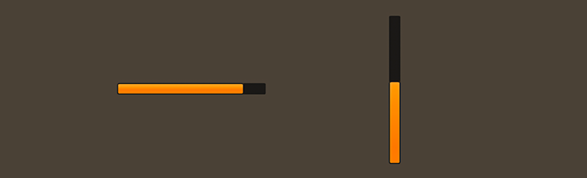

# How to use the Feathers `ProgressBar` component

The [`ProgressBar`](../api-reference/feathers/controls/ProgressBar.html) class displays a visual indicator of how much of a task has been completed. It may fill up horizontally or vertically.

<figure>

<figcaption>`ProgressBar` components skinned with `MetalWorksMobileTheme`</figcaption>
</figure>

-   [The Basics](#the-basics)

-   [Skinning a `ProgressBar`](#skinning-a-progressbar)

## The Basics

First, let's create a `ProgressBar` control, set up its range of values, and add it to the display list.

``` actionscript
var progress:ProgressBar = new ProgressBar();
progress.minimum = 0;
progress.maximum = 100;
progress.value = 10;
this.addChild( progress );
```

The [`minimum`](../api-reference/feathers/controls/ProgressBar.html#minimum) and [`maximum`](../api-reference/feathers/controls/ProgressBar.html#maximum) properties set the range of the progress bar. The [`value`](../api-reference/feathers/controls/ProgressBar.html#value) property must be a value between the minimum and maximum.

By default, the progress bar direction is horizontal. You can change the [`direction`](../api-reference/feathers/controls/ProgressBar.html#direction) property to make the progress bar vertically-oriented instead.

``` actionscript
progress.direction = Direction.VERTICAL;
```

## Skinning a `ProgressBar`

A progress bar provides a number of properties that can be used to customize its appearance. For full details about what skin and style properties are available, see the [`ProgressBar` API reference](../api-reference/feathers/controls/ProgressBar.html). We'll look at a few of the most common ways of styling a progress bar below.

### Background and fill skins

The [`backgroundSkin`](../api-reference/feathers/controls/ProgressBar.html#backgroundSkin) and [`fillSkin`](../api-reference/feathers/controls/ProgressBar.html#fillSkin) properties are used to customize the appearance of the progress bar.

``` actionscript
var backgroundSkin:Image = new Image( backgroundTexture );
backgroundSkin.width = 150;
progress.backgroundSkin = backgroundSkin;
 
var fillSkin:Image = new Image( fillTexture );
fillSkin.width = 20;
progress.fillSkin = fillSkin;
```

Notice that we're setting width values on the skins before passing them in. For the background, we're doing this so that the initial width of the progress bar is at least 150 pixels wide. We can still set the `width` property on the progress bar directly to a smaller or a larger value, if we'd prefer. However, if we don't set the progress bar's width explicitly, the progress bar knows to automatically calculate it's dimensions from the size of the background skin.

For the fill skin, we want to ensure that the fill is never smaller than 20 pixels. Perhaps the fill is a rounded rectangle, so the edges need to be at least 10 pixels wide before they start to overlap or distort. We want to avoid that, so we set the width of the `fillSkin` to inform the progress bar that this is the width that corresponds to the value of the `minimum` property. In other words, if the `value` property is equal to the `minimum` property (in this case, if they are `0`), then the fill skin will be 20 pixels wide. As the `value` property increases toward `100`, the fill skin's width will increase up to 150 pixels.

Additionally, two other skin properties, [`backgroundDisabledSkin`](../api-reference/feathers/controls/ProgressBar.html#backgroundDisabledSkin) and [`fillDisabledSkin`](../api-reference/feathers/controls/ProgressBar.html#fillDisabledSkin), may be used to give a progress bar a different appearance when it is disabled. These skins are optional. For instance, if the `backgroundDisabledSkin` is not provided, the regular `backgroundSkin` will be used when [`isEnabled`](../api-reference/feathers/core/FeathersControl.html#isEnabled) is false.

### Layout

Like many components, the progress bar has padding values. These can be used to add space between the edge of the background and the edge of the fill. For instance, you might want to display part of the background as a border around the fill.

``` actionscript
progress.paddingTop = 2;
progress.paddingRight = 3;
progress.paddingBottom = 2;
progress.paddingLeft = 3;
```

If all four padding values should be the same, you may use the [`padding`](../api-reference/feathers/controls/ProgressBar.html#padding) property to quickly set them all at once:

``` actionscript
progress.padding = 20;
```

## Related Links

-   [`feathers.controls.ProgressBar` API Documentation](../api-reference/feathers/controls/ProgressBar.html)