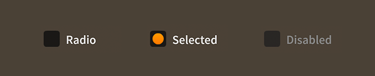

# How to use the Feathers `Radio` component

The [`Radio`](../api-reference/feathers/controls/Radio.html) component is actually a [`ToggleButton`](toggle-button.html) component, but it is given a different visual appearance. Typically, multiple `Radio` instances are added to a [`ToggleGroup`](../api-reference/feathers/core/ToggleGroup.html) to ensure that only one `Radio` in the group is selected at a time.

<figure>

<figcaption>`Radio` components skinned with `MetalWorksMobileTheme`</figcaption>
</figure>

A skinned `Radio` component usually has no background (or a transparent one) and the touch states of the radio are displayed through the icon skins. For more detailed information about the skinning options available to `Radio`, see [How to use the Feathers `ToggleButton` component](toggle-button.html).

## Using `ToggleGroup`

If no [`ToggleGroup`](../api-reference/feathers/core/ToggleGroup.html) is provided, a `Radio` will automatically add itself to [`Radio.defaultRadioGroup`](../api-reference/feathers/controls/Radio.html#defaultRadioGroup). In general, though, you should always create a `ToggleGroup` for a distinct set of radio buttons.

``` code
var group:ToggleGroup = new ToggleGroup();
 
var radio1:Radio = new Radio();
radio1.label = "One";
radio1.toggleGroup = group;
this.addChild( radio1 );
 
var radio2:Radio = new Radio();
radio2.label = "Two";
radio2.toggleGroup = group;
this.addChild( radio2 );
 
var radio3:Radio = new Radio();
radio3.label = "Three";
radio3.toggleGroup = group;
this.addChild( radio3 );
```

Simply pass the `ToggleGroup` instance to the [`toggleGroup`](../api-reference/feathers/controls/Radio.html#toggleGroup) property of a `Radio` instance.

Listen for the [`Event.CHANGE`](../api-reference/feathers/core/ToggleGroup.html#event:change) event dispatched by the toggle group to know when the selected radio button has changed.

``` code
group.addEventListener( Event.CHANGE, group_changeHandler );
```

A listener might look like this:

``` code
function group_changeHandler( event:Event ):void
{
    var group:ToggleGroup = ToggleGroup( event.currentTarget );
    trace( "group.selectedIndex:", group.selectedIndex );
}
```

Use the [`selectedIndex`](../api-reference/feathers/core/ToggleGroup.html#selectedIndex) to get the numeric index of the selected radio button (based on the order that the radio buttons were added to the toggle group). The [`selectedItem`](../api-reference/feathers/core/ToggleGroup.html#selectedItem) will reference the selected radio button directly:

``` code
var radio:Radio = Radio( group.selectedItem );
trace( "radio.label:", radio.label );
```

## Skinning a `Radio`

A skinned `Radio` component usually has no background (or a transparent one) and the touch states of the radio are displayed through the icon skins. For full details about what skin and style properties are available, see the [`Radio` API reference](../api-reference/feathers/controls/Radio.html).

As mentioned above, `Radio` is a subclass of `ToggleButton`. For more detailed information about the skinning options available to `Radio`, see [How to use the Feathers `ToggleButton` component](toggle-button.html).

## User Experience

In general, a set of `Radio` controls should be used only when there are three or more choices that a user must make. If there are only two choices, a `Check` or a `ToggleSwitch` may be more appropriate. If there are so many choices that a set of `Radio` controls will fill a significant amount of space on screen, a `PickerList` is probably a better choice. The default item renderer of a `PickerList` is also a subclass of `ToggleButton`, so it's possible to style the list's items to look like radio buttons, if you prefer.

## Related Links

-   [`feathers.controls.Radio` API Documentation](../api-reference/feathers/controls/Radio.html)

-   [`feathers.core.ToggleGroup` API Documentation](../api-reference/feathers/core/ToggleGroup.html)

-   [How to use the Feathers `ToggleButton` component](toggle-button.html)