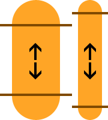

# How to use the Feathers `Scale3Image` display object

The `Scale3Image` class displays a texture divided into three regions, either horizontally or vertically. When the direction of a `Scale3Image` is horizontal and the width is changed, the left and right regions will not scale and the center region will scale horizontally. When the direction of a `Scale3Image` is vertical, the top and bottom regions will not scale and the center region will scale vertically. This display object allows you to create skins with "pill" shapes for UI components like buttons, and sub-components like thumbs and tracks on scroll bars and sliders.

## Regions


The image above shows two ways to divide a "pill" shape into three regions. The two lines on each shape show where the image is sliced. The exact pixel location of these "slices" are easily configurable, as you will see later.

The image below uses arrows to show how each of the regions will scale. Some regions will not scale. Some will scale only in one direction, horizontally or vertically.


From this point forward, each region will be named by its horizontal or vertical position. Horizontal positions are "left", "center", and "right". Vertical positions are "top", "middle", and "bottom".

The top, bottom, left, and right regions (the "caps" of the pill shape) will not be scaled.

The center region will scale horizontally. It will not scale vertically.

The middle region will scale vertically. It will not scale horizontally.

### Scaling in the Opposite Direction

`Scale3Image` is designed to mainly scale in one direction. However, it is capable of scaling in the other direction too. In this situation, the "caps" will scale to maintain aspect ratio. As an example, if a cap is a half circle, it will remain perfectly round after scaling in both directions. The goal is to avoid distortion of the caps.



The image above shows how the caps maintain aspect ratio when scaled in the opposite direction.

## The Grid

Two numeric values defines the *grid*. Actually, these specifically defines the center or middle region described above. Each of the other regions can be automatically calculated using these values along with the original width and height of the texture.

The horizontal orange pill shape pictured above is 200 pixels wide and 80 pixels tall. Using the lines in the picture, we'll define the grid. The x value is 40. The width value is 120 pixels.

``` code
40 + 120 + 40 = 200
```

It works similarly for a vertical pill shape, except the two values represent y and height.

The left and right regions don't necessarily need to be the same size. Neither do the top and bottom regions. However, for pill shapes, it will often be the case that these regions are the same size.

## Code

First, let's create a `feathers.textures.Scale3Textures` object:

``` code
var texture:Texture = Texture.fromBitmapData( bitmapData );
var textures:Scale3Textures = new Scale3Textures( texture, 40, 120, Scale3Textures.DIRECTION_HORIZONTAL );
```

This object is created from a standard `starling.textures.Texture` object, the two region values, and the constant representing the direction of the regions. Either `Scale3Image.DIRECTION_HORIZONTAL` or `Scale3Image.DIRECTION_VERTICAL`.

We'll pass the `Scale3Textures` object to a new `feathers.display.Scale3Image` object:

``` code
var image:Scale3Image = new Scale3Image( textures );
image.width = 100;
this.addChild( image );
```

You can easily change the `width` property for horizontal `Scale3Image` objects (or the `height` property for vertical images), and the regions will scale appropriately, as described above.

## Related Links

-   [`feathers.display.Scale3Image` API Documentation](../api-reference/feathers/display/Scale3Image.html)

For more tutorials, return to the [Feathers Documentation](index.html).


