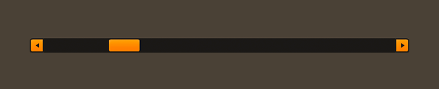

# How to use the Feathers `ScrollBar` component

The [`ScrollBar`](../api-reference/feathers/controls/ScrollBar.html) component selects a numeric value in a specific range by dragging a thumb along a track, or by triggering one of its step buttons at the beginning or end of the track. A scroll bar may be displayed in either a horizontal or a vertical direction. This component is designed to be used with components that support scrolling, like [`ScrollContainer`](scroll-container.html) and [`List`](list.html).

<figure>

<figcaption>A horizontal `ScrollBar` component skinned with `MetalWorksDesktopTheme`</figcaption>
</figure>

<aside class="info">Additionally, Feathers offers a [`SimpleScrollBar`](simple-scroll-bar.html) component. This is a mobile-style scroll bar that only has a thumb to visually indicate the scroll position and range. It has no visible track nor buttons for stepping the scroll position.</aside>

## The Basics

You can use the `ScrollBar` with a class like `ScrollContainer` or `List` by instantiating it in the [`horizontalScrollBarFactory`](../api-reference/feathers/controls/Scroller.html#horizontalScrollBarFactory) or the [`verticalScrollBarFactory`](../api-reference/feathers/controls/Scroller.html#verticalScrollBarFactory).

``` code
list.horizontalScrollBarFactory = function():IScrollBar
{
    return new ScrollBar();
}
```

The container will automatically handle setting properties like [`direction`](../api-reference/feathers/controls/ScrollBar.html#direction), [`minimum`](../api-reference/feathers/controls/ScrollBar.html#minimum), [`maximum`](../api-reference/feathers/controls/ScrollBar.html#maximum), and [`step`](../api-reference/feathers/controls/ScrollBar.html#step), and it will automatically listen for [`Event.CHANGE`](../api-reference/feathers/controls/ScrollBar.html#event:change) to know when the [`value`](../api-reference/feathers/controls/ScrollBar.html#value) property changes.

<aside class="info">If, for some reason, you want to use a `ScrollBar` outside of a container, the values like `minimum`, `maximum`, `step` and `value` that are normally handled by the container work similarly to the same properties on a [`Slider`](slider.html) component.</aside>

## Skinning a `ScrollBar`

The skins for a `ScrollBar` control are divided into several parts, including the thumb, the track(s), and the increment and decrement buttons. For full details about what skin and style properties are available, see the [`ScrollBar` API reference](../api-reference/feathers/controls/ScrollBar.html).

### Targeting a `ScrollBar` in a theme

If you are creating a [theme](themes.html), you can set a function for the default styles like this:

``` code
getStyleProviderForClass( ScrollBar ).defaultStyleFunction = setScrollBarStyles;
```

If you want to customize a specific scroll bar to look different than the default, you may use a custom style name to call a different function:

``` code
scrollBar.styleNameList.add( "custom-scroll-bar" );
```

You can set the function for the custom style name like this:

``` code
getStyleProviderForClass( ScrollBar )
    .setFunctionForStyleName( "custom-scroll-bar", setCustomScrollBarStyles );
```

Trying to change the scroll bar's styles and skins outside of the theme may result in the theme overriding the properties, if you set them before the scroll bar was added to the stage and initialized. Learn to [extend an existing theme](extending-themes.html) to add custom skins.

If you aren't using a theme, then you may set any of the scroll bar's properties directly.

### Skinning the Thumb

This section only explains how to access the thumb sub-component. Please read [How to use the Feathers `Button` component](button.html) for full details about the skinning properties that are available on `Button` components.

#### With a Theme

If you're creating a [theme](themes.html), you can target the [`ScrollBar.DEFAULT_CHILD_STYLE_NAME_THUMB`](../api-reference/feathers/controls/ScrollBar.html#DEFAULT_CHILD_STYLE_NAME_THUMB) style name.

``` code
getStyleProviderForClass( Button )
    .setFunctionForStyleName( ScrollBar.DEFAULT_CHILD_STYLE_NAME_THUMB, setScrollBarThumbStyles );
```

You can override the default style name to use a different one in your theme, if you prefer:

``` code
scrollBar.customThumbStyleName = "custom-thumb";
```

You can set the function for the [`customThumbStyleName`](../api-reference/feathers/controls/ScrollBar.html#customThumbStyleName) like this:

``` code
getStyleProviderForClass( Button )
    .setFunctionForStyleName( "custom-thumb", setScrollBarCustomThumbStyles );
```

#### Without a Theme

If you are not using a theme, you can use [`thumbFactory`](../api-reference/feathers/controls/ScrollBar.html#thumbFactory) to provide skins for the scroll bar's thumb:

``` code
scrollBar.thumbFactory = function():Button
{
    var button:Button = new Button();
    //skin the thumb here
    button.defaultSkin = new Image( upTexture );
    button.downSkin = new Image( downTexture );
    return button;
}
```

Alternatively, or in addition to the `thumbFactory`, you may use the [`thumbProperties`](../api-reference/feathers/controls/ScrollBar.html#thumbProperties) to pass skins to the thumb.

``` code
scrollBar.thumbProperties.defaultSkin = new Image( upTexture );
scrollBar.thumbProperties.downSkin = new Image( downTexture );
```

In general, you should only pass skins to the scroll bar's thumb through `thumbProperties` if you need to change skins after the thumb is created. Using `thumbFactory` will provide slightly better performance, and your development environment will be able to provide code hinting thanks to stronger typing.

### Track(s) and Layout

The scroll bar's track is made from either one or two buttons, depending on the value of the [`trackLayoutMode`](../api-reference/feathers/controls/ScrollBar.html#trackLayoutMode) property. The default value of this property is [`TrackLayoutMode.SINGLE`](../api-reference/feathers/controls/TrackLayoutMode.html#SINGLE), which creates a single track that fills the entire width and height of the scroll bar.

If we'd like to have separate buttons for both sides of the track (one for the minimum side and another for the maximum side), we can set `trackLayoutMode` to [`TrackLayoutMode.SPLIT`](../api-reference/feathers/controls/TrackLayoutMode.html#SPLIT). In this mode, the width or height of each track (depending on the direction of the scroll bar) is adjusted as the thumb moves to ensure that the two tracks always meet at the center of the thumb.

`TrackLayoutMode.SINGLE` is often best for cases where the track's appearance is mostly static. When you want down or hover states for the track, `TrackLayoutMode.SPLIT` works better because the state will only change on one side of the thumb, making it more visually clear to the user what is happening.

When the value of `trackLayoutMode` is `TrackLayoutMode.SINGLE`, the scroll bar will have a minimum track, but it will not have a maximum track. The minimum track will fill the entire region that is scrollable.

### Skinning the Minimum Track

This section only explains how to access the minimum track sub-component. Please read [How to use the Feathers `Button` component](button.html) for full details about the skinning properties that are available on `Button` components.

#### With a Theme

If you're creating a [theme](themes.html), you can target the [`ScrollBar.DEFAULT_CHILD_STYLE_NAME_MINIMUM_TRACK`](../api-reference/feathers/controls/ScrollBar.html#DEFAULT_CHILD_STYLE_NAME_MINIMUM_TRACK) style name.

``` code
getStyleProviderForClass( Button )
    .setFunctionForStyleName( ScrollBar.DEFAULT_CHILD_STYLE_NAME_MINIMUM_TRACK, setScrollBarMinimumTrackStyles );
```

You can override the default style name to use a different one in your theme, if you prefer:

``` code
scrollBar.customMinimumTrackStyleName = "custom-minimum-track";
```

You can set the function for the [`customMinimumTrackStyleName`](../api-reference/feathers/controls/ScrollBar.html#customMinimumTrackStyleName) like this:

``` code
getStyleProviderForClass( Button )
    .setFunctionForStyleName( "custom-minimum-track", setScrollBarCustomMinimumTrackStyles );
```

#### Without a Theme

If you are not using a theme, you can use [`minimumTrackFactory`](../api-reference/feathers/controls/ScrollBar.html#minimumTrackFactory) to provide skins for the scroll bar's minimum track:

``` code
scrollBar.minimumTrackFactory = function():Button
{
    var button:Button = new Button();
    //skin the minimum track here
    button.defaultSkin = new Image( upTexture );
    button.downSkin = new Image( downTexture );
    return button;
}
```

Alternatively, or in addition to the `minimumTrackFactory`, you may use the [`minimumTrackProperties`](../api-reference/feathers/controls/ScrollBar.html#minimumTrackProperties) to pass skins to the minimum track.

``` code
scrollBar.minimumTrackProperties.defaultSkin = new Image( upTexture );
scrollBar.minimumTrackProperties.downSkin = new Image( downTexture );
```

In general, you should only pass properties to the scroll bar's minimum track through `minimumTrackProperties` if you need to change these values after the minimum track is created. Using `minimumTrackFactory` will provide slightly better performance, and your development environment will be able to provide code hinting thanks to stronger typing.

### Skinning the Maximum Track

This section only explains how to access the maximum track sub-component. Please read [How to use the Feathers `Button` component](button.html) for full details about the skinning properties that are available on `Button` components.

The scroll bar's maximum track may be skinned similarly to the minimum track. The style name to use with [themes](themes.html) is [`ScrollBar.DEFAULT_CHILD_STYLE_NAME_MAXIMUM_TRACK`](../api-reference/feathers/controls/ScrollBar.html#DEFAULT_CHILD_STYLE_NAME_MAXIMUM_TRACK) or you can customize the style name with [`customMaximumTrackStyleName`](../api-reference/feathers/controls/ScrollBar.html#customMaximumTrackStyleName). If you aren't using a theme, then you can use [`maximumTrackFactory`](../api-reference/feathers/controls/ScrollBar.html#maximumTrackFactory) and [`maximumTrackProperties`](../api-reference/feathers/controls/ScrollBar.html#maximumTrackProperties).

### Skinning the Decrement Button

This section only explains how to access the decrement button sub-component. Please read [How to use the Feathers Button component](button.html) for full details about the skinning properties that are available on `Button` components.

#### With a Theme

If you're creating a [theme](themes.html), you can target the [`ScrollBar.DEFAULT_CHILD_STYLE_NAME_DECREMENT_BUTTON`](../api-reference/feathers/controls/ScrollBar.html#DEFAULT_CHILD_STYLE_NAME_DECREMENT_BUTTON) style name.

``` code
getStyleProviderForClass( Button )
    .setFunctionForStyleName( ScrollBar.DEFAULT_CHILD_STYLE_NAME_DECREMENT_BUTTON, setScrollBarDecrementButtonStyles );
```

You can override the default style name to use a different one in your theme, if you prefer:

``` code
scrollBar.customDecrementButtonStyleName = "custom-decrement-button";
```

You can set the function for the [`customDecrementButtonStyleName`](../api-reference/feathers/controls/ScrollBar.html#customDecrementButtonStyleName) like this:

``` code
getStyleProviderForClass( Button )
    .setFunctionForStyleName( "custom-decrement-button", setScrollBarCustomDecrementButtonStyles );
```

#### Without a Theme

If you are not using a theme, you can use [`decrementButtonFactory`](../api-reference/feathers/controls/ScrollBar.html#decrementButtonFactory) to provide skins for the scroll bar's decrement button:

``` code
scrollBar.decrementButtonFactory = function():Button
{
    var button:Button = new Button();
    //skin the decrement button here
    button.defaultSkin = new Image( upTexture );
    button.downSkin = new Image( downTexture );
    return button;
}
```

Alternatively, or in addition to the `decrementButtonFactory`, you may use the [`decrementButtonProperties`](../api-reference/feathers/controls/ScrollBar.html#decrementButtonProperties) to pass skins to the decrement button.

``` code
scrollBar.decrementButtonProperties.defaultSkin = new Image( upTexture );
scrollBar.decrementButtonProperties.downSkin = new Image( downTexture );
```

In general, you should only pass properties to the scroll bar's decrement button through `decrementButtonProperties` if you need to change these values after the decrement button is created. Using `decrementButtonFactory` will provide slightly better performance, and your development environment will be able to provide code hinting thanks to stronger typing.

### Skinning the Increment Button

This section only explains how to access the increment button sub-component. Please read [How to use the Feathers `Button` component](button.html) for full details about the skinning properties that are available on `Button` components.

The scroll bar's increment button may be skinned similarly to the decrement button. The style name to use with [themes](themes.html) is [`ScrollBar.DEFAULT_CHILD_STYLE_NAME_INCREMENT_BUTTON`](../api-reference/feathers/controls/ScrollBar.html#DEFAULT_CHILD_STYLE_NAME_INCREMENT_BUTTON) or you can customize the style name with [`customIncrementButtonStyleName`](../api-reference/feathers/controls/ScrollBar.html#customIncrementButtonStyleName). If you aren't using a theme, then you can use [`incrementButtonFactory`](../api-reference/feathers/controls/ScrollBar.html#incrementButtonFactory) and [`incrementButtonProperties`](../api-reference/feathers/controls/ScrollBar.html#incrementButtonProperties).

## Related Links

-   [`feathers.controls.ScrollBar` API Documentation](../api-reference/feathers/controls/ScrollBar.html)

-   [How to use the Feathers `SimpleScrollBar` Component](simple-scroll-bar.html)