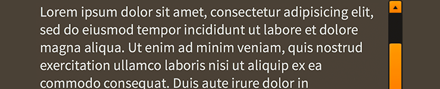

# How to use the Feathers `ScrollText` Component

The [`ScrollText`](../api-reference/feathers/controls/ScrollText.html) is designed for displaying long passages of scrolling text. With longer text, `TextBlockTextRenderer` or `TextFieldTextRenderer` may use too much memory with the textures that they require. `BitmapFontTextRenderer` may be a good alternative, but with enough characters, it may begin to affect performance too. `ScrollText` provides a potential workaround by displaying text on the classic display list as an overlay above Starling.

<figure>

<figcaption>A `ScrollText` component skinned with `MetalWorksDesktopTheme`</figcaption>
</figure>

<aside class="warn">A disadvantage of displaying text on the classic display list is that the text will **always** appear above Stage 3D content, including regular Starling display objects. There is no way to overlay Starling content above `ScrollText`.</aside>

## The Basics

First, let's create a `ScrollText` component, give it some text to display, and add it to the display list.

``` code
var scrollText:ScrollText = new ScrollText();
scrollText.text = "Lorem ipsum dolor sit amet, consectetur adipisicing elit, sed do eiusmod tempor incididunt ut labore et dolore magna aliqua. Ut enim ad minim veniam, quis nostrud exercitation ullamco laboris nisi ut aliquip ex ea commodo consequat. Duis aute irure dolor in reprehenderit in voluptate velit esse cillum dolore eu fugiat nulla pariatur. Excepteur sint occaecat cupidatat non proident, sunt in culpa qui officia deserunt mollit anim id est laborum.";
this.addChild( scrollText );
```

As you can see, the `ScrollText` is added to the Starling display list. This is merely an abstraction. Behind the scenes, a [`flash.text.TextField`](http://help.adobe.com/en_US/FlashPlatform/reference/actionscript/3/flash/text/TextField.html) is created and added to the classic display list. As you move and scale the `ScrollText` instance on the Starling display list, the `TextField` will be manipulated on the classic display list.

If we set the `width` property, the `ScrollText` content will automatically word wrap, and the height will grow.

``` code
scrollText.width = 200;
```

If we set both the `width` and `height` properties, the `ScrollText` content will automatically allow scrolling if the content is taller than the height of the `ScrollText`.

``` code
scrollText.width = 200;
scrollText.height = 200;
```

## Skinning a `ScrollText`

For full details about what skin and style properties are available, see the [`ScrollText` API reference](../api-reference/feathers/controls/ScrollText.html). We'll look at a few of the most common properties below.

### Font Styles

`ScrollText` may be styled with a [`flash.text.TextFormat`](http://help.adobe.com/en_US/FlashPlatform/reference/actionscript/3/flash/text/TextFormat.html). You may use fonts installed on the target device or you may embed a font.

``` code
scrollText.textFormat = new TextFormat( "SomeEmbeddedFont", 12, true );
scrollText.embedFonts = true;
```

Use the [`isHTML`](../api-reference/feathers/controls/ScrollText.html#isHTML) property to display the text as HTML, with the same capabilities as the `htmlText` property of `flash.text.TextField`.

``` code
scrollText.isHTML = true;
scrollText.text = "<font color=\"#ff0000\">Hello world</font>";
```

A number of other styling properties from `flash.text.TextField` are available to use with `ScrollText`, including [`antiAliasType`](../api-reference/feathers/controls/ScrollText.html#antiAliasType), [`backgroundColor`](../api-reference/feathers/controls/ScrollText.html#backgroundColor), [`borderColor`](../api-reference/feathers/controls/ScrollText.html#borderColor), [`gridFitType`](../api-reference/feathers/controls/ScrollText.html#gridFitType), [`styleSheet`](../api-reference/feathers/controls/ScrollText.html#styleSheet), [`sharpness`](../api-reference/feathers/controls/ScrollText.html#sharpness), [`thickness`](../api-reference/feathers/controls/ScrollText.html#thickness), and others. See the [`ScrollText` API documentation](../api-reference/feathers/controls/ScrollText.html) for full details.

### Skinning the Scroll Bars

This section only explains how to access the horizontal scroll bar and vertical scroll bar sub-components. Please read [How to use the Feathers `ScrollBar` component](scroll-bar.html) (or [`SimpleScrollBar`](simple-scroll-bar.html)) for full details about the skinning properties that are available on scroll bar components.

#### With a Theme

If you're creating a [theme](themes.html), you can target the [`Scroller.DEFAULT_CHILD_STYLE_NAME_HORIZONTAL_SCROLL_BAR`](../api-reference/feathers/controls/Scroller.html#DEFAULT_CHILD_STYLE_NAME_HORIZONTAL_SCROLL_BAR) style name for the horizontal scroll bar and the [`Scroller.DEFAULT_CHILD_STYLE_NAME_VERTICAL_SCROLL_BAR`](../api-reference/feathers/controls/Scroller.html#DEFAULT_CHILD_STYLE_NAME_VERTICAL_SCROLL_BAR) style name for the vertical scroll bar.

``` code
getStyleProviderForClass( ScrollBar )
    .setFunctionForStyleName( Scroller.DEFAULT_CHILD_STYLE_NAME_HORIZONTAL_SCROLL_BAR, setHorizontalScrollBarStyles );
getStyleProviderForClass( ScrollBar )
    .setFunctionForStyleName( Scroller.DEFAULT_CHILD_STYLE_NAME_VERTICAL_SCROLL_BAR, setVerticalScrollBarStyles );
```

You can override the default style names to use different ones in your theme, if you prefer:

``` code
scrollText.customHorizontalScrollBarStyleName = "custom-horizontal-scroll-bar";
scrollText.customVerticalScrollBarStyleName = "custom-vertical-scroll-bar";
```

You can set the function for the [`customHorizontalScrollBarStyleName`](../api-reference/feathers/controls/Scroller.html#customHorizontalScrollBarStyleName) and the [`customVerticalScrollBarStyleName`](../api-reference/feathers/controls/Scroller.html#customVerticalScrollBarStyleName) like this:

``` code
getStyleProviderForClass( ScrollBar )
    .setFunctionForStyleName( "custom-horizontal-scroll-bar", setCustomHorizontalScrollBarStyles,  );
getStyleProviderForClass( ScrollBar )
    .setFunctionForStyleName( "custom-vertical-scroll-bar", setCustomVerticalScrollBarStyles );
```

#### Without a Theme

If you are not using a theme, you can use [`horizontalScrollBarFactory`](../api-reference/feathers/controls/Scroller.html#horizontalScrollBarFactory) and [`verticalScrollBarFactory`](../api-reference/feathers/controls/Scroller.html#verticalScrollBarFactory) to provide skins for the scroll bars:

``` code
scrollText.horizontalScrollBarFactory = function():ScrollBar
{
    var scrollBar:ScrollBar = new ScrollBar();
    scrollBar.direction = Direction.HORIZONTAL;
    //skin the scroll bar here
    scrollBar.trackLayoutMode = TrackLayoutMode.SINGLE;
    return scrollBar;
}
```

## Customize scrolling behavior

A number of properties are available to customize scrolling behavior and the scroll bars.

### Interaction Modes

Scrolling containers provide two main interaction modes, which can be changed using the [`interactionMode`](../api-reference/feathers/controls/Scroller.html#interactionMode) property.

By default, you can scroll using touch, just like you would on many mobile devices including smartphones and tablets. This mode allows you to grab the container anywhere within its bounds and drag it around to scroll. This mode is defined by the constant, [`ScrollInteractionMode.TOUCH`](../api-reference/feathers/controls/ScrollInteractionMode.html#TOUCH).

Alternatively, you can set `interactionMode` to [`ScrollInteractionMode.MOUSE`](../api-reference/feathers/controls/ScrollInteractionMode.html#MOUSE). This mode allows you to scroll using the horizontal or vertical scroll bar sub-components. You can also use the mouse wheel to scroll vertically.

Finally, you can set `interactionMode` to [`ScrollInteractionMode.TOUCH_AND_SCROLL_BARS`](../api-reference/feathers/controls/ScrollInteractionMode.html#TOUCH_AND_SCROLL_BARS). This mode allows you to scroll both by dragging the container's content and by using the scroll bars.

### Scroll Bar Display Mode

The [`scrollBarDisplayMode`](../api-reference/feathers/controls/Scroller.html#scrollBarDisplayMode) property controls how and when scroll bars are displayed. This value may be overridden by the scroll policy, as explained below.

The default value is [`ScrollBarDisplayMode.FLOAT`](../api-reference/feathers/controls/ScrollBarDisplayMode.html#FLOAT), which displays the scroll bars as an overlay above the view port's content, rather than affecting the size of the view port. When the scroll bars are floating, they fade out when the container is not actively scrolling. This is a familiar behavior for scroll bars in the touch interaction mode. In the mouse interaction mode, the scroll bars will appear when the mouse hovers over them and then disappear when the hover ends.

To completely hide the scroll bars, but still allow scrolling, you can set `scrollBarDisplayMode` to [`ScrollBarDisplayMode.NONE`](../api-reference/feathers/controls/ScrollBarDisplayMode.html#NONE).

If you want the scroll bars to always be visible outside of the content in a fixed position, you can set `scrollBarDisplayMode` to [`ScrollBarDisplayMode.FIXED`](../api-reference/feathers/controls/ScrollBarDisplayMode.html#FIXED). This is best for traditional desktop scrollable content.

Finally, you can set `scrollBarDisplayMode` to [`ScrollBarDisplayMode.FIXED_FLOAT`](../api-reference/feathers/controls/ScrollBarDisplayMode.html#FIXED_FLOAT) to display the scroll bar as an overlay above the view port's content, but it does not fade away.

### Scroll Policies

The two previous properties control how scrolling works. The [`horizontalScrollPolicy`](../api-reference/feathers/controls/Scroller.html#horizontalScrollPolicy) and [`verticalScrollPolicy`](../api-reference/feathers/controls/Scroller.html#verticalScrollPolicy) properties control whether scrolling is enabled or not.

The default scroll policy for both directions is [`ScrollPolicy.AUTO`](../api-reference/feathers/controls/ScrollPolicy.html#AUTO). If the content's width is greater than the view port's width, the text may scroll horizontally (same for height and vertical scrolling). If not, then the text will not scroll in that direction. In addition to the `scrollBarDisplayMode`, this can affect whether the scroll bar is visible or not.

You can completely disable scrolling in either direction, set the scroll policy to [`ScrollPolicy.OFF`](../api-reference/feathers/controls/ScrollPolicy.html#OFF). The scroll bar will not be visible, and the text won't scroll, even if the content is larger than the view port.

Finally, you can ensure that scrolling is always enabled by setting the scroll policy to [`ScrollPolicy.ON`](../api-reference/feathers/controls/ScrollPolicy.html#ON). If combined with `hasElasticEdges` in the touch interaction mode, it will create a playful edge that always bounces back, even when the content is smaller than the view port. If using the mouse interaction mode, the scroll bar may always be visible under the same circumstances, though it may be disabled if the content is smaller than the view port.

## Related Links

-   [`feathers.controls.ScrollText` API Documentation](../api-reference/feathers/controls/ScrollText.html)