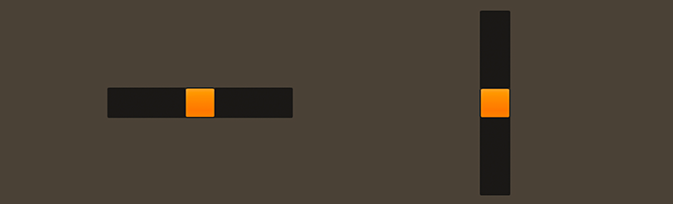

# How to use the Feathers `Slider` component

The [`Slider`](../api-reference/feathers/controls/Slider.html) component selects a numeric value in a specific range by dragging a thumb along a track. A slider may be displayed in either a horizontal or a vertical direction.

<figure>

<figcaption>`Slider` components skinned with `MetalWorksMobileTheme`</figcaption>
</figure>

## The Basics

First, let's create a `Slider` control, set up its range of values, and add it to the display list.

``` code
var slider:Slider = new Slider();
slider.minimum = 0;
slider.maximum = 100;
slider.value = 50;
this.addChild( slider );
```

The [`value`](../api-reference/feathers/controls/Slider.html#value) property indicates the current value of the slider, while the [`minimum`](../api-reference/feathers/controls/Slider.html#minimum) and [`maximum`](../api-reference/feathers/controls/Slider.html#maximum) properties establish a range of possible values. We can further control the slider's behavior with a couple more useful properties:

``` code
slider.step = 1;
slider.page = 10;
```

The [`step`](../api-reference/feathers/controls/Slider.html#step) property controls how the slider's value is rounded as it is dragged. If we set the slider's `step` to `1`, as we do above, the slider will be dragged along whole numbers only and it cannot have a value like `4.5`. The [`page`](../api-reference/feathers/controls/Slider.html#page) value comes into play when you touch the slider's track. The value will be incremented or decremented repeatedly until the touch on the track ends. Typically, the `page` is larger than the `step`.

Add a listener to the [`Event.CHANGE`](../api-reference/feathers/controls/Slider.html#event:change) event to know when the `value` property changes:

``` code
slider.addEventListener( Event.CHANGE, slider_changeHandler );
```

The listener might look something like this:

``` code
function slider_changeHandler( event:Event ):void
{
    var slider:Slider = Slider( event.currentTarget );
    trace( "slider.value changed:", slider.value );
}
```

Finally, the [`direction`](../api-reference/feathers/controls/Slider.html#direction) property may be used to change whether the slider is oriented horizontally or vertically:

``` code
slider.direction = Direction.VERTICAL;
```

When the slider is horizontal, the minimum value is on the left and the maximum is on the right. When the slider is vertical, the minimum value is at the bottom and the maximum is at the top.

## Skinning a `Slider`

The skins for a `Slider` control are divided into the thumb and one or two tracks. For full details about what skin and style properties are available, see the [`Slider` API reference](../api-reference/feathers/controls/Slider.html). We'll look at a few of the most common properties below.

### Track(s) and Layout

The slider's track is made from either one or two buttons, depending on the value of the [`trackLayoutMode`](../api-reference/feathers/controls/Slider.html#trackLayoutMode) property. The default value of this property is [`TrackLayoutMode.SINGLE`](../api-reference/feathers/controls/TrackLayoutMode.html#SINGLE), which creates a single track that fills the entire width or height of the slider (depending on the slider's direction).

If we'd like to have separate buttons for both sides of the track (one for the minimum side and another for the maximum side), we can set `trackLayoutMode` to [`TrackLayoutMode.SPLIT`](../api-reference/feathers/controls/TrackLayoutMode.html#SPLIT). In this mode, the width or height of each track (depending on the direction of the slider) is adjusted as the thumb moves to ensure that the two tracks always meet at the center of the thumb.

`TrackLayoutMode.SINGLE` is often best for cases where the track's appearance is mostly static. When you want down or hover states for the track, `TrackLayoutMode.SPLIT` works better because the state will only change on one side of the thumb, making it more visually clear to the user what is happening.

When the value of `trackLayoutMode` is `TrackLayoutMode.SINGLE`, the slider's will have a minimum track, but it will not have a maximum track. The minimum track will fill the entire region that is draggable.

### Targeting a `Slider` in a theme

If you are creating a [theme](themes.html), you can set a function for the default styles like this:

``` code
getStyleProviderForClass( Slider ).defaultStyleFunction = setSliderStyles;
```

If you want to customize a specific slider to look different than the default, you may use a custom style name to call a different function:

``` code
slider.styleNameList.add( "custom-slider" );
```

You can set the function for the custom style name like this:

``` code
getStyleProviderForClass( Slider )
    .setFunctionForStyleName( "custom-slider", setCustomSliderStyles );
```

Trying to change the slider's styles and skins outside of the theme may result in the theme overriding the properties, if you set them before the slider was added to the stage and initialized. Learn to [extend an existing theme](extending-themes.html) to add custom skins.

If you aren't using a theme, then you may set any of the slider's properties directly.

### Skinning the Thumb

This section only explains how to access the thumb sub-component. Please read [How to use the Feathers `Button` component](button.html) for full details about the skinning properties that are available on `Button` components.

#### With a Theme

If you're creating a [theme](themes.html), you can target the [`Slider.DEFAULT_CHILD_STYLE_NAME_THUMB`](../api-reference/feathers/controls/Slider.html#DEFAULT_CHILD_STYLE_NAME_THUMB) style name.

``` code
getStyleProviderForClass( Button )
    .setFunctionForStyleName( Slider.DEFAULT_CHILD_STYLE_NAME_THUMB, setSliderThumbStyles );
```

You can override the default style name to use a different one in your theme, if you prefer:

``` code
slider.customThumbStyleName = "custom-thumb";
```

You can set the function for the [`customThumbStyleName`](../api-reference/feathers/controls/Slider.html#customThumbStyleName) like this:

``` code
getStyleProviderForClass( Button )
    .setFunctionForStyleName( "custom-thumb", setSliderCustomThumbStyles );
```

#### Without a Theme

If you are not using a theme, you can use [`thumbFactory`](../api-reference/feathers/controls/Slider.html#thumbFactory) to provide skins for the slider's thumb:

``` code
slider.thumbFactory = function():Button
{
    var button:Button = new Button();
    //skin the thumb here
    button.defaultSkin = new Image( upTexture );
    button.downSkin = new Image( downTexture );
    return button;
}
```

Alternatively, or in addition to the `thumbFactory`, you may use the [`thumbProperties`](../api-reference/feathers/controls/Slider.html#thumbProperties) to pass skins to the thumb.

``` code
slider.thumbProperties.defaultSkin = new Image( upTexture );
slider.thumbProperties.downSkin = new Image( downTexture );
```

In general, you should only pass skins to the slider's thumb through `thumbProperties` if you need to change skins after the thumb is created. Using `thumbFactory` will provide slightly better performance, and your development environment will be able to provide code hinting thanks to stronger typing.

### Skinning the Minimum Track

This section only explains how to access the minimum track sub-component. Please read [How to use the Feathers `Button` component](button.html) for full details about the skinning properties that are available on `Button` components.

#### With a Theme

If you're creating a [theme](themes.html), you can target the [`Slider.DEFAULT_CHILD_STYLE_NAME_MINIMUM_TRACK`](../api-reference/feathers/controls/Slider.html#DEFAULT_CHILD_STYLE_NAME_MINIMUM_TRACK) style name.

``` code
getStyleProviderForClass( Button )
    .setFunctionForStyleName( Slider.DEFAULT_CHILD_STYLE_NAME_MINIMUM_TRACK, setSliderMinimumTrackStyles );
```

You can override the default style name to use a different one in your theme, if you prefer:

``` code
slider.customMinimumTrackStyleName = "custom-minimum-track";
```

You can set the function for the [`customMinimumTrackStyleName`](../api-reference/feathers/controls/Slider.html#customMinimumTrackStyleName) like this:

``` code
getStyleProviderForClass( Button )
    .setFunctionForStyleName( "custom-minimum-track", setSliderCustomMinimumTrackStyles );
```

#### Without a Theme

If you are not using a theme, you can use [`minimumTrackFactory`](../api-reference/feathers/controls/Slider.html#minimumTrackFactory) to provide skins for the slider's minimum track:

``` code
slider.minimumTrackFactory = function():Button
{
    var button:Button = new Button();
    //skin the minimum track here
    button.defaultSkin = new Image( upTexture );
    button.downSkin = new Image( downTexture );
    return button;
}
```

Alternatively, or in addition to the `minimumTrackFactory`, you may use the [`minimumTrackProperties`](../api-reference/feathers/controls/Slider.html#minimumTrackProperties) to pass skins to the minimum track.

``` code
slider.minimumTrackProperties.defaultSkin = new Image( upTexture );
slider.minimumTrackProperties.downSkin = new Image( downTexture );
```

In general, you should only pass properties to the slider's minimum track through `minimumTrackProperties` if you need to change these values after the minimum track is created. Using `minimumTrackFactory` will provide slightly better performance, and your development environment will be able to provide code hinting thanks to stronger typing.

### Skinning the Maximum Track

This section only explains how to access the maximum track sub-component. Please read [How to use the Feathers `Button` component](button.html) for full details about the skinning properties that are available on `Button` components.

The slider's maximum track may be skinned similarly to the minimum track. The style name to use with [themes](themes.html) is [`Slider.DEFAULT_CHILD_STYLE_NAME_MAXIMUM_TRACK`](../api-reference/feathers/controls/Slider.html#DEFAULT_CHILD_STYLE_NAME_MAXIMUM_TRACK) or you can customize the style name with [`customMaximumTrackStyleName`](../api-reference/feathers/controls/Slider.html#customMaximumTrackStyleName). If you aren't using a theme, then you can use [`maximumTrackFactory`](../api-reference/feathers/controls/Slider.html#maximumTrackFactory) and [`maximumTrackProperties`](../api-reference/feathers/controls/Slider.html#maximumTrackProperties).

### No Thumb

A slider also provides a [`showThumb`](../api-reference/feathers/controls/Slider.html#showThumb) property. If set to `false`, the thumb will be hidden, and the track will become draggable instead. Combine this with a minimum and a maximum track to have a slider that "fills" with a color as the value increases.

## Related Links

-   [`feathers.controls.Slider` API Documentation](../api-reference/feathers/controls/Slider.html)