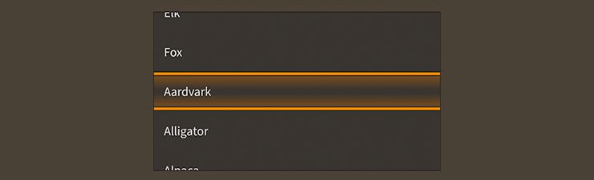

# How to use the Feathers `SpinnerList` component

The [`SpinnerList`](../api-reference/feathers/controls/SpinnerList.html) class extends the [`List`](list.html) component to allow the user to change the selected item by scrolling. Typically, the selected item is positioned in the center of the list, and it may be visually highlighted in some way. A `SpinnerList` will often loop infinitely, repeating its items as the user scrolls.

<figure>

<figcaption>A `SpinnerList` component skinned with `MetalWorksMobileTheme`</figcaption>
</figure>

## The Basics

First, let's create a `SpinnerList` control and add it to the display list:

``` code
var list:SpinnerList = new SpinnerList();
this.addChild( list );
```

Similar to a `List`, we can pass a [`ListCollection`](../api-reference/feathers/data/ListCollection.html) to the [`dataProvider`](../api-reference/feathers/controls/List.html#dataProvider) property:

``` code
list.dataProvider = new ListCollection(
[
    { text: "Milk", thumbnail: textureAtlas.getTexture( "milk" ) },
    { text: "Eggs", thumbnail: textureAtlas.getTexture( "eggs" ) },
    { text: "Bread", thumbnail: textureAtlas.getTexture( "bread" ) },
    { text: "Chicken", thumbnail: textureAtlas.getTexture( "chicken" ) },
]);
```

We'll set up the label and icon in the item renderer the same way too:

``` code
list.itemRendererProperties.labelField = "text";
list.itemRendererProperties.iconSourceField = "thumbnail";
```

We can listen for selection changes with [`Event.CHANGE`](../api-reference/feathers/controls/List.html#event:change):

``` code
list.addEventListener( Event.CHANGE, list_changeHandler );
```

Likewise, we can use the [`selectedIndex`](../api-reference/feathers/controls/List.html#selectedIndex) and [`selectedItem`](../api-reference/feathers/controls/List.html#selectedItem) properties:

``` code
list.selectedIndex = 3;
trace( list.selectedItem.text ); //Chicken
```

One way that `SpinnerList` behaves differently is that selection may not be disabled. A regular `List` may be used to display read-only content without selection, but the purpose of `SpinnerList` is to select an item. If you attempt to set the [`isSelectable`](../api-reference/feathers/controls/List.html#isSelectable) property to `false`, a runtime error will be thrown.

## Skinning an `SpinnerList`

A spinner list provides a number of properties to customize its appearance. For full details about what skin and style properties are available, see the [`SpinnerList` API reference](../api-reference/feathers/controls/SpinnerList.html). We'll look at a few of the most common properties below.

### Highlight the selected item

To add a display object above the selected item to visually highlight it, you may use the [`selectionOverlaySkin`](../api-reference/feathers/controls/SpinnerList.html#selectionOverlaySkin) property:

``` code
list.selectionOverlaySkin = new Image( texture );
```

This skin will be displayed in the center of the list, positioned either horizontally or vertically, depending on which way the list may be scrolled.

As mentioned above, `SpinnerList` is a subclass of `List`. For more detailed information about the skinning options available to `SpinnerList`, see [How to use the Feathers `List` component](list.html).

## Related Links

-   [`feathers.controls.SpinnerList` API Documentation](../api-reference/feathers/controls/SpinnerList.html)

-   [How to Use the Feathers `List` Component](list.html)