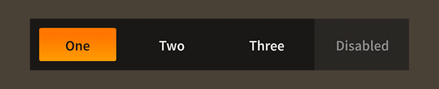

# How to use the Feathers `TabBar` component

The [`TabBar`](../api-reference/feathers/controls/TabBar.html) class displays a set of togglable buttons with a vertical or horizontal layout, where only one button at a time may be selected. A tab bar's tabs may be added or removed at runtime through its data provider, and the first and last tabs may be optionally styled differently. For instance, one could create a more "pill" shaped control that looks more like a segmented button bar than a set of tabs.

<figure>

<figcaption>A `TabBar` component skinned with `MetalWorksMobileTheme`</figcaption>
</figure>

## The Basics

First, let's create a `TabBar` control, set its data provider to display a few tabs, and add it to the display list:

``` code
var tabs:TabBar = new TabBar();
tabs.dataProvider = new ListCollection(
[
    { label: "One" },
    { label: "Two" },
    { label: "Three" },
]);
this.addChild( tabs );
```

The `label` field in each item from the data provider will set the [`label`](../api-reference/feathers/controls/Button.html#label) property on the corresponding tab. In addition to the label, you can also set the various icon properties available on the [`Button`](../api-reference/feathers/controls/Button.html) class, such as [`defaultIcon`](../api-reference/feathers/controls/Button.html#defaultIcon), [`upIcon`](../api-reference/feathers/controls/Button.html#upIcon), or [`downIcon`](../api-reference/feathers/controls/Button.html#downIcon).

<aside class="info">For full details about which properties can be set on tabs, see the description of the [`dataProvider`](../api-reference/feathers/controls/TabBar.html#dataProvider) property.</aside>

To know when the selected tab changes, we need to listen to [`Event.CHANGE`](../api-reference/feathers/controls/TabBar.html#event:change):

``` code
tabs.addEventListener( Event.CHANGE, tabs_changeHandler );
```

A listener might look something like this:

``` code
function tabs_changeHandler( event:Event ):void
{
    var tabs:TabBar = TabBar( event.currentTarget );
    trace( "selectedIndex:", tabs.selectedIndex );
}
```

The [`selectedIndex`](../api-reference/feathers/controls/TabBar.html#selectedIndex) property indicates the zero-based index of the currently selected tab.

## Skinning a `TabBar`

Except for a couple of layout properties, most of the skinning happens on the tabs. For full details about what skin and style properties are available, see the [`TabBar` API reference](../api-reference/feathers/controls/TabBar.html). We'll look at a few of the most common properties below.

### Layout

For layout, you can set the [`direction`](../api-reference/feathers/controls/TabBar.html#direction) property to [`Direction.HORIZONTAL`](../api-reference/feathers/layout/Direction.html#HORIZONTAL) or [`Direction.VERTICAL`](../api-reference/feathers/layout/Direction.html#VERTICAL).

The [`gap`](../api-reference/feathers/controls/TabBar.html#gap) property sets the extra space, measured in pixels, between tabs. You can also use the [`firstGap`](../api-reference/feathers/controls/TabBar.html#firstGap) property to provide a different gap after the first tab, and the [`lastGap`](../api-reference/feathers/controls/TabBar.html#lastGap) property to provide a different gap before the last tab.

The [`distributeTabSizes`](../api-reference/feathers/controls/TabBar.html#distributeTabSizes) property controls whether the combined size of tabs fill the entire length of the `TabBar` or if they use the minimum space required.

### Skinning the Tabs

This section only explains how to access the tab sub-components, which are simply toggle buttons. Please read [How to use the Feathers `ToggleButton` component](toggle-button.html) for full details about the skinning properties that are available on `ToggleButton` components.

#### With a Theme

If you're creating a [theme](themes.html), you can target the [`TabBar.DEFAULT_CHILD_STYLE_NAME_TAB`](../api-reference/feathers/controls/TabBar.html#DEFAULT_CHILD_STYLE_NAME_TAB) style name.

``` code
getStyleProviderForClass( ToggleButton )
    .setFunctionForStyleName( TabBar.DEFAULT_CHILD_STYLE_NAME_TAB, setTabStyles );
```

You can override the default style name to use a different one in your theme, if you prefer:

``` code
tabBar.customTabStyleName = "custom-tab";
```

You can set the function for the [`customTabStyleName`](../api-reference/feathers/controls/TabBar.html#customTabStyleName) like this:

``` code
getStyleProviderForClass( ToggleButton )
    .setFunctionForStyleName( "custom-tab", setCustomTabStyles );
```

#### Without a Theme

If you are not using a theme, you can use [`tabFactory`](../api-reference/feathers/controls/TabBar.html#tabFactory) to provide skins for the tabs:

``` code
tabBar.tabFactory = function():ToggleButton
{
    var tab:ToggleButton = new ToggleButton();
    tab.defaultSkin = new Image( texture );
    tab.downSkin = new Image( texture );
    tab.defaultLabelProperties.textFormat = new TextFormat("Arial", 24, 0x323232, true );
    return tab;
};
```

In addition to the `tabFactory`, you may use the [`tabProperties`](../api-reference/feathers/controls/TabBar.html#tabProperties) to pass properties to the tabs. The values of these properties are shared by *all* tabs, so display objects should never be passed in using `tabProperties`. A display object may only have one parent, so passing in a display object as a skin to every tab is impossible. Other types of styles, like gap and padding, can be passed in through `tabProperties`:

``` code
tabBar.tabProperties.gap = 20;
```

In general, you should only pass properties to the tab bar's tabs through `tabProperties` if you need to change these values after the tabs are created. Using `tabFactory` will provide slightly better performance, and your development environment will be able to provide code hinting thanks to stronger typing.

### Skinning the First and Last Tabs

This section only explains how to access the first and last tab sub-components. Please read [How to use the Feathers `ToggleButton` component](toggle-button.html) for full details about the skinning properties that are available on `ToggleButton` components.

The tab bar's first and last tabs will have the same skins as the other tabs by default. However, their skins may be customized separately, if desired.

For the first tab, you can customize the name with [`customFirstTabStyleName`](../api-reference/feathers/controls/TabBar.html#customFirstTabStyleName). If you aren't using a theme, then you can use [`firstTabFactory`](../api-reference/feathers/controls/TabBar.html#firstTabFactory) and [`firstTabProperties`](../api-reference/feathers/controls/TabBar.html#firstTabProperties).

For the last tab, you can customize the name with [`customLastTabStyleName`](../api-reference/feathers/controls/TabBar.html#customLastTabStyleName). If you aren't using a theme, then you can use [`lastTabFactory`](../api-reference/feathers/controls/TabBar.html#lastTabFactory) and [`lastTabProperties`](../api-reference/feathers/controls/TabBar.html#lastTabProperties).

Separate skins for the first and last tabs are completely optional.

## Related Links

-   [`feathers.controls.TabBar` API Documentation](../api-reference/feathers/controls/TabBar.html)