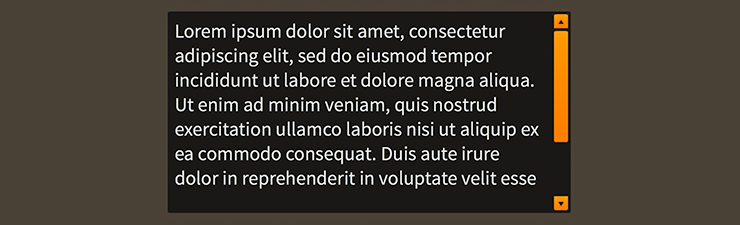

# How to use the Feathers `TextArea` Component

The [`TextArea`](../api-reference/feathers/controls/TextArea.html) class supports the editing of multiline, uniformly-formatted text.

<figure>

<figcaption>A `TextArea` component skinned with `MetalWorksDesktopTheme`</figcaption>
</figure>

<aside class="info">`TextArea` is designed specifically for desktop apps, and it is *not* recommended for use in mobile touchscreen apps. Instead, on mobile, you should use a [`TextInput`](text-input.html) component with a [`StageTextTextEditor`](../api-reference/feathers/controls/text/StageTextTextEditor.html) with its [`multiline`](../api-reference/feathers/controls/text/StageTextTextEditor.html#multiline) property set to `true`. The underlying `StageText` will provide its own native scroll bar.</aside>

-   [The Basics](#the-basics)

-   [Customize input behavior](#customize-input-behavior)

-   [Skinning a `TextArea`](#skinning-a-textarea)

-   [Customize scrolling behavior](#customize-scrolling-behavior)

## The Basics

First, let's create a `TextArea` control and add it to the display list:

``` code
var textArea:TextArea = new TextArea();
this.addChild( textArea );
```

### Changing text programmatically

Text may be changed programatically by setting the [`text`](../api-reference/feathers/controls/TextArea.html#text) property:

``` code
textArea.text = "Hello\nWorld";
```

### Focus and Selection

You may programmatically set focus to the text area by calling [`setFocus()`](../api-reference/feathers/controls/TextArea.html#setFocus()):

``` code
textArea.setFocus();
```

You can select part of the text too:

``` code
textArea.selectRange(0, textArea.text.length);
```

If you simply want to set the position of the cursor, you can omit the second argument to [`selectRange()`](../api-reference/feathers/controls/TextArea.html#selectRange()):

``` code
textArea.selectRange(0);
```

### Events

Text areas provide some useful events. One of the most common requirements is knowing, in real time, when the value of the [`text`](../api-reference/feathers/controls/TextArea.html#text) property has changed:

``` code
textArea.addEventListener( Event.CHANGE, textArea_changeHandler );
```

We can listen for [`Event.CHANGE`](../api-reference/feathers/controls/TextArea.html#event:change).

You might also want to know when the text area receives and loses focus:

``` code
textArea.addEventListener( FeathersEventType.FOCUS_IN, textArea_focusInHandler );
textArea.addEventListener( FeathersEventType.FOCUS_OUT, textArea_focusOutHandler );
```

The [`FeathersEventType.FOCUS_IN`](../api-reference/feathers/controls/TextArea.html#event:focusIn) and [`FeathersEventType.FOCUS_OUT`](../api-reference/feathers/controls/TextArea.html#event:focusOut) events are specially dispatched by the `TextArea`, even if the [focus manager](focus.html) is not enabled.

## Customize input behavior

Several properties allow you to customize a text area's behavior.

Set the [`isEditable`](../api-reference/feathers/controls/TextArea.html#isEditable) property to false to make the text uneditable, without giving the text area a disabled appearance:

``` code
textArea.isEditable = false;
```

To limit the number of characters that may be entered, use the [`maxChars`](../api-reference/feathers/controls/TextArea.html#maxChars) property:

``` code
textArea.maxChars = 16;
```

The [`restrict`](../api-reference/feathers/controls/TextArea.html#restrict) property limits the set of characters that can be entered into the text area. It works like the `restrict` property on `flash.text.TextField`.

``` code
textArea.restrict = "0-9";
```

In the example above, we restrict to numeric values only.

## Skinning a `TextArea`

A text area provides a number of properties to customize its appearance. For full details about what skin and style properties are available, see the [`TextArea` API reference](../api-reference/feathers/controls/TextArea.html). We'll look at a few of the most common ways of styling a text area below.

### Font Styles

The text area's font styles may be customized using the [`fontStyles`](../api-reference/feathers/controls/TextArea.html#fontStyles) property.

``` code
textArea.fontStyles = new TextFormat( "Helvetica", 20, 0x3c3c3c );
```

Pass in a [`starling.text.TextFormat`](http://doc.starling-framework.org/current/starling/text/TextFormat.html) object, which will work with any type of [text editor](text-editors.html).

If the text area should use different font styles when it is disabled, you may set the [`disabledFontStyles`](../api-reference/feathers/controls/TextArea.html#disabledFontStyles) property too:

``` code
textArea.disabledFontStyles = new TextFormat( "Helvetica", 20, 0x9a9a9a );
```

Finally, we can even customize the font styles for each of the text area's specific states:

```code
textArea.setFontStylesForState( TextInputState.ERROR,
    new TextFormat( "Helvetica", 20, 0xcc0000 ) );
```

Using the code above, the color of the text area's text will change when the text area displays an `errorString`, and the state changes to `TextInputState.ERROR`.

When font styles aren't available for a specific state, the text area will use the default `fontStyles` as a fallback. For example, we haven't provided font styles for `TextInputState.FOCUSED`, so the default styles will be used.

### Background Skin

Let's give our text area its background skin. In the following example, we'll use an [`ImageSkin`](../api-reference/feathers/skins/ImageSkin.html), but the skin may be any Starling display object:

``` code
var skin:ImageSkin = new ImageSkin( upTexture );
skin.scale9Grid = new Rectangle( 2, 3, 3, 8 );
textArea.backgroundSkin = skin;
```

We can change the appearance of the text area's skin when the state changes. In the next example, we provide another texture to the same `ImageSkin` for the text area's "focused" state:

``` code
skin.setTextureForState( TextInputState.FOCUSED, focusedTexture );
```

The `ImageSkin` automatically listens for changes to the text area's state and updates its appearance to match. When the text area is given focus, the `ImageSkin` will display this texture instead of the default one.

We can also provide different display objects for specific states, if needed. In the next example, we have a texture for the "disabled" state that requires a different `scale9Grid` than the other textures. We can create a separate `ImageSkin` for this state:

``` code
var disabledSkin:ImageSkin = new ImageSkin( disabledTexture );
textArea.scale9Grid = new Rectangle( 4, 2, 2, 10 );
textArea.setSkinForState( TextInputState.DISABLED, disabledSkin );
```

Pass in skins for any state using the [`setSkinForState()`](../api-reference/feathers/controls/TextArea.html#setSkinForState()) function.

If a skin is not provided for a specific state, the text area will display its `backgroundSkin`. Similarly, when using an `ImageSkin`, and a texture isn't provided for a specific state, it will display its default texture.

### Layout

Padding may be added on each side of the text area:

``` code
textArea.paddingTop = 5;
textArea.paddingRight = 8;
textArea.paddingBottom = 5;
textArea.paddingLeft = 8;
```

If all four padding values should be the same, you may use the [`padding`](../api-reference/feathers/controls/Scroller.html#padding) property to quickly set them all at once:

``` code
textArea.padding = 6;
```

### Skinning the Scroll Bars

This section only explains how to access the horizontal scroll bar and vertical scroll bar sub-components. Please read [How to use the Feathers `ScrollBar` component](scroll-bar.html) (or [`SimpleScrollBar`](simple-scroll-bar.html)) for full details about the skinning properties that are available on scroll bar components.

#### With a Theme

If you're creating a [theme](themes.html), you can target the [`Scroller.DEFAULT_CHILD_STYLE_NAME_HORIZONTAL_SCROLL_BAR`](../api-reference/feathers/controls/Scroller.html#DEFAULT_CHILD_STYLE_NAME_HORIZONTAL_SCROLL_BAR) style name for the horizontal scroll bar and the [`Scroller.DEFAULT_CHILD_STYLE_NAME_VERTICAL_SCROLL_BAR`](../api-reference/feathers/controls/Scroller.html#DEFAULT_CHILD_STYLE_NAME_VERTICAL_SCROLL_BAR) style name for the vertical scroll bar.

``` code
getStyleProviderForClass( ScrollBar )
    .setFunctionForStyleName( Scroller.DEFAULT_CHILD_STYLE_NAME_HORIZONTAL_SCROLL_BAR, setHorizontalScrollBarStyles );
getStyleProviderForClass( ScrollBar )
    .setFunctionForStyleName( Scroller.DEFAULT_CHILD_STYLE_NAME_VERTICAL_SCROLL_BAR, setVerticalScrollBarStyles );
```

The styling function for the horizontal scroll bar might look like this:

``` code
private function setHorizontalScrollBarStyles(scrollBar:ScrollBar):void
{
    scrollBar.trackLayoutMode = TrackLayoutMode.SINGLE;
}
```

You can override the default style names to use different ones in your theme, if you prefer:

``` code
textArea.customHorizontalScrollBarStyleName = "custom-horizontal-scroll-bar";
textArea.customVerticalScrollBarStyleName = "custom-vertical-scroll-bar";
```

You can set the funciton for the [`customHorizontalScrollBarStyleName`](../api-reference/feathers/controls/Scroller.html#customHorizontalScrollBarStyleName) and the [`customVerticalScrollBarStyleName`](../api-reference/feathers/controls/Scroller.html#customVerticalScrollBarStyleName) like this:

``` code
getStyleProviderForClass( ScrollBar )
    .setFunctionForStyleName( "custom-horizontal-scroll-bar", setCustomHorizontalScrollBarStyles );
getStyleProviderForClass( ScrollBar )
    .setFunctionForStyleName( "custom-vertical-scroll-bar", setCustomVerticalScrollBarStyles );
```

#### Without a Theme

If you are not using a theme, you can use [`horizontalScrollBarFactory`](../api-reference/feathers/controls/Scroller.html#horizontalScrollBarFactory) and [`verticalScrollBarFactory`](../api-reference/feathers/controls/Scroller.html#verticalScrollBarFactory) to provide skins for the text area's scroll bars:

``` code
textArea.horizontalScrollBarFactory = function():ScrollBar
{
    var scrollBar:ScrollBar = new ScrollBar();

    //skin the scroll bar here, if not using a theme
    scrollBar.trackLayoutMode = TrackLayoutMode.SINGLE;

    return scrollBar;
}
```

## Customize scrolling behavior

A number of properties are available to customize scrolling behavior and the scroll bars.

### Interaction Modes

Scrolling containers provide two main interaction modes, which can be changed using the [`interactionMode`](../api-reference/feathers/controls/Scroller.html#interactionMode) property.

By default, you can scroll using touch, just like you would on many mobile devices including smartphones and tablets. This mode allows you to grab the container anywhere within its bounds and drag it around to scroll. This mode is defined by the constant, [`ScrollInteractionMode.TOUCH`](../api-reference/feathers/controls/ScrollInteractionMode.html#TOUCH).

Alternatively, you can set `interactionMode` to [`ScrollInteractionMode.MOUSE`](../api-reference/feathers/controls/ScrollInteractionMode.html#MOUSE). This mode allows you to scroll using the horizontal or vertical scroll bar sub-components. You can also use the mouse wheel to scroll vertically.

Finally, you can set `interactionMode` to [`ScrollInteractionMode.TOUCH_AND_SCROLL_BARS`](../api-reference/feathers/controls/ScrollInteractionMode.html#TOUCH_AND_SCROLL_BARS). This mode allows you to scroll both by dragging the container's content and by using the scroll bars.

### Scroll Bar Display Mode

The [`scrollBarDisplayMode`](../api-reference/feathers/controls/Scroller.html#scrollBarDisplayMode) property controls how and when scroll bars are displayed. This value may be overridden by the scroll policy, as explained below.

The default value is [`ScrollBarDisplayMode.FLOAT`](../api-reference/feathers/controls/ScrollBarDisplayMode.html#FLOAT), which displays the scroll bars as an overlay above the view port's content, rather than affecting the size of the view port. When the scroll bars are floating, they fade out when the container is not actively scrolling. This is a familiar behavior for scroll bars in the touch interaction mode. In the mouse interaction mode, the scroll bars will appear when the mouse hovers over them and then disappear when the hover ends.

To completely hide the scroll bars, but still allow scrolling, you can set `scrollBarDisplayMode` to [`ScrollBarDisplayMode.NONE`](../api-reference/feathers/controls/ScrollBarDisplayMode.html#NONE).

If you want the scroll bars to always be visible outside of the content in a fixed position, you can set `scrollBarDisplayMode` to [`ScrollBarDisplayMode.FIXED`](../api-reference/feathers/controls/ScrollBarDisplayMode.html#FIXED). This is best for traditional desktop scrollable content.

Finally, you can set `scrollBarDisplayMode` to [`ScrollBarDisplayMode.FIXED_FLOAT`](../api-reference/feathers/controls/ScrollBarDisplayMode.html#FIXED_FLOAT) to display the scroll bar as an overlay above the view port's content, but it does not fade away.

### Scroll Policies

The two previous properties control how scrolling works. The [`horizontalScrollPolicy`](../api-reference/feathers/controls/Scroller.html#horizontalScrollPolicy) and [`verticalScrollPolicy`](../api-reference/feathers/controls/Scroller.html#verticalScrollPolicy) properties control whether scrolling is enabled or not.

The default scroll policy for both directions is [`ScrollPolicy.AUTO`](../api-reference/feathers/controls/ScrollPolicy.html#AUTO). If the content's width is greater than the view port's width, the text area may scroll horizontally (same for height and vertical scrolling). If not, then the text area will not scroll in that direction. In addition to the `scrollBarDisplayMode`, this can affect whether the scroll bar is visible or not.

You can completely disable scrolling in either direction, set the scroll policy to [`ScrollPolicy.OFF`](../api-reference/feathers/controls/ScrollPolicy.html#OFF). The scroll bar will not be visible, and the text area won't scroll, even if the content is larger than the view port.

Finally, you can ensure that scrolling is always enabled by setting the scroll policy to [`ScrollPolicy.ON`](../api-reference/feathers/controls/ScrollPolicy.html#ON). If combined with `hasElasticEdges` in the touch interaction mode, it will create a playful edge that always bounces back, even when the content is smaller than the view port. If using the mouse interaction mode, the scroll bar may always be visible under the same circumstances, though it may be disabled if the content is smaller than the view port.

## Related Links

-   [`feathers.controls.TextArea` API Documentation](../api-reference/feathers/controls/TextArea.html)

-   [How to Use the Feathers `TextInput` Component](text-input.html)

-   [Introduction to Feathers Text Editors](text-editors.html)