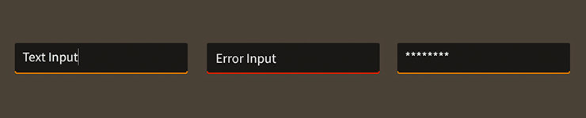

# How to use the Feathers `TextInput` component

The [`TextInput`](../api-reference/feathers/controls/TextInput.html) class supports the editing of text. It displays a background skin and uses a [text editor](text-editors.html) to allow the user to modify the text.

<figure>

<figcaption>`TextInput` components skinned with `MetalWorksMobileTheme`</figcaption>
</figure>

-   [The Basics](#the-basics)

-   [Customize input behavior](#customize-input-behavior)

-   [Skinning a `TextInput`](#skinning-a-textinput)

## The Basics

First, let's create a `TextInput` control and add it to the display list:

``` actionscript
var input:TextInput = new TextInput();
this.addChild( input );
```

### Changing text programmatically

Text may be changed programatically by setting the [`text`](../api-reference/feathers/controls/TextInput.html#text) property:

``` actionscript
input.text = "Hello World";
```

### Prompt

A prompt or hint may be displayed to describe the purpose of the text input when the text input does not contain any text.

``` actionscript
input.prompt = "Password";
```

Simply set the [`prompt`](../api-reference/feathers/controls/TextInput.html#prompt) property to any `String` to display it inside the text input.

### Focus and Selection

You may programmatically set focus to the text input by calling [`setFocus()`](../api-reference/feathers/controls/TextInput.html#setFocus()):

``` actionscript
input.setFocus();
```

You can select part of the text too:

``` actionscript
input.selectRange(0, input.text.length);
```

If you simply want to set the position of the cursor, you can omit the second argument to [`selectRange()`](../api-reference/feathers/controls/TextInput.html#selectRange()):

``` actionscript
input.selectRange(0);
```

### Events

Text inputs provide a number of useful events. One of the most common requirements is knowing, in real time, when the value of the [`text`](../api-reference/feathers/controls/TextInput.html#text) property has changed:

``` actionscript
input.addEventListener( Event.CHANGE, input_changeHandler );
```

We can listen for [`Event.CHANGE`](../api-reference/feathers/controls/TextInput.html#event:change).

We might also want to know when the user presses [`Keyboard.ENTER`](http://help.adobe.com/en_US/FlashPlatform/reference/actionscript/3/flash/ui/Keyboard.html#ENTER):

``` actionscript
input.addEventListener( FeathersEventType.ENTER, input_enterHandler );
```

Simply listen for [`FeathersEventType.ENTER`](../api-reference/feathers/controls/TextInput.html#event:enter).

<aside class="warn">On some mobile platforms, the `FeathersEventType.ENTER` event may not always be dispatched by certain text editors. For complete details, please refer to the API reference for the specific text editor that you are using.</aside>

Finally, you might also want to know when the text input receives and loses focus:

``` actionscript
input.addEventListener( FeathersEventType.FOCUS_IN, input_focusInHandler );
input.addEventListener( FeathersEventType.FOCUS_OUT, input_focusOutHandler );
```

The [`FeathersEventType.FOCUS_IN`](../api-reference/feathers/controls/TextInput.html#event:focusIn) and [`FeathersEventType.FOCUS_OUT`](../api-reference/feathers/controls/TextInput.html#event:focusOut) events are specially dispatched by the `TextInput`, even if the [focus manager](focus.html) is not enabled.

### Customize input behavior

The [`displayAsPassword`](../api-reference/feathers/controls/TextInput.html#displayAsPassword) property may be enabled to mask a text input's text:

``` actionscript
input.displayAsPassword = true;
```

Set the [`isEditable`](../api-reference/feathers/controls/TextInput.html#isEditable) property to false to make the text uneditable, without giving the text input a disabled appearance:

``` actionscript
input.isEditable = false;
```

To limit the number of characters that may be entered, use the [`maxChars`](../api-reference/feathers/controls/TextInput.html#maxChars) property:

``` actionscript
input.maxChars = 16;
```

The [`restrict`](../api-reference/feathers/controls/TextInput.html#restrict) property limits the set of characters that can be entered into the text input. It works like the `restrict` property on `flash.text.TextField`.

``` actionscript
input.restrict = "0-9";
```

In the example above, we restrict to numeric values only.

## Skinning a `TextInput`

A text input provides a number of properties to customize its appearance. For full details about what skin and style properties are available, see the [`TextInput` API reference](../api-reference/feathers/controls/TextInput.html). We'll look at a few of the most common ways of styling a text input below.

### Font Styles

The text input's font styles may be customized using the [`fontStyles`](../api-reference/feathers/controls/TextInput.html#fontStyles) property.

``` actionscript
input.fontStyles = new TextFormat( "Helvetica", 20, 0x3c3c3c );
```

Pass in a [`starling.text.TextFormat`](http://doc.starling-framework.org/current/starling/text/TextFormat.html) object, which will work with any type of [text editor](text-editors.html).

If the input should use different font styles when it is disabled, you may set the [`disabledFontStyles`](../api-reference/feathers/controls/TextInput.html#disabledFontStyles) property too:

``` actionscript
input.disabledFontStyles = new TextFormat( "Helvetica", 20, 0x9a9a9a );
```

Finally, we can even customize the font styles for each of the input's specific states:

``` actionscript
input.setFontStylesForState( TextInputState.ERROR,
    new TextFormat( "Helvetica", 20, 0xcc0000 ) );
```

Using the code above, the color of the input's text will change when the input displays an `errorString`, and the state changes to `TextInputState.ERROR`.

When font styles aren't available for a specific state, the input will use the default `fontStyles` as a fallback. For example, we haven't provided font styles for `TextInputState.FOCUSED`, so the default styles will be used.

The font styles of the prompt [text renderer](text-renderers.html) may be customized separately:

``` actionscript
input.promptFontStyles = new TextFormat( "Helvetica", 20, 0x3c3c3c );
input.promptDisabledFontStyles = new TextFormat( "Helvetica", 20, 0x9a9a9a );
input.setPromptFontStylesForState( TextInputState.ERROR,
    new TextFormat( "Helvetica", 20, 0xcc0000 ) );
```

See the [`promptFontStyles`](../api-reference/feathers/controls/TextInput.html#promptFontStyles) and [`promptDisabledFontStyles`](../api-reference/feathers/controls/TextInput.html#promptDisabledFontStyles) properties, and the [`setPromptFontStylesForState()`](../api-reference/feathers/controls/TextInput.html#setPromptFontStylesForState()) function for details.

### Background Skin

Let's give our text input its background skin. In the following example, we'll use an [`ImageSkin`](../api-reference/feathers/skins/ImageSkin.html), but the skin may be any Starling display object:

``` actionscript
var skin:ImageSkin = new ImageSkin( upTexture );
skin.scale9Grid = new Rectangle( 2, 3, 3, 8 );
input.backgroundSkin = skin;
```

We can change the appearance of the text input's skin when the state changes. In the next example, we provide another texture to the same `ImageSkin` for the text input's "focused" state:

``` actionscript
skin.setTextureForState( TextInputState.FOCUSED, focusedTexture );
```

The `ImageSkin` automatically listens for changes to the text input's state and updates its appearance to match. When the text input is given focus, the `ImageSkin` will display this texture instead of the default one.

We can also provide different display objects for specific states, if needed. In the next example, we have a texture for the "disabled" state that requires a different `scale9Grid` than the other textures. We can create a separate `ImageSkin` for this state:

``` actionscript
var disabledSkin:ImageSkin = new ImageSkin( disabledTexture );
input.scale9Grid = new Rectangle( 4, 2, 2, 10 );
input.setSkinForState( TextInputState.DISABLED, disabledSkin );
```

Pass in skins for any state using the [`setSkinForState()`](../api-reference/feathers/controls/TextInput.html#setSkinForState()) function.

If a skin is not provided for a specific state, the text area will display its `backgroundSkin`. Similarly, when using an `ImageSkin`, and a texture isn't provided for a specific state, it will display its default texture.

### Icon

Let's also add an icon to the `TextInput`. Icons may be customized for each of the text input's states (just like the background skin), but let's simply use one icon. In this example, we'll pass in a `starling.display.Image`:

``` actionscript
input.defaultIcon = new Image( iconTexture );
```

This icon will be displayed for all of the text input's different states.

If we wanted to change the appearance of the icon when the text input's state changes, we could use a [`feathers.skins.ImageSkin`](../api-reference/feathers/skins/ImageSkin.html) with multiple textures, like we did in the example above that demonstrated how to set the text input's background skin. Similarly, we could use [`setIconForState()`](../api-reference/feathers/controls/TextInput.html#setIconForState()) to pass in different display objects for each state.

### Layout

Padding may be added on each side of the text input:

``` actionscript
input.paddingTop = 5;
input.paddingRight = 8;
input.paddingBottom = 5;
input.paddingLeft = 8;
```

If all four padding values should be the same, you may use the [`padding`](../api-reference/feathers/controls/TextInput.html#padding) property to quickly set them all at once:

``` actionscript
input.padding = 6;
```

The [`typicalText`](../api-reference/feathers/controls/TextInput.html#typicalText) property may be used to help the text input calculate its dimensions based on the dimensions of a specific rendered string:

``` actionscript
input.typicalText = "The quick brown fox jumps over the lazy dog";
```

By default, the text input does not use its text for measurement. Instead, it uses the background skin, padding, and other layout properties. `typicalText` is useful when there is a width or height that must be based on the font styles. For instance, the [`NumericStepper`](numeric-stepper.html) component uses this property to provide the text input with a string that represents the largest possible string it might display.

## Related Links

-   [`feathers.controls.TextInput` API Documentation](../api-reference/feathers/controls/TextInput.html)

-   [How to Use the Feathers `TextArea` Component](text-area.html)

-   [Introduction to Feathers Text Editors](text-editors.html)