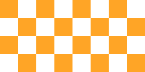

# How to use the Feathers `TiledImage` display object

The [`TiledImage`](../api-reference/feathers/display/TiledImage.html) class repeats a texture in a given region, horizontally and vertically. If the dimensions of the tiled image aren't a perfect multiple of the dimensions of the texture, the edges will be clipped.

A tiled image may use any Starling texture, including sub-textures from [texture atlases](http://wiki.starling-framework.org/manual/textures_and_images#texture_atlases).



## Code

First, we need a texture. We might create one from bitmap data:

``` code
var texture:Texture = Texture.fromBitmapData( bitmapData );
```

Or we might create one from a texture atlas:

``` code
var texture:Texture = atlas.getTexture( "my-texture" );
```

``` code
var image:TiledImage = new TiledImage( texture );
image.width = 300;
image.height = 200;
this.addChild( image );
```

If you want to scale the texture up or down before tiling it, a second parameter is available in the constructor:

``` code
var image:TiledImage = new TiledImage( texture, 0.5 );
```

This option is useful when scaling for different screen resolutions or densities.

## Tips and Tricks

Tiling images on the GPU involve some gotchas. If your images aren't drawn to whole pixels or they are scaled, the textures may bleed a bit and cause unsightly lines or empty gaps between images. During animations, flickering may happen where textures meet as these gaps quickly appear and disappear. It can help to always ensure that your display objects aren't placed on fractional pixels, but that can be an exercise in frustration, especially on a deep display list.

The popular [Texture Packer](http://texturepacker.com/) software, used to create texture atlases, offers a useful feature named "Extrude". When you enable this feature, the pixels around the edges of your sub-textures will be duplicated, but it won't change the size of your sub-textures. The duplicated pixels appear just outside the sub-texture's bounds. When texture bleeding happens, the same color that appears on the edge of the sub-texture will bleed into the bounds instead of a transparent pixel or another color.

When tiling images, extruding is always recommended.

## Related Links

-   [`feathers.display.TiledImage` API Documentation](../api-reference/feathers/display/TiledImage.html)