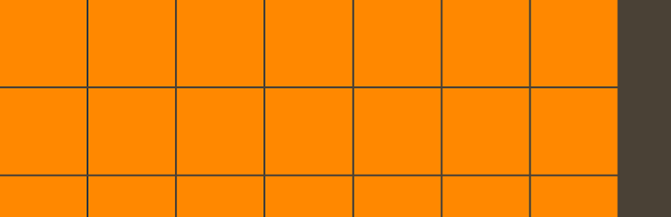

# Using `TiledRowsLayout` in Feathers containers

The [`TiledRowsLayout`](../api-reference/feathers/layout/TiledRowsLayout.html) class may be used by components that support layout, such as [`List`](list.html), [`LayoutGroup`](layout-group.html) and [`ScrollContainer`](scroll-container.html), to display items from left to right in multiple rows. It supports paging horizontally or vertically, and a number of useful options for the spacing and alignment may be modified.

<picture></picture>

## The Basics

Let's create a tiled rows layout and add it to a [`LayoutGroup`](layout-group.html):

``` actionscript
var layout:TiledRowsLayout = new TiledRowsLayout();
 
var container:LayoutGroup = new LayoutGroup();
container.layout = layout;
this.addChild( container );
```

There are a number of simple properties that may be used to affect positioning and sizing of items in the layout. Let's look at some of the most common.

### Tile size

If we want *rectangular* tiles instead of *square*, we can set the [`useSquareTiles`](../api-reference/feathers/layout/TiledRowsLayout.html#useSquareTiles) property to `false`.

### Spacing

The *padding* is the space around the edges of the container. Let's set the [`padding`](../api-reference/feathers/layout/TiledRowsLayout.html#padding) property to `12` pixels:

``` actionscript
layout.padding = 12;
```

If needed, the padding on each side of the container may be set separately. Below, we set the [`paddingTop`](../api-reference/feathers/layout/TiledRowsLayout.html#paddingTop) and [`paddingBottom`](../api-reference/feathers/layout/TiledRowsLayout.html#paddingBottom) to `10` pixels, and we set the [`paddingLeft`](../api-reference/feathers/layout/TiledRowsLayout.html#paddingLeft) and [`paddingRight`](../api-reference/feathers/layout/TiledRowsLayout.html#paddingRight) to `15` pixels:

``` actionscript
layout.paddingTop = 10;
layout.paddingRight = 15;
layout.paddingBottom = 10;
layout.paddingLeft = 15;
```

The *gap* is the space between items, both horizontally or vertically. Let's set the [`gap`](../api-reference/feathers/layout/TiledRowsLayout.html#gap) property to `5` pixels:

``` actionscript
layout.gap = 5;
```

If needed, the horizontal and vertical gaps may be set separately. We'll set the [`horizontalGap`](../api-reference/feathers/layout/TiledRowsLayout.html#horizontalGap) property to `4` pixels and the [`verticalGap`](../api-reference/feathers/layout/TiledRowsLayout.html#verticalGap) property to `6` pixels:

``` actionscript
layout.horizontalGap = 4;
layout.verticalGap = 6;
```

### Alignment

We can *align* the items in the layout using the [`horizontalLayout`](../api-reference/feathers/layout/TiledRowsLayout.html#horizontalAlign) and [`verticalLayout`](../api-reference/feathers/layout/TiledRowsLayout.html#verticalAlign) properties. Vertical alignment may be used in two cases. In the first case, it will always apply when the tiles are divided into pages. Second, it will apply when the total height of the content (including padding and gap values) is less than or equal to the height of the container that uses the layout, regardless of whether the layout uses paging. Let's adjust the alignments so that the content will be aligned to the top left:

``` actionscript
layout.horizontalAlign = HorizontalAlign.LEFT;
layout.verticalAlign = VerticalAlign.TOP;
```

Since items may be smaller than the tile dimensions, we can align items within their tiles separately from the alignment of the rows. We'll align the items in the horizontal center and the vertical middle of their tiles:

``` actionscript
layout.tileHorizontalAlign = HorizontalAlign.CENTER;
layout.tileVerticalAlign = VerticalAlign.MIDDLE;
```

### Rows and columns

It's possible to request a specific number of columns for the layout to display. The layout may not always be able to accomodate this value because the container may be too small, but if there is enough room for the requested number of columns, that's the number it will display. Let's tell the layout to use three columns by setting the [`requestedColumnCount`](../api-reference/feathers/layout/TiledRowsLayout.html#requestedColumnCount) property:

``` actionscript
layout.requestedColumnCount = 3;
```

Now, the layout will always display three columns, even if the container can fit four or more. However, if only one or two columns can be fit into the container, the layout will display the maximum number that will fit.

<aside class="info">If the width of the container is not set, the layout will automatically calculate a width that accomodates the `requestedColumnCount`.</aside>

## Paging

Pages can organize the content of the layout into more manageable pieces. We can enable [`paging`](../api-reference/feathers/layout/TiledRowsLayout.html#paging) in either the horizontal direction or the vertical direction. In the example below, we'll enable horizontal paging:

``` actionscript
layout.paging = TiledRowsLayout.PAGING_HORIZONTAL;
```

If we set padding values on a layout that has paging enabled, each page will use those padding values around its edges. Similarly, vertical alignment will apply to all pages because a page will never display more content than is visible before breaking to the next page.

On our [`ScrollContainer`](scroll-container.html) or [`List`](list.html), we should also enable page snapping:

``` actionscript
container.snapToPages = true;
```

We can combine the component with a [`PageIndicator`](page-indicator.html) to navigate between pages and to visually display which page is currently visible.

## Virtual Tiled Rows Layout

In a [`List`](list.html), [`Tree`](tree.html), or [`GroupedList`](grouped-list.html), the layout may be *virtualized*, meaning that some items in the layout will not actually exist if they are not visible. This helps to improve performance of a scrolling list because only a limited number of item renderers will be created at any given moment. If the list's data provider is very large, a virtual layout is essential, even on desktop computers that have incredible processing power compared to mobile devices.

A virtualized layout will need as estimate about how big a "virtual" item renderer should be. We should set the [`typicalItem`](../api-reference/feathers/controls/List.html#typicalItem) property of the list to have it determine the *typical* width and height of an item renderer to use as this estimated value. If we don't pass in a typical item, the first item in the data provider is used for this estimate.

By default [`useVirtualLayout`](../api-reference/feathers/layout/TiledRowsLayout.html#useVirtualLayout) is `true` for containers that support it. We can disable virtual layouts by setting it to `false`. When a layout is not virtualized, every single item renderer must be created by the component. If a list has thousands of items, this means that thousands of item renderers need to be created. This can lead to significant performance issues, especially on mobile. In general, `useVirtualLayout` should rarely be disabled.

``` actionscript
layout.useVirtualLayout = false;
```

The [`LayoutGroup`](layout-group.html) and [`ScrollContainer`](scroll-container.html) components never use virtual layouts.

## Related Links

-   [`feathers.layout.TiledRowsLayout` API Documentation](../api-reference/feathers/layout/TiledRowsLayout.html)