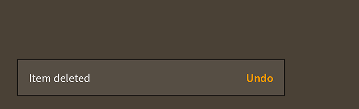

# How to use the Feathers `Toast` component

The [`Toast`](../api-reference/feathers/controls/Toast.html) class allows the display of in-app notifications as [pop-ups](pop-ups.html) over all other content. A toast may contain a string message and optional action buttons, or it can display completely custom content. The toast will close automatically after a timeout, but it may also be configured to remain open indefinitely.

<figure>

<figcaption>A `Toast` component skinned with `MetalWorksMobileTheme`</figcaption>
</figure>

-   [The Basics](#the-basics)

-   [Skinning a `Toast`](#skinning-a-toast)

-   [Closing and Disposal](#closing-and-disposal)

## The Basics

We create a `Toast` a bit differently than other components. Rather than calling a constructor, we call the static function, like [`Toast.showMessage()`](../api-reference/feathers/controls/Toast.html#showMessage()), [`Toast.showMessageWithActions()`](../api-reference/feathers/controls/Toast.html#showMessageWithActions()), or [`Toast.showContent()`](../api-reference/feathers/controls/Toast.html#showContent()).

### Message

Let's see how this works by displaying some simple text in a `Toast` when we touch a button. First, let's create the button:

``` code
var button:Button = new Button();
button.label = "Click Me";
button.addEventListener( Event.TRIGGERED, button_triggeredHandler );
this.addChild( button );
```

Then, in the listener for the `Event.TRIGGERED` event, we create the toast:

``` code
function button_triggeredHandler( event:Event ):void
{
    var button:Button = Button( event.currentTarget );
    var toast:Toast = Toast.showMessage( "I am a toast" );
}
```

In addition to the string to display in the toast, [`Toast.showMessage()`](../api-reference/feathers/controls/Toast.html#showMessage()) accepts a second argument, the timeout when the toast will be closed automatically. This value is measured in seconds.

``` code
Toast.showMessage( "I am a toast", 6.5 );
```

In the example above, the timeout will be closed in six and a half seconds. If we don't want the toast to close automatically, we can set the timeout to `Number.POSITIVE_INFINITY`. We can close the toast manually by calling its [`close()`](../api-reference/feathers/controls/Toast.html#close()) method:

``` code
toast.close();
```

### Message and actions

A toast may optionally include one or more action buttons by creating it with [`Toast.showMessageWithActions()`](../api-reference/feathers/controls/Toast.html#showMessageWithActions()). In the following example, we display a toast with an **Undo** button:

``` code
Toast.showMessageWithActions( "Item deleted", new ArrayCollection(
[
    { label: "Undo", triggered: undoButton_triggeredHandler }
]));
```

Each item in the colllection may contain its own separate `Event.TRIGGERED` listener, or you can listen for `Event.CLOSE` on the `Toast` instance. If one of the buttons was triggered, the event's data will contain an item from the collection.

``` code
toast.addEventListener( Event.CLOSE, function(event:Event, item:Object):void
{
    trace( item.label );
});
```

### Custom content

A toast may be created without a message and actions and use completely custom content instead by calling [`Toast.showContent()`](../api-reference/feathers/controls/Toast.html#showContent()). In the following example, we display a toast that contains an `Image`:

``` code
var image:Image = new Image( texture );
Toast.showContent( image );
```

Any Starling display object or Feathers component may be used as the content. To include multiple items in the content, you may add them all to a parent [`LayoutGroup`](layout-group.html).

## Closing and Disposal

When manually closing the toast, you may call the [`close()`](../api-reference/feathers/controls/Toast.html#close()) function and pass in `true` or `false` for the `dispose` argument.

It's possible that the toast will close itself automatically. For instance, the [`timeout`](../api-reference/feathers/controls/Toast.html#timeout) property specifies the time, in seconds, that the toast will remain open.

By default, when the toast closes itself, it will also dispose itself. Set the [`disposeOnSelfClose`](../api-reference/feathers/controls/Toast.html#disposeOnSelfClose) property to `false` if you intend to reuse the toast. Simply pass it to [`Toast.addToast()`](../api-reference/feathers/controls/Toast.html#addToast()) to reuse it.

Finally, you may want to reuse the toasts's content. By default, the toast will also dispose its content when it is disposed. Set the [`disposeContent`](../api-reference/feathers/controls/Toast.html#disposeContent) property to `false` to allow your code to reuse the toast's content in another toast or elsewhere on the display list after the original toast is disposed.

## Related Links

-   [`feathers.controls.Toast` API Documentation](../api-reference/feathers/controls/Toast.html)