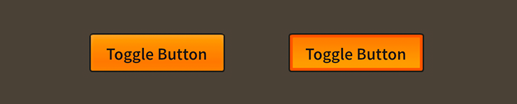

# How to use the Feathers `ToggleButton` component

The [`ToggleButton`](../api-reference/feathers/controls/ToggleButton.html) class is a [button](button.html) that may be selected and deselected when triggered. Like a button, a toggle button's skin, label, and icon can all be customized for each state, including separate styles for when the toggle button is selected and deselected.

<figure>

<figcaption>`ToggleButton` components skinned with `MetalWorksMobileTheme`</figcaption>
</figure>

## The Basics

First, let's create a `ToggleButton` control, give it a label, and add it to the display list:

``` code
var toggle:ToggleButton = new ToggleButton();
toggle.label = "Click Me";
this.addChild( toggle );
```

A toggle button may be selected and deselected when it is triggered, or we can change the button's selection programatically by setting the [`isSelected`](../api-reference/feathers/controls/ToggleButton.html#isSelected) property:

``` code
button.isSelected = true;
```

If we listen to the [`Event.CHANGE`](../api-reference/feathers/controls/ToggleButton.html#event:change) event, we can track whether the user has triggered the button to change the selection:

``` code
toggle.addEventListener( Event.CHANGE, toggle_changeHandler );
```

Check for the new value of `isSelected` in the listener:

``` code
function toggle_changeHandler( event:Event ):void
{
    var toggle:ToggleButton = ToggleButton( event.currentTarget );
    trace( "toggle.isSelected has changed:", toggle.isSelected );
}
```

## Skinning a `ToggleButton`

A number of skins and styles may be customized on a toggle button, expanding on the options provided by [buttons](button.html). For full details about what skin and style properties are available, see the [`ToggleButton` API reference](../api-reference/feathers/controls/ToggleButton.html). We'll look at a few of the most common properties below.

### Background skins, labels, and icons

In addition to the states provided by the `Button` class, the `ToggleButton` class supports some extra states that will be used when the button is selected. 

The [`defaultSelectedSkin`](../api-reference/feathers/controls/ToggleButton.html#defaultSelectedSkin) property works in a similar way to the [`defaultSkin`](../api-reference/feathers/controls/BasicButton.html#defaultSkin) property from the `Button` class. If the `ToggleButton` is selected, and a skin isn't provided for the current state, the `defaultSelectedSkin` will be used.

The same [`setSkinForState()`](../api-reference/feathers/controls/BasicButton.html#setSkinForState()) may set skins for the selected states of a ToggleButton. In addition to the states available to a regular `Button`, the following states may be referenced for a `ToggleButton`:

* [`ButtonState.UP_AND_SELECTED`](../api-reference/feathers/controls/ButtonState.html#UP_AND_SELECTED)
* [`ButtonState.DOWN_AND_SELECTED`](../api-reference/feathers/controls/ButtonState.html#DOWN_AND_SELECTED)
* [`ButtonState.HOVER_AND_SELECTED`](../api-reference/feathers/controls/ButtonState.html#HOVER_AND_SELECTED)
* [`ButtonState.DISABLED_AND_SELECTED`](../api-reference/feathers/controls/ButtonState.html#DISABLED_AND_SELECTED)

Likewise, a `ToggleButton` provides the [`defaultSelectedIcon`](../api-reference/feathers/controls/ToggleButton.html#defaultSelectedIcon) property for styling the icon when selected. The [`setIconForState()`](../api-reference/feathers/controls/Button.html#setIconForState()) method may also use the extra states defined above, like `ButtonState.UP_AND_SELECTED` and `ButtonState.DOWN_AND_SELECTED`.

### Targeting a `ToggleButton` in a theme

If you are creating a [theme](themes.html), you can specify a function for the default styles like this:

``` code
getStyleProviderForClass( ToggleButton ).defaultStyleFunction = setToggleButtonStyles;
```

If you want to customize a specific toggle button to look different than the default, you may use a custom style name to call a different function:

``` code
toggle.styleNameList.add( "custom-toggle-button" );
```

You can specify the function for the custom style name like this:

``` code
getStyleProviderForClass( ToggleButton )
    .setFunctionForStyleName( "custom-toggle-button", setCustomToggleButtonStyles );
```

Trying to change the toggle button's styles and skins outside of the theme may result in the theme overriding the properties, if you set them before the button was added to the stage and initialized. Learn to [extend an existing theme](extending-themes.html) to add custom skins.

If you aren't using a theme, then you may set any of the toggle button's properties directly.

## Related Links

-   [`feathers.controls.ToggleButton` API Documentation](../api-reference/feathers/controls/ToggleButton.html)

-   [How to use the Feathers `Button` component](button.html)