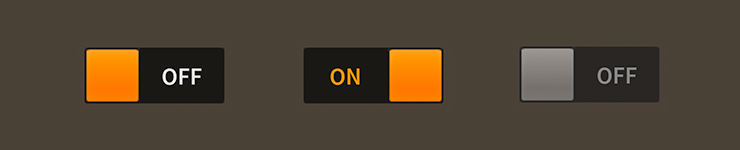

# How to use the Feathers `ToggleSwitch` component

The [`ToggleSwitch`](../api-reference/feathers/controls/ToggleSwitch.html) component switches between on and off states. It can be considered a stylized alternative to a [`Check`](check.html) control that is especially relevant when targeting touch screens. The thumb may be dragged from side to side, or it may be tapped to change selection.

<figure>

<figcaption>`ToggleSwitch` components skinned with `MetalWorksMobileTheme`</figcaption>
</figure>

-   [The Basics](#the-basics)

-   [Skinning a `ToggleSwitch`](#skinning-a-toggleswitch)

## The Basics

First, let's create a toggle switch, select it, and add it to the display list.

``` code
var toggle:ToggleSwitch = new ToggleSwitch();
toggle.isSelected = true;
this.addChild( toggle );
```

The [`isSelected`](../api-reference/feathers/controls/ToggleSwitch.html#isSelected) property indicates if the toggle switch is on (`true`) or off (`false`). Add a listener to [`Event.CHANGE`](../api-reference/feathers/controls/ToggleSwitch.html#event:change) to know when the `isSelected` property changes:

``` code
toggle.addEventListener( Event.CHANGE, toggle_changeHandler );
```

The listener might look something like this:

``` code
function toggle_changeHandler( event:Event ):void
{
    var toggle:ToggleSwitch = ToggleSwitch( event.currentTarget );
    trace( "toggle.isSelected changed:", toggle.isSelected );
}
```

## Skinning a `ToggleSwitch`

The skins for a `ToggleSwitch` control are divided into the thumb, labels for off and on text, and one or two tracks. For full details about what skin and style properties are available, see the [`ToggleSwitch` API reference](../api-reference/feathers/controls/ToggleSwitch.html). We'll look at a few of the most common ways of styling a toggle switch below.

### Font styles

The font styles of the on and off labels may be customized using the [`onLabelFontStyles`](../api-reference/feathers/controls/ToggleSwitch.html#onLabelFontStyles) and [`offLabelFontStyles`](../api-reference/feathers/controls/ToggleSwitch.html#offLabelFontStyles) properties, respectively.

``` code
toggle.onLabelFontStyles = new TextFormat( "Helvetica", 20, 0xcc0000 );
toggle.offLabelFontStyles = new TextFormat( "Helvetica", 20, 0x000000 );
```

Pass in a [`starling.text.TextFormat`](http://doc.starling-framework.org/current/starling/text/TextFormat.html) object, which will work with any type of [text renderer](text-renderers.html).

If the labels should use different font styles when it is disabled, you may set the [`onLabelDisabledFontStyles`](../api-reference/feathers/controls/ToggleSwitch.html#onLabelDisabledFontStyles) and [`offLabelDisabledFontStyles`](../api-reference/feathers/controls/ToggleSwitch.html#offLabelDisabledFontStyles) properties too:

``` code
toggle.onLabelDisabledFontStyles = new TextFormat( "Helvetica", 20, 0x9a9a9a );
toggle.offLabelDisabledFontStyles = new TextFormat( "Helvetica", 20, 0x9a9a9a );
```

### Track(s) and Layout

The toggle switch's track is made from either one or two buttons, depending on the value of the [`trackLayoutMode`](../api-reference/feathers/controls/ToggleSwitch.html#trackLayoutMode) property. The default value of this property is [`TrackLayoutMode.SINGLE`](../api-reference/feathers/controls/TrackLayoutMode.html#SINGLE), which creates a single track that fills the entire width and height of the toggle switch.

If we'd like to have separate buttons for both sides of the track (one for the on side and another for the off side), we can set `trackLayoutMode` to [`TrackLayoutMode.SPLIT`](../api-reference/feathers/controls/TrackLayoutMode.html#SPLIT). In this mode, the width or height of each track (depending on the direction of the toggle switch) is adjusted as the thumb moves to ensure that the two tracks always meet at the center of the thumb.

`TrackLayoutMode.SINGLE` is often best for cases where the track's appearance is mostly static. When you want down or hover states for the track, `TrackLayoutMode.SPLIT` works better because the state will only change on one side of the thumb, making it more visually clear to the user what is happening.

When the value of `trackLayoutMode` is `TrackLayoutMode.SINGLE`, the toggle switch will have a on track, but it will not have a off track. The on track will fill the entire region that is draggable.

### Skinning the Thumb

This section only explains how to access the thumb sub-component. Please read [How to use the Feathers `Button` component](button.html) for full details about the skinning properties that are available on `Button` components.

#### With a Theme

If you're creating a [theme](themes.html), you can target the [`ToggleSwitch.DEFAULT_CHILD_STYLE_NAME_THUMB`](../api-reference/feathers/controls/ToggleSwitch.html#DEFAULT_CHILD_STYLE_NAME_THUMB) style name.

``` code
getStyleProviderForClass( Button )
    .setFunctionForStyleName( ToggleSwitch.DEFAULT_CHILD_STYLE_NAME_THUMB, setToggleSwitchThumbStyles );
```

The styling function might look like this:

``` code
private function setToggleSwitchThumbStyles( thumb:Button ):void
{
    var skin:ImageSkin = new ImageSkin( texture );
    skin.scale9Grid = new Rectangle( 2, 3, 1, 6 );
    thumb.defaultSkin = skin;
}
```

You can override the default style name to use a different one in your theme, if you prefer:

``` code
toggle.customThumbStyleName = "custom-thumb";
```

You can set the function for the [`customThumbStyleName`](../api-reference/feathers/controls/ToggleSwitch.html#customThumbStyleName) like this:

``` code
getStyleProviderForClass( Button )
    .setFunctionForStyleName("custom-thumb", setToggleSwitchCustomThumbStyles );
```

#### Without a Theme

If you are not using a theme, you can use [`thumbFactory`](../api-reference/feathers/controls/ToggleSwitch.html#thumbFactory) to provide skins for the toggle switch's thumb:

``` code
toggle.thumbFactory = function():Button
{
    var button:Button = new Button();

    //skin the thumb here, if not using a theme
    var skin:ImageSkin = new ImageSkin( texture );
    skin.scale9Grid = new Rectangle( 2, 3, 1, 6 );
    thumb.defaultSkin = skin;

    return button;
}
```

### Skinning the On Track

This section only explains how to access the on track sub-component. Please read [How to use the Feathers `Button` component](button.html) for full details about the skinning properties that are available on `Button` components.

#### With a Theme

If you're creating a [theme](themes.html), you can target the [`ToggleSwitch.DEFAULT_CHILD_STYLE_NAME_ON_TRACK`](../api-reference/feathers/controls/ToggleSwitch.html#DEFAULT_CHILD_STYLE_NAME_ON_TRACK) style name.

``` code
getStyleProviderForClass( Button )
    .setFunctionForStyleName( ToggleSwitch.DEFAULT_CHILD_STYLE_NAME_ON_TRACK, setToggleSwitchOnTrackStyles );
```

The styling function might look like this:

``` code
private function setToggleSwitchOnTrackStyles( track:Button ):void
{
    var skin:ImageSkin = new ImageSkin( texture );
    skin.scale9Grid = new Rectangle( 2, 3, 1, 6 );
    track.defaultSkin = skin;
}
```

You can override the default style name to use a different one in your theme, if you prefer:

``` code
toggle.customOnTrackStyleName = "custom-on-track";
```

You can set the function for the [`customOnTrackStyleName`](../api-reference/feathers/controls/ToggleSwitch.html#customOnTrackStyleName) like this:

``` code
getStyleProviderForClass( Button )
    .setFunctionForStyleName( "custom-on-track", setToggleSwitchCustomOnTrackStyles );
```

#### Without a Theme

If you are not using a theme, you can use [`onTrackFactory`](../api-reference/feathers/controls/ToggleSwitch.html#onTrackFactory) to provide skins for the toggle switch's on track:

``` code
toggle.onTrackFactory = function():Button
{
    var button:Button = new Button();

    //skin the on track here, if not using a theme
    var skin:ImageSkin = new ImageSkin( texture );
    skin.scale9Grid = new Rectangle( 2, 3, 1, 6 );
    track.defaultSkin = skin;

    return button;
}
```

### Skinning the Off Track

This section only explains how to access the off track sub-component. Please read [How to use the Feathers `Button` component](button.html) for full details about the skinning properties that are available on `Button` components.

The toggle switch's off track may be skinned similarly to the on track. The style name to use with [themes](themes.html) is [`ToggleSwitch.DEFAULT_CHILD_STYLE_NAME_OFF_TRACK`](../api-reference/feathers/controls/ToggleSwitch.html#DEFAULT_CHILD_STYLE_NAME_OFF_TRACK) or you can customize the style name with [`customOffTrackStyleName`](../api-reference/feathers/controls/ToggleSwitch.html#customOffTrackStyleName). If you aren't using a theme, then you can use [`offTrackFactory`](../api-reference/feathers/controls/ToggleSwitch.html#offTrackFactory).

## Related Links

-   [`feathers.controls.ToggleSwitch` API Documentation](../api-reference/feathers/controls/ToggleSwitch.html)