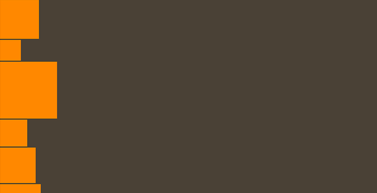

# Using `VerticalLayout` in Feathers containers

The [`VerticalLayout`](../api-reference/feathers/layout/VerticalLayout.html) class may be used by components that support layout, such as [`List`](list.html), [`LayoutGroup`](layout-group.html) and [`ScrollContainer`](scroll-container.html), to display items from top to bottom in a single column. It supports a number of useful options for adjusting the spacing and alignment.

<picture></picture>

## The Basics

First, let's create a `VerticalLayout` and pass it to a [`LayoutGroup`](layout-group.html):

``` code
var layout:VerticalLayout = new VerticalLayout();
 
var container:LayoutGroup = new LayoutGroup();
container.layout = layout;
this.addChild( container );
```

There are a number of simple properties that may be used to affect positioning and sizing of items in the layout. Let's look at some of the most common.

### Spacing

The *padding* is the space around the edges of the container. Let's set the [`padding`](../api-reference/feathers/layout/VerticalLayout.html#padding) property to `12` pixels:

``` code
layout.padding = 12;
```

If needed, the padding on each side of the container may be set separately. Below, we set the [`paddingTop`](../api-reference/feathers/layout/VerticalLayout.html#paddingTop) and [`paddingBottom`](../api-reference/feathers/layout/VerticalLayout.html#paddingBottom) to `10` pixels, and we set the [`paddingLeft`](../api-reference/feathers/layout/VerticalLayout.html#paddingLeft) and [`paddingRight`](../api-reference/feathers/layout/VerticalLayout.html#paddingRight) to `15` pixels:

``` code
layout.paddingTop = 10;
layout.paddingRight = 15;
layout.paddingBottom = 10;
layout.paddingLeft = 15;
```

The *gap* is the space between items. Let's set the [`gap`](../api-reference/feathers/layout/VerticalLayout.html#gap) property to `5` pixels:

``` code
layout.gap = 5;
```

### Alignment

We can *align* the items in the layout using the [`horizontalAlign`](../api-reference/feathers/layout/VerticalLayout.html#horizontalAlign) and [`verticalAlign`](../api-reference/feathers/layout/VerticalLayout.html#verticalAlign) properties. Vertical alignment may be used only when the total height of the content (including padding and gap values) is less than or equal to the height of the container that uses the layout. Let's adjust the alignments so that the content will be aligned to the horizontal center and vertical middle:

``` code
layout.horizontalAlign = HorizontalAlign.CENTER;
layout.verticalAlign = VerticalAlign.MIDDLE;
```

<aside class="info">The `horizontalAlign` property has a special value, named [`HorizontalAlign.JUSTIFY`](../api-reference/feathers/layout/HorizontalAlign.html#JUSTIFY). When it is used, the width of all items in the layout is adjusted to fill the full width of the container.</aside>

## Percentage Dimensions

We can pass [`VerticalLayoutData`](../api-reference/feathers/layout/VerticalLayoutData.html) to a component's [`layoutData`](../api-reference/feathers/core/FeathersControl.html#layoutData) property to specify the width or height using a percentage value. In the simplest, very common case, this is a percentage of the parent container's width or height.

In the following example, we add two buttons to a container using `VerticalLayout`. The first button takes up 25% of the container's height, and the second button takes up 75% of the container's height:

``` code
var button1:Button = new Button();
button1.label = "1";
var button1LayoutData:VerticalLayoutData = new VerticalLayoutData();
button1LayoutData.percentHeight = 25;
button1.layoutData = button1LayoutData;
container.addChild(button1);
 
var button2:Button = new Button();
button2.label = "2";
var button2LayoutData:VerticalLayoutData = new VerticalLayoutData();
button2LayoutData.percentHeight = 75;
button2.layoutData = button2LayoutData;
container.addChild(button2);
```

If there are other children in the container with fixed pixel heights, [`percentHeight`](../api-reference/feathers/layout/VerticalLayoutData.html#percentHeight) will be based on the remaining space in the parent container after the fixed pixel height is subtracted from the container's height.

In the following example, we have two buttons again, but this time, the first button is a fixed 300 pixels high. Now, the percentages are based on the height of the container *minus 300 pixels*. We want the second button to simply fill the remaining vertical space in the container, so we set `percentHeight` to `100`:

``` code
var button1:Button = new Button();
button1.label = "1";
button1.height = 300;
container.addChild(button1);
 
var button2:Button = new Button();
button2.label = "2";
var button2LayoutData:VerticalLayoutData = new VerticalLayoutData();
button2LayoutData.percentHeight = 100;
button2.layoutData = button2LayoutData;
container.addChild(button2);
```

Because the first button's height is 300 pixels, and not a percentage, the second button's height won't be equal to the height of the container, even though `percentHeight` is equal to `100`. Percentages are always calculated after fixed values in pixels are accounted for.

We can also set [`percentWidth`](../api-reference/feathers/layout/VerticalLayoutData.html#percentWidth) to fill a percentage of the container's width. For `VerticalLayout`, since the children are positioned one after the other from the top to bottom, there are never fixed values to account for horizontally.

Let's use the same height values from the previous example, but we'll specify 100% width on the first button:

``` code
var button1:Button = new Button();
button1.label = "1";
button1.height = 300;
var button1LayoutData:VerticalLayoutData = new VerticalLayoutData();
button1LayoutData.percentWidth = 100;
button1.layoutData = button1LayoutData;
container.addChild(button1);
 
var button2:Button = new Button();
button2.label = "2";
var button2LayoutData:VerticalLayoutData = new VerticalLayoutData();
button2LayoutData.percentHeight = 100;
button2.layoutData = button2LayoutData;
container.addChild(button2);
```

Notice that we can mix and match fixed pixel values with percentage values on the same child. The height of the first button is still 300 pixels, but the width is 100%.

As a shortcut, we can optionally specify both `percentWidth` and `percentHeight` in the `VerticalLayoutData` constructor:

``` code
new VerticalLayoutData( 100, 50 ); //width: 100%, height: 50%
```

The value `NaN` may be used to say that we do not want to use percentage dimensions. For instance, if we wanted a button that is 100% width and 300 pixels high, like in the earlier example, we might do it like this:

``` code
button1.height = 300;
button1.layoutData = new VerticalLayoutData( 100, NaN );
```

Percentage dimensions always take precedence, so if we were to pass a numeric value instead of `NaN` as the second parameter of the constructor, then the fixed height of 300 pixels would be ignored.

## Virtual Vertical Layout

In a [`List`](list.html) or [`GroupedList`](grouped-list.html), the layout may be *virtualized*, meaning that some items in the layout will not actually exist if they are not visible. This helps to improve performance of a scrolling list because only a limited number of item renderers will be created at any given moment. If the list's data provider is very large, a virtual layout is essential, even on desktop computers that have incredible processing power compared to mobile devices.

A virtualized layout will need as estimate about how big a "virtual" item renderer should be. We should set the [`typicalItem`](../api-reference/feathers/controls/List.html#typicalItem) property of the list to have it determine the *typical* width and height of an item renderer to use as this estimated value. If we don't pass in a typical item, the first item in the data provider is used for this estimate.

By default [`useVirtualLayout`](../api-reference/feathers/layout/VerticalLayout.html#useVirtualLayout) is `true` for containers that support it. We can disable virtual layouts by setting it to `false`. When a layout is not virtualized, every single item renderer must be created by the component. If a list has thousands of items, this means that thousands of item renderers need to be created. This can lead to significant performance issues, especially on mobile. In general, `useVirtualLayout` should rarely be disabled.

``` code
layout.useVirtualLayout = false;
```

The [`LayoutGroup`](layout-group.html) and [`ScrollContainer`](scroll-container.html) components never use virtual layouts.

### Variable Item Dimensions in a Virtual Vertical Layout

By default, a virtualized vertical layout will assume that all items will have the same height. This restriction helps improve performance, and most lists won't need items with variable heights. However, we can set the [`hasVariableItemDimensions`](../api-reference/feathers/layout/VerticalLayout.html#hasVariableItemDimensions) property to `true`, if we need our list's item renderers to have different height values. When we do this, the typical item height is used as an estimated height for virtual item renderers, and the real height value for each item renderer is stored as it comes into view, improving the accuracy of the layout over time.

``` code
layout.hasVariableItemDimensions = false;
```

## Related Links

-   [`feathers.layout.VerticalLayout` API Documentation](../api-reference/feathers/layout/VerticalLayout.html)